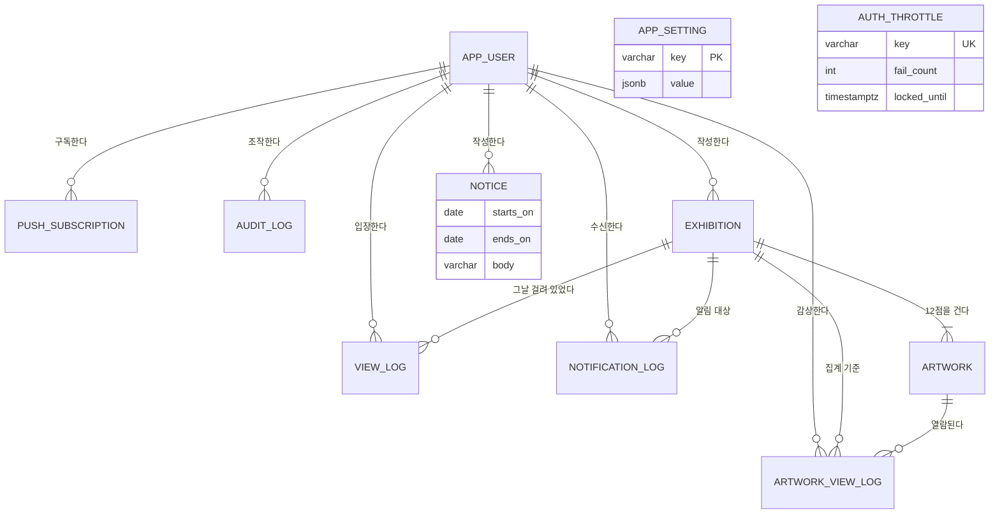

# 갤러리 K — 데이터베이스 설계서

| | |
|---|---|
| **문서 버전** | v1.0 |
| **작성일** | 2026-08-27 |
| **상위 문서** | `docs/PRD.md` v1.1 |
| **대상 DBMS** | AWS RDS for PostgreSQL 16 |
| **ORM** | SQLModel 0.0.x (SQLAlchemy 2.x 코어 위) + Alembic |
| **상태** | 확정 (구현 기준선) |

---

## 1. 설계 원칙

| # | 원칙 | 구체적 적용 |
|---|---|---|
| **DP-1** | **시간 축을 분리한다** | PRD §4.3의 발행일/관람일 분리를 스키마에 그대로 반영한다. `exhibition.exhibition_date`(발행일)와 `view_log.viewed_on`(관람일)은 서로 다른 축이며 절대 혼용하지 않는다 |
| **DP-2** | **상태는 저장하고, 파생은 계산한다** | `is_published`는 파생 계산이 아닌 상태 플래그다(PRD 부록 B). 반대로 `is_complete`처럼 같은 행 안에서 순수 결정되는 값은 생성 컬럼으로 둔다 |
| **DP-3** | **무결성은 DB에서 지킨다** | 애플리케이션 검증은 UX용이고, 최종 방어선은 제약조건이다. UNIQUE·CHECK·FK·EXCLUDE를 적극 사용한다 |
| **DP-4** | **관측 가능성을 스키마에 포함한다** | 알림 발송, 관리자 조작, 이미지 파이프라인은 모두 결과 이력을 남긴다. 서버리스 환경에서 로그 이외의 사후 추적 수단이 필요하다 |
| **DP-5** | **개인정보는 최소로 담고 빠르게 지운다** | 수집 3항목(전화번호·비밀번호·이름) 외 어떤 개인 식별 정보도 컬럼으로 두지 않는다. 로그는 180일 자동 파기한다 |
| **DP-6** | **확장 지점을 열되 미리 만들지 않는다** | v1.1·v1.2 기능(SMS 재설정, 카카오 연동, 예약 발행)은 스키마 훅만 §13에 정의하고 MVP 테이블에는 포함하지 않는다 |

---

## 2. 공통 규약

### 2.1 명명 규칙

| 대상 | 규칙 | 예 |
|---|---|---|
| 테이블 | 단수형 `snake_case`. SQL 예약어 충돌 회피 접두 허용 | `app_user`, `exhibition`, `artwork_view_log` |
| 컬럼 | `snake_case`. 불리언은 `is_`/`has_`, 시각은 `_at`, 날짜는 `_on`/`_date`, 개수는 `_count` | `is_hidden`, `published_at`, `viewed_on` |
| PK | 항상 `id` | |
| FK | `{참조테이블단수}_id` | `exhibition_id` |
| 인덱스 | `ix_{table}_{목적}` | `ix_exhibition_live` |
| 유니크 | `uq_{table}_{컬럼들}` | `uq_view_log_user_day` |
| 체크 | `ck_{table}_{컬럼}` | `ck_artwork_position` |
| 외래키 | `fk_{table}_{컬럼}` | `fk_artwork_exhibition_id` |

### 2.2 타입 규약

| 용도 | 타입 | 결정 근거 |
|---|---|---|
| 기본키 | `uuid` (UUID v7, 애플리케이션 생성) | 시간 정렬성이 있어 B-tree 삽입 지역성이 확보되고, 서버리스 다중 실행 환경에서 시퀀스 경합이 없다 |
| 열거형 | `text` + `CHECK IN (...)` | PostgreSQL 네이티브 ENUM은 값 추가·삭제 시 마이그레이션 비용이 크다. Python 측 `str, Enum`과 1:1 매핑하고 §5 카탈로그를 단일 진실 원천으로 둔다 |
| 시각 | `timestamptz` | 항상 UTC로 저장하고 표현 시 KST로 변환한다 |
| 날짜(업무일) | `date` | KST 캘린더 날짜. 타임존 변환 대상이 아니다 |
| 짧은 문자열 | `varchar(n)` — n은 PRD 글자수 제한과 동일 | 길이 제약을 DB에서 강제한다 |
| 긴 텍스트 | `varchar(n)` (무제한 `text` 금지) | 모든 사용자 입력에는 상한이 있다 |
| 금액·비율 | 사용하지 않음 | 비영리·비상업 서비스 |
| 구조화 설정 | `jsonb` | `app_setting.value`, 감사 로그 스냅샷 한정 |

### 2.3 공통 컬럼(믹스인)

| 믹스인 | 컬럼 | 적용 대상 |
|---|---|---|
| `UUIDPKMixin` | `id uuid PK DEFAULT (애플리케이션 생성 UUIDv7)` | 전 테이블 (`app_setting` 제외) |
| `TimestampMixin` | `created_at timestamptz NOT NULL DEFAULT now()`, `updated_at timestamptz NOT NULL DEFAULT now()` | 전 테이블 |
| `VersionMixin` | `version integer NOT NULL DEFAULT 1` | 동시 수정 가능성이 있는 `exhibition`, `artwork` |

- `updated_at`은 DB 트리거가 아니라 SQLAlchemy `onupdate`로 갱신한다. 배치성 UPDATE 경로에서는 서비스가 명시적으로 세팅한다.
- `version`은 SQLAlchemy `version_id_col`로 낙관적 잠금에 사용한다. 충돌 시 `409 CONFLICT_VERSION`(API 문서 §5) 으로 매핑된다.

### 2.4 시간대 규약

- **DB 세션 타임존은 UTC로 고정**한다. 커넥션 파라미터에 `-c TimeZone=UTC`를 지정한다.
- **업무 날짜(발행일·관람일·공지 기간)는 예외 없이 KST(Asia/Seoul) 캘린더 기준**이다. 애플리케이션이 `today_kst()`로 계산해 파라미터로 넘기며, SQL 안에서 `CURRENT_DATE`를 쓰지 않는다. (Lambda 런타임 TZ가 UTC이므로 `CURRENT_DATE`는 KST 09:00 이전에 하루 어긋난다.)
- 한국은 서머타임을 쓰지 않으므로 KST 오프셋은 항상 +09:00이다. 그럼에도 상수 `+09:00` 하드코딩 대신 `zoneinfo("Asia/Seoul")`를 사용한다.

### 2.5 삭제 정책

| 유형 | 정책 | 적용 |
|---|---|---|
| **하드 삭제** | 행을 제거한다 | `app_user`(탈퇴), 보존기간 만료 로그, `push_subscription`(구독 만료) |
| **숨김 플래그** | 행은 남기고 조회에서 제외한다 | `exhibition.is_hidden` |
| **익명화** | 참조를 끊고 통계 대상에서 제외한다 | `view_log`, `artwork_view_log` (탈퇴 시 `user_id`→NULL, `is_anonymized`→true) |

소프트 삭제(`deleted_at`) 패턴은 **채택하지 않는다.** 회원 수 100명 규모에서 모든 질의에 `WHERE deleted_at IS NULL`을 강제하는 비용이 이득보다 크고, 개인정보 즉시 파기 원칙(PRD §7.3)과도 충돌한다.

---

## 3. 개체 관계도



**관계 요약**

| 관계 | 카디널리티 | 삭제 동작 | 근거 |
|---|---|---|---|
| `exhibition` → `artwork` | 1 : 0..12 | `CASCADE` | 전시를 지우면 그림도 의미가 없다. 단 발행된 전시는 삭제하지 않는다(§8.3) |
| `app_user` → `view_log` | 1 : N | `SET NULL` + 익명화 | 탈퇴해도 집계 이력의 형태는 남기되 개인 식별은 끊는다 |
| `app_user` → `push_subscription` | 1 : N | `CASCADE` | 개인정보성 자원이므로 즉시 파기 |
| `exhibition` → `view_log` | 1 : N | `SET NULL` | 전시 삭제는 원칙상 발생하지 않으나 방어적으로 둔다 |
| `artwork` → `artwork_view_log` | 1 : N | `CASCADE` | 그림 교체 시 그 그림의 열람 기록은 의미를 잃는다 |

---

## 4. 테이블 상세

### 4.1 `app_user` — 회원

PRD §7.2 User. 관람자와 큐레이터를 하나의 테이블로 관리하고 `role`로 구분한다. 큐레이터는 시드로 1개만 생성되며 화면에서 생성 불가하다(PRD 부록 B).

| 컬럼 | 타입 | Null | 기본값 | 제약·인덱스 | 설명 |
|---|---|:---:|---|---|---|
| `id` | uuid | N | UUIDv7 | PK | |
| `phone` | varchar(11) | N | | `uq_app_user_phone` | **로그인 ID.** 하이픈 없는 숫자만(`01012345678`). 정규화는 애플리케이션 책임 |
| `password_hash` | varchar(100) | N | | | bcrypt(cost 12) 해시. 평문·복호 가능 형식 저장 금지 |
| `name` | varchar(20) | N | | | 표시 이름 |
| `role` | text | N | `'viewer'` | `ck_app_user_role` | `viewer` \| `curator` |
| `notify_enabled` | bool | N | `false` | | 아침 알림 수신 여부 |
| `notify_at` | time | N | `'07:30'` | | 알림 희망 시각(KST). **끄더라도 값은 보존**한다 |
| `font_scale` | text | N | `'normal'` | `ck_app_user_font_scale` | `normal` \| `large` (v1.1 UI, 컬럼은 MVP부터) |
| `is_blocked` | bool | N | `false` | | 차단 회원. 로그인 시점에만 작동(PRD §6.4) |
| `blocked_at` | timestamptz | Y | | | |
| `blocked_reason` | varchar(200) | Y | | | 큐레이터 메모. 회원에게 노출하지 않는다 |
| `created_via` | text | N | `'self'` | `ck_app_user_created_via` | `self` \| `curator`(대행 가입, PRD §6.14) |
| `must_change_password` | bool | N | `false` | | 대행 가입·비밀번호 초기화 시 true. 다음 로그인에서 변경 유도 |
| `token_version` | integer | N | `1` | | JWT 무효화 카운터. 비밀번호 변경·초기화 시 +1 |
| `last_login_at` | timestamptz | Y | | | |
| `created_at` / `updated_at` | timestamptz | N | `now()` | | |

**인덱스**

| 이름 | 정의 | 용도 |
|---|---|---|
| `uq_app_user_phone` | `UNIQUE (phone)` | 로그인·가입 중복 검사 |
| `ix_app_user_notify` | `(notify_at) WHERE notify_enabled AND NOT is_blocked` | 아침 알림 대상 조회(§7 Q5) |
| `ix_app_user_created_at` | `(created_at DESC)` | B-3 회원 목록 기본 정렬 |
| `ix_app_user_name_trgm` | `gin (name gin_trgm_ops)` | B-1 사용자 검색(부분 일치). `pg_trgm` 확장 필요 |

**제약**

- `ck_app_user_role`: `role IN ('viewer','curator')`
- `ck_app_user_font_scale`: `font_scale IN ('normal','large')`
- `ck_app_user_created_via`: `created_via IN ('self','curator')`
- `ck_app_user_phone_digits`: `phone ~ '^01[0-9]{8,9}$'`

**규칙**

- `role='curator'` 행은 **최대 1개**를 전제로 운영한다. DB 제약(`UNIQUE`+부분 인덱스)으로 강제한다: `uq_app_user_single_curator UNIQUE (role) WHERE role = 'curator'`.
- 차단(`is_blocked`)은 기존 세션을 끊지 않는다(PRD §6.4). 즉시 차단이 필요하면 `token_version`을 함께 증가시키는 별도 조작(§13 확장 훅)이 필요하며 MVP에서는 제공하지 않는다.

### 4.2 `auth_throttle` — 인증 시도 제한

PRD §6.2 "5회 연속 실패 시 10분 차단"을 서버리스 환경에서 구현하기 위한 테이블. Lambda는 인스턴스 메모리를 신뢰할 수 없으므로 상태를 DB에 둔다.

| 컬럼 | 타입 | Null | 기본값 | 제약·인덱스 | 설명 |
|---|---|:---:|---|---|---|
| `id` | uuid | N | UUIDv7 | PK | |
| `throttle_key` | varchar(120) | N | | `uq_auth_throttle_key` | `{scope}:{식별자}` 형식. 예 `login:01012345678` |
| `scope` | text | N | | `ck_auth_throttle_scope` | `login` \| `signup` \| `password_reset` \| `media_session` |
| `fail_count` | smallint | N | `0` | | 연속 실패 횟수 |
| `first_failed_at` | timestamptz | Y | | | 윈도 시작점 |
| `last_failed_at` | timestamptz | Y | | | |
| `locked_until` | timestamptz | Y | | | 이 시각까지 차단 |
| `created_at` / `updated_at` | timestamptz | N | `now()` | | |

**인덱스** — `uq_auth_throttle_key UNIQUE (throttle_key)`, `ix_auth_throttle_locked (locked_until) WHERE locked_until IS NOT NULL`(정리 배치용).

**규칙** — 성공 인증 시 해당 키 행을 삭제한다. 실패 시 `INSERT ... ON CONFLICT (throttle_key) DO UPDATE`로 원자적 증가시킨다. `fail_count >= 5`이면 `locked_until = now() + 10분`, `fail_count`는 0으로 리셋한다. 윈도(첫 실패로부터 10분)를 벗어난 시도는 카운트를 1로 재시작한다.

### 4.3 `push_subscription` — 웹 푸시 구독

PRD §6.12. 한 회원이 폰·PC 등 여러 단말에서 구독할 수 있으므로 1:N으로 분리한다.

| 컬럼 | 타입 | Null | 기본값 | 제약·인덱스 | 설명 |
|---|---|:---:|---|---|---|
| `id` | uuid | N | UUIDv7 | PK | |
| `user_id` | uuid | N | | FK→`app_user` `CASCADE` | |
| `endpoint` | varchar(1000) | N | | | 푸시 서비스 엔드포인트 URL |
| `endpoint_hash` | char(64) | N | | `uq_push_subscription_endpoint` | `sha256(endpoint)`. 엔드포인트가 B-tree 인덱스 상한을 넘길 수 있어 해시로 유니크를 건다 |
| `p256dh` | varchar(200) | N | | | 구독 공개키 |
| `auth` | varchar(100) | N | | | 인증 시크릿 |
| `platform` | text | N | `'unknown'` | `ck_push_subscription_platform` | `ios` \| `android` \| `desktop` \| `unknown`. B-3 알림 상태 표시와 iOS 안내에 쓴다 |
| `user_agent` | varchar(300) | Y | | | 진단용 |
| `is_active` | bool | N | `true` | | |
| `failure_count` | smallint | N | `0` | | 연속 실패. 404/410 응답 시 즉시 비활성 |
| `last_success_at` / `last_failure_at` | timestamptz | Y | | | |
| `created_at` / `updated_at` | timestamptz | N | `now()` | | |

**인덱스** — `uq_push_subscription_endpoint UNIQUE (endpoint_hash)`, `ix_push_subscription_user (user_id) WHERE is_active`.

**규칙** — 동일 `endpoint_hash`가 다른 회원으로 재등록되면 `user_id`를 갱신한다(단말 공유·재로그인 시나리오). 푸시 응답이 404/410이면 `is_active=false`로 내리고, 500류 실패는 `failure_count`를 올려 3회 연속이면 비활성화한다.

### 4.4 `exhibition` — 전시(하루 단위)

PRD §7.2 Exhibition. **드래프트와 발행본이 같은 행**이다. 별도 draft 테이블을 두지 않는 이유는 B-2 화면이 편집 중 상태를 그대로 미리보기해야 하고(§6.10), 발행이 별도 액션이 아니라 조건 충족 시 자동 전환이기 때문이다.

| 컬럼 | 타입 | Null | 기본값 | 제약·인덱스 | 설명 |
|---|---|:---:|---|---|---|
| `id` | uuid | N | UUIDv7 | PK | |
| `exhibition_date` | date | N | | `uq_exhibition_date` | **발행일(KST).** 하루에 하나(제품 원칙 1) |
| `title` | varchar(20) | Y | | | 전시 제목. 드래프트 단계에서는 NULL 허용 |
| `theme` | varchar(500) | Y | | | 전시 테마 본문. 줄바꿈 보존 |
| `is_published` | bool | N | `false` | | **단방향 상태 플래그.** true로 전환된 뒤 어떤 수정으로도 false로 돌아가지 않는다(PRD 부록 B) |
| `published_at` | timestamptz | Y | | | 발행 조건이 처음 충족된 시각 |
| `is_hidden` | bool | N | `false` | | 관람자에게서 감추는 유일한 수단(PRD §6.9) |
| `hidden_at` | timestamptz | Y | | | |
| `hidden_reason` | varchar(200) | Y | | | 큐레이터 메모 |
| `artwork_count` | smallint | N | `0` | `ck_exhibition_artwork_count` | 연결된 `artwork` 행 수(0–12). 비정규화 카운터 |
| `complete_artwork_count` | smallint | N | `0` | `ck_exhibition_complete_count` | `artwork.is_complete = true`인 행 수(0–12) |
| `created_by` | uuid | Y | | FK→`app_user` `SET NULL` | |
| `draft_updated_at` | timestamptz | Y | | | 마지막 자동 임시저장 시각. B-2 화면의 "저장됨" 표시 근거 |
| `version` | integer | N | `1` | | 낙관적 잠금 |
| `created_at` / `updated_at` | timestamptz | N | `now()` | | |

**인덱스**

| 이름 | 정의 | 용도 |
|---|---|---|
| `uq_exhibition_date` | `UNIQUE (exhibition_date)` | 하루 1전시 강제, 날짜 단건 조회 |
| `ix_exhibition_live` | `(exhibition_date DESC) WHERE is_published AND NOT is_hidden` | **현재 전시 질의(Q1)와 아카이브(Q3)의 전용 인덱스.** 모든 관람자의 모든 접속이 이 인덱스를 탄다 |
| `ix_exhibition_published_at` | `(published_at DESC) WHERE is_published` | 백필 허용으로 정책이 바뀔 경우의 대체 정렬(PRD §4.3 주석). 예비 |

**제약**

- `ck_exhibition_artwork_count`: `artwork_count BETWEEN 0 AND 12`
- `ck_exhibition_complete_count`: `complete_artwork_count BETWEEN 0 AND artwork_count`
- `ck_exhibition_published_at`: `(is_published = false AND published_at IS NULL) OR (is_published = true AND published_at IS NOT NULL)`
- `ck_exhibition_hidden_at`: `(is_hidden = false) OR (is_hidden = true AND hidden_at IS NOT NULL)`

**발행 조건** — `title IS NOT NULL AND btrim(title) <> '' AND theme IS NOT NULL AND btrim(theme) <> '' AND complete_artwork_count = 12`. 이 조건이 처음 충족되는 순간 서비스가 `is_published=true`, `published_at=now()`를 기록한다. 조건은 서비스 계층에서만 판정하며 DB 트리거를 쓰지 않는다 — 발행은 알림 발송(§4.10)을 유발하는 도메인 이벤트이므로 트랜잭션 스크립트로 관리되어야 한다.

**비정규화 카운터 관리** — `artwork_count`·`complete_artwork_count`는 그림 생성·삭제·수정과 **같은 트랜잭션 안에서** 재계산 UPDATE로 갱신한다(증감이 아닌 `SELECT count(*)` 기반 재설정). 12행 이하의 소규모 집합이므로 비용이 무시할 만하고, 증감 방식이 갖는 드리프트 위험이 없다. 야간 정합성 배치(§11.3)가 불일치를 검출한다.

### 4.5 `artwork` — 그림

PRD §7.2 Artwork. 이미지 업로드가 비동기 파이프라인(백엔드 문서 §8)이므로 이미지 상태 기계를 컬럼으로 갖는다.

| 컬럼 | 타입 | Null | 기본값 | 제약·인덱스 | 설명 |
|---|---|:---:|---|---|---|
| `id` | uuid | N | UUIDv7 | PK | |
| `exhibition_id` | uuid | N | | FK→`exhibition` `CASCADE` | |
| `position` | smallint | N | | `ck_artwork_position`, `uq_artwork_slot` | 전시 내 순서 1–12 |
| `title` | varchar(20) | Y | | | |
| `artist` | varchar(40) | Y | | | |
| `year_text` | varchar(20) | Y | | | `1665년경` 등 자유 텍스트 |
| `description` | varchar(300) | Y | | | 40자 이상 권장(경고만), 300자 초과 저장 차단 |
| `collection` | varchar(60) | Y | | | 소장처 |
| `source_url` | varchar(500) | Y | | `ck_artwork_source_url` | `https://`로 시작하는 URL만 |
| `image_status` | text | N | `'empty'` | `ck_artwork_image_status` | `empty`\|`uploading`\|`processing`\|`ready`\|`failed` |
| `image_original_key` | varchar(300) | Y | | | S3 오브젝트 키(원본) |
| `image_display_key` | varchar(300) | Y | | | 긴 변 1600px WebP |
| `image_thumb_key` | varchar(300) | Y | | | 400×400 정사각 WebP |
| `image_lqip` | varchar(2048) | Y | | | 16px 폭 WebP의 data URL. 블러 플레이스홀더용(PRD §6.5) |
| `image_width` / `image_height` | integer | Y | | | 원본 픽셀 크기. 레이아웃 시프트 방지용 |
| `image_bytes` | integer | Y | | | 원본 바이트 수 |
| `image_mime` | varchar(40) | Y | | | |
| `image_error_code` | varchar(40) | Y | | | 처리 실패 사유 코드 |
| `image_uploaded_at` / `image_ready_at` | timestamptz | Y | | | |
| `is_complete` | bool | N | 생성 컬럼 | | 아래 정의. `STORED GENERATED` |
| `version` | integer | N | `1` | | 낙관적 잠금 |
| `created_at` / `updated_at` | timestamptz | N | `now()` | | |

**생성 컬럼 정의**

```
is_complete = (title IS NOT NULL AND btrim(title) <> ''
            AND artist IS NOT NULL AND btrim(artist) <> ''
            AND year_text IS NOT NULL AND btrim(year_text) <> ''
            AND description IS NOT NULL AND btrim(description) <> ''
            AND image_status = 'ready')
```

한 행 안에서만 결정되므로 `GENERATED ALWAYS AS (...) STORED`로 둔다(DP-2). 완성 판정 로직이 코드 여러 곳에 흩어지는 것을 원천 차단한다.

**인덱스**

| 이름 | 정의 | 용도 |
|---|---|---|
| `uq_artwork_slot` | `UNIQUE (exhibition_id, position)` | 슬롯 중복 방지 |
| `ix_artwork_exhibition` | `(exhibition_id, position)` | 전시 상세 조회(12행 정렬) |
| `ix_artwork_pending_image` | `(image_status, image_uploaded_at) WHERE image_status IN ('uploading','processing')` | 처리 지연 감시 배치 |

**제약**

- `ck_artwork_position`: `position BETWEEN 1 AND 12`
- `ck_artwork_image_status`: `image_status IN ('empty','uploading','processing','ready','failed')`
- `ck_artwork_image_keys`: `image_status <> 'ready' OR (image_display_key IS NOT NULL AND image_thumb_key IS NOT NULL)`
- `ck_artwork_source_url`: `source_url IS NULL OR source_url ~ '^https://'`

**순서 변경** — 드래그 재정렬은 `position`을 재할당한다. `UNIQUE (exhibition_id, position)`이 걸려 있으므로 단일 트랜잭션 안에서 **`DEFERRABLE INITIALLY IMMEDIATE`로 선언하고 `SET CONSTRAINTS ... DEFERRED` 후 일괄 UPDATE**한다. 임시 오프셋(+100) 트릭을 쓰지 않는다.

### 4.6 `view_log` — 갤러리 입장 기록

PRD §7.2 ViewLog + GAP-11. **관람일 기준 하루 1행**이 이 테이블의 전부다.

| 컬럼 | 타입 | Null | 기본값 | 제약·인덱스 | 설명 |
|---|---|:---:|---|---|---|
| `id` | uuid | N | UUIDv7 | PK | |
| `user_id` | uuid | Y | | FK→`app_user` `SET NULL` | 탈퇴 시 NULL |
| `viewed_on` | date | N | | `uq_view_log_user_day` | **관람일(KST).** 지표의 기준 축 |
| `exhibition_id` | uuid | Y | | FK→`exhibition` `SET NULL` | 그날 실제로 열린 전시. 연장 중이면 과거 전시를 가리킨다 |
| `first_entered_at` | timestamptz | N | `now()` | | |
| `last_entered_at` | timestamptz | N | `now()` | | |
| `entry_count` | smallint | N | `1` | | 진단용. **지표 계산에는 쓰지 않는다** |
| `is_anonymized` | bool | N | `false` | | 탈퇴 회원의 잔여 로그 |
| `created_at` / `updated_at` | timestamptz | N | `now()` | | |

**인덱스** — `uq_view_log_user_day UNIQUE (user_id, viewed_on)`, `ix_view_log_day (viewed_on DESC)`, `ix_view_log_exhibition (exhibition_id)`, `ix_view_log_user_recent (user_id, viewed_on DESC)`.

**기록 규칙**

- C 갤러리 화면 진입 시 `INSERT ... ON CONFLICT (user_id, viewed_on) DO UPDATE SET entry_count = view_log.entry_count + 1, last_entered_at = EXCLUDED.last_entered_at`.
- 충돌 시 `exhibition_id`는 **갱신하지 않는다.** 그날 처음 연 전시를 그날의 대표값으로 삼는다. 하루 안에 오늘치와 아카이브를 모두 본 경우 첫 진입 전시가 남는다.
- 아카이브(C-3) 진입도 동일하게 그날의 입장으로 센다(PRD §6.5). 구분 컬럼을 두지 않는 것은 의도된 결정이다(부록 B).
- `user_id IS NULL`인 행은 유니크 제약에서 자동 제외된다(PostgreSQL NULL 비교 규칙). 익명화 후 중복이 생길 수 있으나 통계에서 배제되므로 무해하다.

**의도적으로 두지 않는 컬럼** — `source`(오늘/아카이브 구분), `session_id`, `ip`, `user_agent`. PRD 부록 B가 명시적으로 구분하지 않기로 했고, 개인정보 최소화 원칙(DP-5)에 따른다.

### 4.7 `artwork_view_log` — 그림 열람 기록

PRD §7.2 ArtworkViewLog. "같은 그림을 이틀에 걸쳐 보면 중복 제거해서 센다" → **(회원, 그림) 조합당 1행**이며 첫 열람일을 함께 보관한다.

| 컬럼 | 타입 | Null | 기본값 | 제약·인덱스 | 설명 |
|---|---|:---:|---|---|---|
| `id` | uuid | N | UUIDv7 | PK | |
| `user_id` | uuid | Y | | FK→`app_user` `SET NULL` | |
| `artwork_id` | uuid | N | | FK→`artwork` `CASCADE`, `uq_artwork_view_log_user_artwork` | |
| `exhibition_id` | uuid | N | | FK→`exhibition` `CASCADE` | 비정규화. 조인 없이 전시별 집계 |
| `first_viewed_on` | date | N | | | 첫 열람 **관람일**(KST). B-1-1의 `8 / 12` 산출 기준 |
| `first_viewed_at` | timestamptz | N | `now()` | | |
| `last_viewed_at` | timestamptz | N | `now()` | | |
| `view_count` | smallint | N | `1` | | 진단용 |
| `is_anonymized` | bool | N | `false` | | |
| `created_at` / `updated_at` | timestamptz | N | `now()` | | |

**인덱스** — `uq_artwork_view_log_user_artwork UNIQUE (user_id, artwork_id)`, `ix_artwork_view_log_user_day (user_id, first_viewed_on DESC)`, `ix_artwork_view_log_exhibition (exhibition_id, user_id)`, `ix_artwork_view_log_artwork (artwork_id)`.

**활용** — C 갤러리 그리드의 "이미 열어본 표식"은 **전시 기준**이다(PRD §6.5). `WHERE user_id = ? AND exhibition_id = ?`로 조회하며 `ix_artwork_view_log_exhibition`이 이를 커버한다.

### 4.8 `notice` — 휴관 공지

PRD §6.1 GAP-18.

| 컬럼 | 타입 | Null | 기본값 | 제약·인덱스 | 설명 |
|---|---|:---:|---|---|---|
| `id` | uuid | N | UUIDv7 | PK | |
| `starts_on` | date | N | | | 공지 시작일(KST, 포함) |
| `ends_on` | date | N | | `ck_notice_period` | 공지 종료일(KST, 포함) |
| `body` | varchar(300) | N | | | 안내 문구 |
| `is_active` | bool | N | `true` | | 취소 시 false |
| `created_by` | uuid | Y | | FK→`app_user` `SET NULL` | |
| `created_at` / `updated_at` | timestamptz | N | `now()` | | |

**제약·인덱스**

- `ck_notice_period`: `ends_on >= starts_on`
- `ex_notice_no_overlap`: `EXCLUDE USING gist (daterange(starts_on, ends_on, '[]') WITH &&) WHERE (is_active)` — 활성 공지 기간이 겹치지 않게 DB가 보장한다. `btree_gist` 확장 필요. 겹침을 허용하면 "오늘의 공지"가 비결정적이 된다.
- `ix_notice_period (starts_on, ends_on) WHERE is_active`

**활용** — 공지 기간은 §3.2 발행 빈도 지표의 분모에서 제외된다. 큐레이터 연장 알림(§4.10)도 이 기간에는 발송하지 않는다.

### 4.9 `app_setting` — 전역 설정

키-값 단일 테이블. 설정 하나마다 컬럼을 늘리는 대신 확장 가능한 형태로 둔다(DP-6).

| 컬럼 | 타입 | Null | 기본값 | 설명 |
|---|---|:---:|---|---|
| `key` | varchar(50) | N | | PK |
| `value` | jsonb | N | | 스칼라도 JSON 스칼라로 저장 |
| `value_type` | text | N | | `bool`\|`int`\|`string`\|`time`\|`json` |
| `description` | varchar(200) | N | | 운영자용 설명 |
| `is_mutable` | bool | N | `true` | false면 API로 변경 불가(배포로만 변경) |
| `updated_by` | uuid | Y | | FK→`app_user` `SET NULL` |
| `updated_at` | timestamptz | N | `now()` | |

**시드 값**

| key | type | 기본값 | 근거 |
|---|---|---|---|
| `signup_open` | bool | `true` | PRD §6.14 가입 잠금 |
| `notify_default_time` | time | `"07:30"` | §6.12 |
| `notify_cutoff_hour` | int | `21` | §6.12 · 부록 B. 조정 가능해야 한다 |
| `carryover_alert_days` | int | `2` | 연장 2일 연속 시 큐레이터 알림 |
| `archive_size` | int | `30` | §6.8 최근 30개 전시 |
| `admin_calendar_days` | int | `7` | §6.9 기본 7일치 |
| `log_retention_days` | int | `180` | PRD §7.3 |
| `media_signed_ttl_seconds` | int | `21600` | 미디어 서명 유효기간 6시간 |
| `media_signing_mode` | string | `"cookie"` | `cookie`(기본) \| `url`. 쿠키가 차단되는 환경을 위한 대체 경로(API 문서 §6.10) |
| `maintenance_mode` | bool | `false` | 점검 모드. A 첫 화면만 살린다(§8.5) |
| `session_ttl_days` | int | `90` | GAP-14 |

설정은 애플리케이션에서 **요청 단위 캐시 + 60초 TTL 프로세스 캐시**로 읽는다(백엔드 문서 §6.4).

### 4.10 `notification_log` — 알림 발송 이력

PRD §6.12. 중복 발송 방지와 사후 추적을 동시에 담당한다.

| 컬럼 | 타입 | Null | 기본값 | 제약·인덱스 | 설명 |
|---|---|:---:|---|---|---|
| `id` | uuid | N | UUIDv7 | PK | |
| `user_id` | uuid | Y | | FK→`app_user` `SET NULL` | 수신자(큐레이터 알림 포함) |
| `kind` | text | N | | `ck_notification_log_kind` | `morning_exhibition`(예약 발송) \| `late_publish`(사용자 알림 시각이 지난 뒤 발행되어 즉시 발송) \| `curator_carryover` \| `curator_signup` |
| `dedupe_key` | varchar(160) | N | | `uq_notification_log_dedupe` | 예 `morning:{user_id}:{exhibition_date}` |
| `exhibition_id` | uuid | Y | | FK→`exhibition` `SET NULL` | |
| `status` | text | N | `'pending'` | `ck_notification_log_status` | `pending`\|`sent`\|`skipped`\|`failed` |
| `skip_reason` | varchar(40) | Y | | | `carryover`\|`cutoff_passed`\|`notify_disabled`\|`no_subscription`\|`blocked`\|`notice_period` |
| `scheduled_for` | timestamptz | N | | | 발송 예정 시각 |
| `sent_at` | timestamptz | Y | | | |
| `attempt_count` | smallint | N | `0` | | |
| `last_error` | varchar(300) | Y | | | |
| `payload` | jsonb | Y | | | 발송 시점 제목·본문·링크 스냅샷 |
| `created_at` / `updated_at` | timestamptz | N | `now()` | | |

**인덱스** — `uq_notification_log_dedupe UNIQUE (dedupe_key)`, `ix_notification_log_pending (scheduled_for) WHERE status = 'pending'`, `ix_notification_log_user (user_id, created_at DESC)`.

**규칙** — `dedupe_key`의 UNIQUE 제약이 "하루 1회"와 "연장 2일차 1회만"을 DB 수준에서 보장한다. 스케줄러가 중복 기동해도 두 번째는 제약 위반으로 무시된다. 발송하지 않기로 한 경우에도 `status='skipped'` 행을 남긴다 — **보내지 않은 이유가 남아야 운영 중 문의에 답할 수 있다.**

### 4.11 `audit_log` — 관리자 조작 이력

PRD 본문에는 없으나 DP-4에 따라 추가한다. 차단·숨김·비밀번호 초기화 같은 되돌리기 어려운 조작의 근거를 남긴다.

| 컬럼 | 타입 | Null | 기본값 | 설명 |
|---|---|:---:|---|---|
| `id` | uuid | N | UUIDv7 | PK |
| `actor_id` | uuid | Y | | FK→`app_user` `SET NULL` |
| `actor_role` | text | N | | 조작 시점의 역할 스냅샷 |
| `action` | varchar(60) | N | | 예 `member.block`, `exhibition.hide`, `exhibition.carry_draft` |
| `target_type` | varchar(40) | Y | | `exhibition`\|`artwork`\|`app_user`\|`notice`\|`app_setting` |
| `target_id` | uuid | Y | | |
| `summary` | varchar(200) | N | | 사람이 읽는 한 줄 |
| `changes` | jsonb | Y | | `{"before": {...}, "after": {...}}`. **비밀번호 해시·전화번호 전체는 담지 않는다** |
| `request_id` | varchar(40) | Y | | API 응답 `meta.request_id`와 대조 |
| `created_at` | timestamptz | N | `now()` | |

**인덱스** — `ix_audit_log_created (created_at DESC)`, `ix_audit_log_target (target_type, target_id, created_at DESC)`, `ix_audit_log_actor (actor_id, created_at DESC)`.

---

## 5. 열거형 카탈로그

애플리케이션 `chalicelib/db/models/enums.py`가 단일 진실 원천이며, 프런트엔드 `shared/types/enums.ts`가 이를 미러링한다(API 문서 §3.6에 값 목록을 명시).

| 열거형 | 값 | 사용처 |
|---|---|---|
| `UserRole` | `viewer`, `curator` | `app_user.role` |
| `FontScale` | `normal`, `large` | `app_user.font_scale` |
| `CreatedVia` | `self`, `curator` | `app_user.created_via` |
| `ImageStatus` | `empty`, `uploading`, `processing`, `ready`, `failed` | `artwork.image_status` |
| `ExhibitionDayStatus` | `published`, `carried_over`, `empty` | **DB 컬럼 아님.** 관리자 달력 응답의 파생 상태(Y/↑/N) |
| `NotificationKind` | `morning_exhibition`, `late_publish`, `curator_carryover`, `curator_signup` | `notification_log.kind` |
| `NotificationStatus` | `pending`, `sent`, `skipped`, `failed` | `notification_log.status` |
| `ThrottleScope` | `login`, `signup`, `password_reset`, `media_session` | `auth_throttle.scope` |
| `PushPlatform` | `ios`, `android`, `desktop`, `unknown` | `push_subscription.platform` |

---

## 6. 상태 전이

### 6.1 전시 라이프사이클

| 상태 | 조건 | 관람자 노출 | 다음 상태 |
|---|---|---|---|
| **없음** | 해당 날짜 행 자체가 없음 | — | 드래프트(B-2 진입 시 행 생성) |
| **드래프트** | `is_published=false` | 미노출 | 발행 (조건 충족 시) · 삭제 (§8.3 조건부) |
| **발행됨** | `is_published=true`, `is_hidden=false` | `exhibition_date <= 오늘`이면 노출 대상 | 숨김 |
| **숨김** | `is_published=true`, `is_hidden=true` | 미노출. 아카이브에서도 제외 | 발행됨 (숨김 해제) |

**불변식**

1. `is_published`는 **단조 증가**한다(false→true만 허용).
2. 드래프트 → 발행 전환은 발행 조건(§4.4)이 충족되는 저장 요청의 트랜잭션 안에서만 일어난다.
3. 발행 전환과 동시에 `notification_log`에 그 전시의 알림 작업이 등록된다(§4.10).
4. `exhibition_date > 오늘`인 발행본은 존재할 수 있다(미리 채워둔 미래 전시). 관람자 질의가 `exhibition_date <= 오늘` 조건으로 걸러내므로 별도 예약 처리가 필요 없다.
5. 발행일이 과거인 새 전시 생성(백필)은 **서비스 계층에서 거부**한다. DB 제약으로는 강제하지 않는다 — 날짜가 지나면 기존 행도 자동으로 과거가 되므로 제약으로 표현할 수 없다.

### 6.2 이미지 파이프라인 상태

| 상태 | 진입 계기 | 이탈 계기 |
|---|---|---|
| `empty` | 그림 행 생성 | 업로드 URL 발급 → `uploading` |
| `uploading` | Presigned URL 발급 | S3 이벤트 수신 → `processing` / 30분 무응답 → `failed`(`UPLOAD_TIMEOUT`) |
| `processing` | 리사이즈 Lambda 시작 | 3종 생성 성공 → `ready` / 예외 → `failed` |
| `ready` | 썸네일·디스플레이·LQIP 생성 완료 | 재업로드 시 `uploading`으로 회귀 |
| `failed` | 처리 예외 | 재업로드 시 `uploading`으로 회귀 |

`ready` 이외의 상태는 `is_complete=false`를 강제하므로(§4.5 생성 컬럼) **이미지 처리가 끝나지 않은 그림은 발행 카운트에 잡히지 않는다.**

### 6.3 알림 상태

`pending` → (`sent` | `skipped` | `failed`). `failed`는 최대 3회까지 재시도하며 초과 시 그대로 종료한다. 아침 알림은 시의성이 전부이므로 **당일 `notify_cutoff_hour`를 넘기면 재시도하지 않고 `skipped(cutoff_passed)`로 종료**한다.

---

## 7. 핵심 질의 패턴

모든 질의는 KST 기준 날짜를 애플리케이션에서 계산해 파라미터로 주입한다(§2.4).

| ID | 질의 | 조건식 | 사용 인덱스 | 호출 빈도 |
|---|---|---|---|---|
| **Q1** | **현재 전시** | `is_published AND NOT is_hidden AND exhibition_date <= :today` `ORDER BY exhibition_date DESC LIMIT 1` | `ix_exhibition_live` | 최고 (모든 진입) |
| **Q2** | 특정 날짜 전시 | `exhibition_date = :date AND is_published AND NOT is_hidden` | `uq_exhibition_date` | 중 (아카이브 상세) |
| **Q3** | 아카이브 목록 | Q1과 동일 조건 + `LIMIT :archive_size` (기본 30) | `ix_exhibition_live` | 중 |
| **Q4** | 전시 그림 12점 | `exhibition_id = :id ORDER BY position` | `ix_artwork_exhibition` | 높음 |
| **Q5** | 알림 대상 회원 | `notify_enabled AND NOT is_blocked AND notify_at BETWEEN :from AND :to` | `ix_app_user_notify` | 5분마다 |
| **Q6** | 관리자 달력 | §7.1 참조 | `uq_exhibition_date` + `ix_exhibition_live` | 낮음 |
| **Q7** | 일별 입장자 수 | `viewed_on BETWEEN :from AND :to AND NOT is_anonymized` `GROUP BY viewed_on` | `ix_view_log_day` | 낮음 |
| **Q8** | 회원별 감상 상세 | `user_id = :id AND viewed_on >= :from` + 전시별 열람 그림 수 | `ix_view_log_user_recent`, `ix_artwork_view_log_user_day` | 낮음 |
| **Q9** | 주간 감상률(NSM) | 회원별 `count(DISTINCT viewed_on) >= 3`인 회원 비율 | `ix_view_log_day` | 낮음 |
| **Q10** | 관람 표식 | `user_id = :id AND exhibition_id = :ex` | `ix_artwork_view_log_exhibition` | 높음 |
| **Q11** | 현재 휴관 공지 | `is_active AND :today BETWEEN starts_on AND ends_on` | `ix_notice_period` | 높음 (A 화면) |
| **Q12** | 회원 목록(B-3) | §7.2 참조 | `ix_app_user_created_at`, `ix_view_log_user_recent`, `ix_push_subscription_user` | 낮음 |

### 7.1 관리자 달력 질의(Q6) — 연장 상태 해석

B 관리자 화면의 3열(`Y` / `↑ MM.DD` / `N`)은 **저장된 값이 아니라 날짜 범위에 대해 계산되는 파생값**이다. 계산 규칙:

1. 요청 범위의 각 날짜 `d`에 대해,
2. `exhibition` 행이 있고 `is_published AND NOT is_hidden`이면 → `published`(`Y`)
3. 아니고 `d < 오늘`이면 → `d` 이하의 최근 발행 전시를 찾아 `carried_over`(`↑ 발행일`). 찾지 못하면(개관 전) `empty`
4. 아니고 `d >= 오늘`이면 → `empty`(`N`)

구현은 날짜 시리즈 생성 후 `LATERAL` 조인으로 각 날짜의 대표 전시를 1건씩 끌어오는 **단일 질의**로 수행한다. 날짜별 반복 질의(N+1)를 금지한다. 범위 상한은 기본 7일, 과거 스크롤 시 30일 단위 페이지네이션으로 확장한다.

또한 각 날짜 행에는 드래프트 존재 여부(`has_draft`)와 진행률(`complete_artwork_count`)을 함께 반환한다 — 과거 미발행일의 `오늘 날짜로 이어서 쓰기` 노출 조건이 이 값이다(PRD §6.9).

### 7.2 회원 목록 질의(Q12) — 파생 필드 결합

`MemberItem`(API 문서 §3.8)은 회원 행마다 **마지막 입장일**과 **푸시 상태**를 함께 요구한다. 두 값 모두 다른 테이블에 있으므로 행마다 조회하면 N+1이 된다. 다음과 같이 **단일 질의**로 해결한다.

1. `app_user`를 필터·정렬·페이징한다(서브쿼리로 페이지 경계를 먼저 확정).
2. 그 결과에 `LATERAL` 로 `view_log`의 `max(viewed_on)`을 붙인다 — `ix_view_log_user_recent`가 인덱스 온리 스캔으로 해결한다.
3. 같은 방식으로 `push_subscription`을 집계해 `push_status`(활성 1건 이상이면 `active`, 구독은 있으나 전부 비활성이면 `inactive`, 없으면 `none`)와 `platform` 배열을 만든다.

`sort=-last_viewed_on`처럼 **파생 필드로 정렬하는 경우**에는 1과 2의 순서가 뒤바뀐다(전체 회원에 대해 파생값을 먼저 계산한 뒤 정렬·페이징). 회원 수가 수백 명 수준이므로 전체 스캔이 허용되며, 회원이 5,000명을 넘으면 §13의 `daily_stat` 롤업 또는 `app_user.last_viewed_on` 비정규화를 도입한다.

### 7.3 성능 예산

| 질의 | 목표 | 대상 규모 |
|---|---|---|
| Q1 | ≤ 3ms | 전시 행 수 = 운영일수(연 365) |
| Q4 | ≤ 5ms | 12행 |
| Q7·Q9 | ≤ 50ms | 회원 100 × 180일 = 최대 18,000행 |
| Q6 | ≤ 30ms | 최대 30일 범위 |

전 테이블 합계 예상 행 수는 3년 운영 기준 **약 25만 행**, 데이터 크기 **200MB 미만**(이미지는 S3)이다. RDS 최소 인스턴스(db.t4g.micro)로 충분하며, 인덱스는 전량 메모리에 상주한다.

---

## 8. 데이터 무결성 규칙

### 8.1 DB가 보장하는 것

| 규칙 | 수단 |
|---|---|
| 하루에 전시 하나 | `uq_exhibition_date` |
| 전시 내 슬롯 중복 없음 | `uq_artwork_slot` |
| 슬롯 번호 1–12 | `ck_artwork_position` |
| 관람일당 입장 1행 | `uq_view_log_user_day` |
| (회원, 그림)당 열람 1행 | `uq_artwork_view_log_user_artwork` |
| 알림 중복 발송 없음 | `uq_notification_log_dedupe` |
| 휴관 공지 기간 중첩 없음 | `ex_notice_no_overlap` |
| 큐레이터 계정 유일 | `uq_app_user_single_curator` |
| 발행 상태와 발행 시각의 정합 | `ck_exhibition_published_at` |
| `ready` 이미지의 키 존재 | `ck_artwork_image_keys` |
| 완성 판정의 단일 정의 | `artwork.is_complete` 생성 컬럼 |

### 8.2 애플리케이션이 보장하는 것

| 규칙 | 위치 | 실패 시 |
|---|---|---|
| `is_published` 단방향 | `ExhibitionService.apply_publish_rules` | 무시(상태 유지) |
| 백필 금지 | `ExhibitionService.assert_editable` | `409 EXHIBITION_BACKFILL_FORBIDDEN` |
| 이어쓰기 대상 중복 검사 | `DraftService.carry_over` | `409 DRAFT_TARGET_OCCUPIED` |
| 카운터 재계산 | `ArtworkService` 전 변경 경로 | 야간 배치가 교정 |
| 가입 잠금 | `AuthService.signup` | `403 SIGNUP_CLOSED` |
| 차단 회원 로그인 거부 | `AuthService.login` | `401 AUTH_INVALID_CREDENTIALS`(사실 은닉) |
| 글자수 상한 | Pydantic 스키마 + `varchar(n)` 이중 방어 | `422 VALIDATION_FAILED` |

### 8.3 삭제 제한

- **발행된 전시(`is_published=true`)는 삭제하지 않는다.** 유일한 철회 수단은 `is_hidden`이다. API에 삭제 엔드포인트를 두지 않는다.
- 드래프트 전시는 그림이 0개일 때만 삭제 가능하다. 그림이 있으면 그림을 먼저 비워야 한다 — 실수로 하루치 작업을 날리는 경로를 만들지 않는다.
- 그림 삭제는 슬롯 비우기(행 삭제)로 처리하고, S3 오브젝트는 즉시 지우지 않고 **7일 뒤 정리 배치**가 회수한다(되돌리기 여지 확보).

---

## 9. 마이그레이션 전략

### 9.1 도구와 배치

Alembic을 `backend/migrations/`에 둔다. Chalice 배포 패키지에는 포함하지 않으며, **마이그레이션은 배포 파이프라인의 독립 단계**로 실행한다(백엔드 문서 §11).

| 항목 | 규약 |
|---|---|
| 리비전 파일명 | `{순번4자리}_{동사}_{대상}.py` — 예 `0003_add_notice_exclusion.py` |
| 브랜치 | 사용하지 않음. 단일 선형 히스토리 |
| `down_revision` | 항상 명시. `downgrade()`는 반드시 구현 |
| 자동 생성 | `--autogenerate` 결과를 **그대로 쓰지 않는다.** 부분 인덱스·EXCLUDE·생성 컬럼은 감지되지 않으므로 수기 보정한다 |
| 확장 | `0001`에서 `pg_trgm`, `btree_gist` 생성 |

### 9.2 안전 규칙

1. **파괴적 변경은 2단계로 나눈다.** 컬럼 삭제·이름 변경은 (a) 새 컬럼 추가 + 이중 쓰기 배포 → (b) 다음 릴리스에서 구 컬럼 제거.
2. **인덱스는 `CONCURRENTLY`로 만든다.** 이 경우 해당 리비전은 트랜잭션 밖에서 실행하도록 표시한다.
3. `NOT NULL` 추가는 (기본값 포함 컬럼 추가) → (백필) → (제약 추가) 순서로 나눈다.
4. 마이그레이션은 **롤백 가능해야 하고**, 스테이징에서 프로덕션 스냅샷 복원본에 먼저 적용해 검증한다.

### 9.3 시드 데이터

`0002_seed.py`가 아래를 멱등하게 삽입한다(존재하면 건너뜀).

| 대상 | 내용 |
|---|---|
| 큐레이터 계정 | 환경변수 `SEED_CURATOR_PHONE`·`SEED_CURATOR_PASSWORD`·`SEED_CURATOR_NAME` 기반 1건. `must_change_password=true` |
| `app_setting` | §4.9 시드 표 전량 |

시드용 환경변수가 없으면 마이그레이션은 실패한다 — 큐레이터 계정 없는 배포는 동작 불가 상태이므로 조용히 넘기지 않는다.

---

## 10. 보존·파기 정책

| 데이터 | 보존 기간 | 파기 방식 | 근거 |
|---|---|---|---|
| `exhibition`, `artwork` | 영구 | — | PRD §7.3 |
| `view_log`, `artwork_view_log` | **180일** | 일 1회 배치 하드 삭제 | PRD §7.3 |
| `notification_log` | 90일 | 일 1회 배치 하드 삭제 | 운영 문의 대응 기간 |
| `audit_log` | 365일 | 일 1회 배치 하드 삭제 | 관리자 조작 추적 |
| `auth_throttle` | 24시간(비활성 행) | 일 1회 배치 | |
| `push_subscription` | 비활성 후 30일 | 일 1회 배치 | |
| 탈퇴 회원(`app_user`) | 즉시 | 하드 삭제 + 로그 익명화 | PRD §7.3 |
| S3 원본 이미지 | 영구 | — | |
| S3 고아 오브젝트 | 7일 | 정리 배치 | §8.3 |

### 10.1 탈퇴 처리 트랜잭션

1. `view_log`·`artwork_view_log`의 해당 `user_id`를 NULL로 바꾸고 `is_anonymized=true`로 표시한다.
2. `push_subscription`·`notification_log`·`auth_throttle`의 관련 행을 삭제한다.
3. `audit_log.actor_id`는 FK `SET NULL`로 자동 해제된다(관리자 조작 기록의 형태는 남는다).
4. `app_user` 행을 삭제한다.
5. `audit_log`에 `member.withdraw` 1건을 남긴다 — **actor는 NULL, target_id도 NULL, summary에만 "회원 1명 탈퇴"를 남긴다.** 탈퇴자를 식별할 수 있는 값은 어디에도 남기지 않는다.

익명화된 로그는 §3.2 지표의 **분모·분자 모두에서 제외**된다. 모든 지표 질의는 `is_anonymized = false` 조건을 포함한다.

---

## 11. 운영 배치

| 배치 | 주기 | 내용 |
|---|---|---|
| `retention_cleanup` | 매일 04:00 KST | §10 보존 기간 초과 행 삭제 |
| `consistency_check` | 매일 04:10 KST | `exhibition` 카운터 재계산·불일치 시 교정 및 경보 |
| `stuck_upload_sweeper` | 30분마다 | `uploading`/`processing` 30분 초과 건을 `failed`로 전환 |
| `orphan_object_cleanup` | 매일 04:20 KST | DB가 참조하지 않는 S3 오브젝트 중 7일 경과분 삭제 |
| `push_subscription_prune` | 매일 04:30 KST | 비활성 30일 경과 구독 삭제 |

배치는 모두 **멱등**해야 하며, 처리 건수를 구조화 로그로 남긴다.

---

## 12. 백업·복구

| 항목 | 설정 |
|---|---|
| 자동 백업 | RDS 자동 백업 7일 보관, PITR 활성화 |
| 스냅샷 | 배포 직전 수동 스냅샷 1회 (마이그레이션 포함 배포에 한함) |
| 복구 목표 | RPO 5분 / RTO 2시간 (가용성 목표 99%에 대응) |
| 검증 | 분기 1회 스테이징으로 복원 리허설 |
| S3 | 버전 관리 활성화 + 90일 후 비현행 버전 만료 |

---

## 13. 확장 훅 (v1.1 / v1.2)

MVP에서 **테이블을 만들지 않되** 스키마 변경이 국소적이 되도록 설계 지점만 확정해 둔다.

| 기능 | 시점 | 스키마 변경 | 영향 범위 |
|---|---|---|---|
| SMS 비밀번호 재설정 (A-2) | v1.1 | 신규 테이블 `password_reset_token`(`phone`, `code_hash`, `expires_at`, `attempt_count`, `consumed_at`, `created_at`) | 신규 테이블만. 기존 무영향 |
| 카카오 로그인 | v1.2 | 신규 테이블 `social_identity`(`user_id`, `provider`, `provider_uid` UNIQUE) | `app_user` 무변경. 계정 병합 로직만 추가 |
| 예약 발행(시각 지정) | v1.2 | `exhibition.publish_at timestamptz` 추가 + Q1 조건에 `publish_at <= now()` 추가 | Q1 인덱스를 `(exhibition_date DESC, publish_at)`로 확장 |
| 작가별·테마별 다시 보기 | v1.2 | `artwork.artist_normalized varchar(40)` + `ix_artwork_artist` | 정규화 백필 필요 |
| 통계 롤업 | 필요 시 | `daily_stat`(`stat_on`, `entrant_count`, `artwork_view_count`) 일 1행 | 회원 100명 규모에서는 **불필요.** 실시간 집계로 충분하며, 회원 1,000명 초과 시 도입 |
| 즉시 차단(세션 무효화) | 필요 시 | 없음 — `token_version` 증가로 구현 가능 | API만 추가 |
| 다중 큐레이터 | Non-goal | `uq_app_user_single_curator` 제거 + `audit_log` 기반 권한 분리 | 제거만으로 열림 |

---

## 14. PRD 대비 변경·보완 사항

| # | PRD 기술 | 이 문서의 결정 | 사유 |
|---|---|---|---|
| **D-1** | `User.notify_at`이 NULL이면 알림 없음 | `notify_enabled` 불리언을 분리하고 `notify_at`은 NOT NULL | 알림을 껐다 켤 때 이전에 고른 시각이 보존되어야 한다(C-4 UX) |
| **D-2** | 테이블명 `User` | `app_user` | `user`는 PostgreSQL 예약어 |
| **D-3** | `Exhibition.date` | `exhibition_date` | `date`는 타입명과 충돌해 질의 가독성을 해친다 |
| **D-4** | 이미지 S3 키 3종만 명시 | `image_status`·`image_lqip`·`image_width/height`·`image_error_code` 추가 | 비동기 리사이즈(PRD §9.2)의 중간 상태와 블러 플레이스홀더(§6.5)를 표현하려면 필수 |
| **D-5** | `ArtworkViewLog(user_id, artwork_id, viewed_at)` | `first_viewed_on`·`view_count` 추가, (user, artwork) UNIQUE | "중복 제거해서 센다"를 제약으로 표현하고, B-1-1의 일자별 `8/12`를 조인 없이 산출 |
| **D-6** | `ViewLog`에 전시 기록 | `entry_count`·`last_entered_at` 추가 | 지표에는 쓰지 않되 이상 트래픽 진단에 필요 |
| **D-7** | 전역 설정 `signup_open` 하나 | `app_setting` 키-값 테이블 | 알림 컷오프 등 조정 가능해야 할 값이 최소 10개다(부록 B) |
| **D-8** | (없음) | `auth_throttle`, `push_subscription`, `notification_log`, `audit_log` 신설 | 각각 로그인 차단·웹푸시·중복 발송 방지·관리자 조작 추적. 모두 PRD 본문 기능의 구현 필수 요소 |
| **D-9** | (없음) | `exhibition.artwork_count` / `complete_artwork_count` 비정규화 | 관리자 달력이 날짜별 진행률을 표시해야 하는데 매 행마다 그림 집계를 하면 N+1이 된다 |
| **D-10** | (없음) | `notice` 기간 중첩 금지 EXCLUDE 제약 | 겹치는 공지가 있으면 "현재 공지"가 비결정적이 된다 |
| **D-11** | 교차 검토 | `app_setting`에 `media_signing_mode` 추가 | API 문서 §6.10이 참조하는 키가 시드 목록에 없었다 |
| **D-12** | 교차 검토 | 회원 목록 파생 필드 질의(Q12) 정의 | `last_viewed_on`·`push_status`가 응답 스키마에만 있고 산출 방법이 없어 N+1이 될 자리였다 |
| **D-13** | 교차 검토 | `notification_log.kind`의 각 값에 사용 시점을 명기 | 열거값의 의미가 문서에 없으면 구현자가 임의로 쓴다 |
