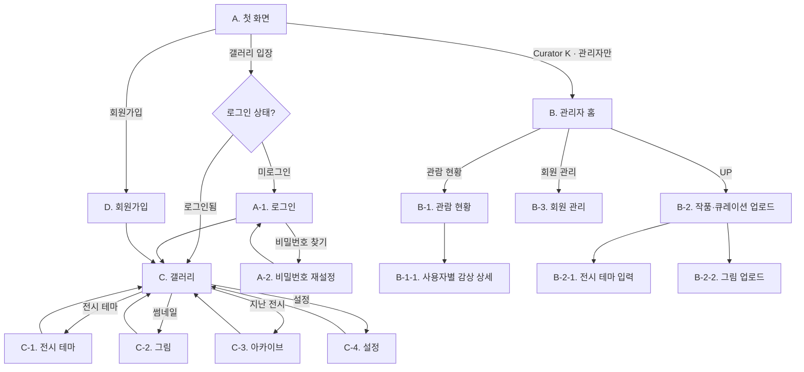
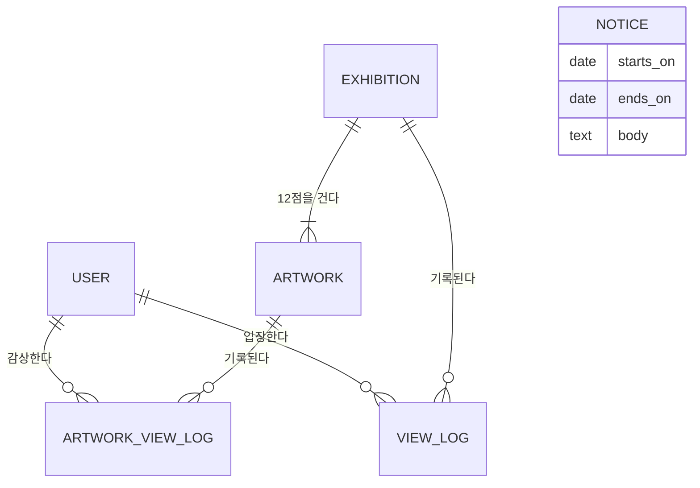

# 갤러리 K — 제품 요구사항 정의서 (PRD)

| | |
|---|---|
| **문서 버전** | v1.1 (인터뷰 반영) |
| **작성일** | 2026-08-27 |
| **작성자** | 큐레이터 K |
| **상태** | Draft |
| **근거 자료** | 갤러리 K 서비스 흐름 및 화면.pdf (화면 A / B / B-1 / B-2 / C / C-1 / C-2 / D) |

---

## 1. 제품 개요

### 1.1 한 줄 정의

> 매일 아침, 큐레이터가 고른 12점의 그림으로 열리는 **초대제 모바일 갤러리**.

### 1.2 기본 정보

| 항목 | 내용 |
|---|---|
| 제품명 | 갤러리 K (Morning Gallery K) |
| 형태 | 모바일 우선 웹앱 (PWA — 홈 화면 추가·웹 푸시·마지막 전시 캐시까지. 앱스토어 미등록) |
| 성격 | 비영리 · 비상업 · 폐쇄형(초대제) |
| 예상 규모 | 30~100명 내외의 가족·지인 |
| 운영 | 큐레이터 1인 (관리자 계정 1개) |

### 1.3 제품 원칙

이 다섯 가지는 이후 모든 기능 결정의 판단 기준이다.

1. **하루에 하나의 전시.** 무한 스크롤도, 추천 알고리즘도 없다. 끝이 있는 경험을 준다.
2. **고르게 하지 않는다.** 무엇을 볼지 선택하는 부담을 큐레이터가 대신 진다.
3. **세 번의 탭 안에.** 앱을 열고 첫 그림을 보기까지 최대 3번의 탭.
4. **그림이 주인공.** UI는 액자다. 액자가 그림보다 눈에 띄면 실패다.
5. **운영이 지속 가능해야 한다.** 큐레이터 1인이 하루 30분으로 굴릴 수 있어야 한다.

---

## 2. 타겟과 문제

### 2.1 타겟 사용자

#### Primary — 관람자 (초대받은 가족·지인)

**P1. 출근길 5분 · 김정민 (44세, 직장인)**
- 지하철에서 스마트폰을 보는 20분. 뉴스는 피로하고 SNS는 소모적이다.
- **원하는 것** — 짧고, 기분이 나아지고, 매일 새로울 것.
- **두려운 것** — 또 하나의 '해야 할 일'이 늘어나는 것.
- **설계 함의** — 60초 안에 가치를 주어야 한다. 밀린 것을 따라잡으라고 요구하지 않는다.

**P2. 아침의 습관 · 박영선 (68세, 은퇴)**
- 스마트폰 사용은 카카오톡, 유튜브, 사진 정도. 작은 글씨와 여러 단계 메뉴에 약하다.
- **원하는 것** — 매일 같은 자리에 있는 것, 실수해도 되돌아올 수 있는 것.
- **두려운 것** — 잘못 눌러 뭔가 사라지는 것, 모르는 사이 돈이 나가는 것.
- **설계 함의** — 큰 글씨, 넓은 터치 영역, 모든 화면에 '돌아가기'. 파괴적 동작 없음.

**P3. 더 알고 싶은 사람 · 이하늘 (29세, 디자이너)**
- 전시를 좋아하지만 실제로는 1년에 두세 번 간다.
- **원하는 것** — 그림의 맥락, 작가 이름을 자연스럽게 기억하게 되는 경험.
- **두려운 것** — 설명이 위키 복붙처럼 얕거나, 반대로 학술적이라 읽히지 않는 것.
- **설계 함의** — 설명은 짧되 '한 가지 볼거리'를 짚어준다. 원본 이미지 확대를 지원한다.

#### Secondary — 큐레이터 K (관리자)

- 매일의 전시를 기획·집필·업로드하는 **유일한 운영자**.
- **원하는 것** — 주말에 여러 날치를 미리 준비하기, 빠뜨린 날을 한눈에 보기, 반응 확인하기.
- **두려운 것** — 하루라도 빠지면 신뢰가 깨지는 것. 운영이 부담이 되어 스스로 그만두는 것.
- **설계 함의** — 관리자 화면의 1순위 정보는 '**어느 날이 비어 있는가**'다.

### 2.2 해결하려는 문제

| # | 문제 | 지금 벌어지는 일 | 이 제품이 바꾸는 것 |
|---|---|---|---|
| **PB-1** | **접근 비용** — 그림을 보려면 미술관에 가야 하고 시간·이동·비용이 든다 | 1년에 몇 번, 특별한 날에만 | 매일 아침, 손 안에서 |
| **PB-2** | **탐색 비용** — 온라인에 그림은 많지만 무엇을 볼지 고르는 일 자체가 노동이다 | 검색하다 지쳐 결국 안 봄 | 고르는 일을 큐레이터가 대신함 |
| **PB-3** | **감상의 편식** — 아는 작가, 유명한 그림만 반복해서 본다 | 모네·고흐·클림트에서 멈춤 | 매일 다른 테마·작가·화풍 12점 |
| **PB-4** | **맥락의 부재** — 그림을 봐도 무엇을 보고 있는지 모른다 | "예쁘다"에서 끝남 | 제목·작가·연도·설명을 함께 제공 |
| **PB-5** | **지속성의 부재** — 좋다고 느껴도 습관이 되지 않는다 | 한 번 보고 잊음 | 매일 같은 시각, 같은 자리에 |

> PB-5는 원본 기획서에 명시되지 않았지만, 앞의 네 문제를 다 풀어도 이것이 남으면 제품은 실패한다. 그래서 §6.12의 **매일 아침 알림**을 MVP 범위에 포함했다.

### 2.3 왜 폐쇄형인가

- **소셜 압박이 없다.** 좋아요 수, 팔로워, 남의 감상과 비교할 일이 없다. 순수하게 보는 경험만 남는다.
- **신뢰 관계가 큐레이션의 근거다.** "K가 골랐으니까"가 추천 알고리즘을 대신한다. 이는 공개 서비스가 흉내낼 수 없는 이 제품만의 자산이다.
- **비공개·비상업 범위**이므로 이미지 이용의 실무 리스크가 낮다. 다만 무위험은 아니다 — §9.4 참조.

### 2.4 Non-goals (v1에서 하지 않는 것)

명시적으로 하지 않는다. 나중에 논의하자는 뜻이 아니라, v1의 설계에서 **고려조차 하지 않는다**는 뜻이다.

- 과금 · 광고 · 결제
- 공개 배포 · 앱스토어 등록 · 검색엔진 노출
- 댓글 · 좋아요 · 공유 · 팔로우 등 소셜 기능
- 추천 알고리즘 · 개인화 피드
- 다국어 (한국어 전용)
- 다중 큐레이터 · 세분화된 권한 체계

---

## 3. 목표와 성공 지표

### 3.1 제품 목표

| ID | 목표 | 대응 문제 |
|---|---|---|
| **G1** | 관람자가 **매일 아침 그림을 보는 습관**을 갖게 한다 | PB-1, PB-5 |
| **G2** | 관람자가 **몰랐던 작가·화풍**을 만나고, 그것을 기억하게 한다 | PB-2, PB-3, PB-4 |
| **G3** | 큐레이터가 **부담 없이 오래** 운영할 수 있게 한다 | (운영 지속성) |

### 3.2 성공 지표

상업 서비스가 아니므로 규모(MAU, 매출)가 아닌 **참여의 깊이**로 측정한다.

**North Star Metric — 주간 감상률**

```
한 주에 3일 이상 갤러리에 입장한 회원 수 ÷ 전체 회원 수  ≥ 60%
(분모 = 차단·탈퇴를 제외한 전 회원)
```

**보조 지표**

| 지표 | 정의 | 목표 | 연결 목표 |
|---|---|---|---|
| 일 감상 그림 수 | 한 관람일에 연 그림 화면(C-2) 수 | ≥ 6 / 12 | G2 |
| 전시 테마 열람률 | 입장한 관람일 중 C-1을 연 비율 | ≥ 40% | G2 |
| 완주율 | 12점을 모두 연 관람일 비율 | ≥ 25% | G2 |
| D+7 재방문율 | 가입 7일 뒤에도 입장하는 회원 비율 | ≥ 70% | G1 |
| 알림 → 입장 전환율 | 아침 알림 발송 후 2시간 내 입장 비율 | ≥ 35% | G1 |
| **발행 빈도** | 최근 30일 중 새 전시가 발행된 날 수 (휴관 공지 기간은 분모에서 제외) | ≥ 20일 | G3 |
| **사전 준비 리드타임** | 오늘 기준 며칠 뒤까지 발행 준비가 되어 있나 | ≥ 3일 | G3 |

> 마지막 두 지표는 **큐레이터 지표**다. G3가 무너지면 나머지 지표는 측정할 대상 자체가 사라지므로, 관람자 지표와 동등한 비중으로 본다.

> **'발행 준수율'을 '발행 빈도'로 바꾼 이유** — 연장 규칙(§4.3)에서 미발행일은 실패가 아니라 정상 동작이다. 100%를 목표로 두면 하루 거를 때마다 지표가 실패로 기록되고, 그 압박이 곧 RISK-1이다. 대신 **30일 중 20일**이라는 현실적인 리듬을 목표로 삼는다. **연장 일수에는 상한을 두지 않는다** — 휴가처럼 긴 휴지기가 있을 수 있고, 그때는 휴관 공지(§6.1)로 알리고 마지막 전시를 그대로 건다. 공지된 휴관 기간은 이 지표의 분모에서 뺀다.

### 3.3 지표를 보지 않는 방식

관람자에게는 어떤 지표도 노출하지 않는다. 연속 출석일, 감상한 그림 수, 랭킹 같은 게임화 장치는 제품 원칙 4('그림이 주인공')와 충돌하므로 v1에서 배제한다.

---

## 4. 해결 방법

### 4.1 핵심 경험

> 아침에 알림이 온다 → 앱을 연다 → 오늘의 전시 제목과 12점의 썸네일이 보인다 → 마음에 드는 것을 누른다 → 그림과 설명을 읽는다 → 다음으로 넘긴다 → **끝난다**

**60초 안에 최소 1점, 5분 안에 12점**을 볼 수 있어야 한다. '끝난다'는 것이 이 제품의 핵심 가치다.

### 4.2 화면 지도



굵게 표시된 것 중 **A-1, A-2, C-3, C-4, B-1-1, B-2-1, B-2-2, B-3**은 원본 흐름도에 없거나 암시만 되어 있던 화면으로, 이 PRD에서 새로 정의했다.

### 4.3 전시 발행 및 연장 규칙

이 제품의 시간 축은 두 개다. 둘을 분리하는 것이 이 절의 전부다.

| 용어 | 정의 |
|---|---|
| **발행일** (exhibition date) | 큐레이터가 그 전시를 건 날짜. 전시에 영구히 귀속된다 |
| **관람일** (viewing date) | 관람자가 보고 있는 오늘 |
| **연장** (carry-over) | 발행일 < 관람일인 상태. 오늘 새 전시가 없어 직전 전시가 그대로 걸려 있다 |

#### 규칙 1 — 관람자는 언제나 '가장 최근에 발행된 전시'를 본다

```sql
SELECT * FROM exhibition
WHERE is_published = true AND date <= TODAY
ORDER BY date DESC
LIMIT 1
```

관람자 화면에 '빈 날'은 존재하지 않는다. 큐레이터가 올리지 못한 날에는 **직전 전시가 자동으로 연장**된다. 별도의 연장 처리도, 관리자의 조작도 필요 없다 — 위 한 줄의 질의가 스킵과 연장을 모두 표현한다.

#### 규칙 2 — 올리지 못한 날은 스킵된다. 밀리지 않는다

미발행일은 그대로 지나간다. 8월 31일을 올리지 못했다고 해서 9월 1일에 '8월 31일 전시'를 올리는 일은 없다. **다음 발행은 언제나 그날 날짜로 한다.** 연속으로 며칠을 못 올려도 마찬가지다.

#### 규칙 3 — 알림은 새 전시가 발행된 날에만

연장된 날에는 알림을 보내지 않는다. 어제 본 것과 같은 전시로 다시 부르지 않기 위해서다 (§6.12).

#### 동작 예시

큐레이터가 8/29, 8/30, 9/01, 9/03, 9/06에 올린 경우:

| 관람일 | 큐레이터 | 발행 상태 | 관람자가 보는 전시 | 아침 알림 |
|---|---|---|---|---|
| 08.29 토 | 업로드 | 발행 | 08.29 전시 | 발송 |
| 08.30 일 | 업로드 | 발행 | 08.30 전시 | 발송 |
| 08.31 월 | — | **연장** | **08.30 전시** | — |
| 09.01 화 | 업로드 | 발행 | 09.01 전시 | 발송 |
| 09.02 수 | — | **연장** | **09.01 전시** | — |
| 09.03 목 | 업로드 | 발행 | 09.03 전시 | 발송 |
| 09.04 금 | — | **연장** | **09.03 전시** | — |
| 09.05 토 | — | **연장 (2일째)** | **09.03 전시** | — · 큐레이터에게 알림 |
| 09.06 일 | 업로드 | 발행 | 09.06 전시 | 발송 |

#### 관람자에게 이 사실을 어떻게 드러내는가

숨기지도, 사과하지도 않는다. C 화면 상단에 **관람일(오늘 날짜)을 그대로** 두고 (원본 사양 유지), 전시 제목 아래에 **발행일을 작게 병기**한다.

> 2026. 08. 31. 월
> **빛을 등진 사람들**
> <sub>8월 30일의 전시</sub>

어제 본 사람은 같은 전시임을 알아채고, 처음 온 사람은 그냥 오늘의 전시로 받아들인다. `오늘의 전시는 준비 중입니다` 같은 사과 문구를 두지 않는다 — **관람자에게는 아무 문제도 일어나지 않았기 때문이다.**

#### 백필(과거 날짜 신규 발행)은 막는다

이미 지나간 미발행일에 전시를 **새 발행일로 세우는 것**은 허용하지 않는다. 아무도 그날 그 전시를 본 적이 없는데 아카이브에만 나중에 나타나면, 목록의 시간 순서가 관람자의 기억과 어긋난다. **이미 발행된 전시의 내용 수정은 계속 허용**한다 (§6.9).

다만 **미완성 작업물은 버리지 않는다.** 8월 31일에 11점까지 올려두고 자정을 넘겼다면, 그 원고와 이미지를 **오늘 날짜로 옮겨** 이어서 완성할 수 있다. 막는 것은 '과거 날짜에 새 전시가 생기는 것'이지 '어제 쓴 글을 오늘 쓰는 것'이 아니다. 12점 × 설명은 하루치 노동이고, 그것이 자정 한 번으로 잠기면 그 자체가 RISK-1이다.

> 이 결정은 되돌릴 수 있다. 백필을 허용하기로 한다면 아카이브 정렬을 발행일이 아닌 **작성 시각** 기준으로 바꾸면 된다.

### 4.4 원본 흐름도에서 확장한 지점

업로드된 흐름도의 8개 화면을 실제 동작하는 서비스로 만들기 위해, 반드시 채워야 하는 공백을 아래와 같이 식별하고 결정했다.

| # | 원본의 공백 | 이 PRD의 결정 | 참조 |
|---|---|---|---|
| **GAP-1** | 로그인이 A 화면 안에 문장으로만 암시됨 | **A-1 로그인**을 독립 화면으로 분리 | §6.2 |
| **GAP-2** | 비밀번호를 잊었을 때의 경로 없음 | **A-2 비밀번호 재설정** (SMS 인증) 추가 | §6.3 |
| **GAP-3** | '폐쇄형'이라 했으나 가입을 통제할 수단이 없음 | **URL 자체가 초대장.** 코드 대신 **가입 잠금 + 사후 차단**으로 통제 | §6.4 |
| **GAP-4** | 오늘 전시가 아직 발행되지 않은 경우의 화면 정의 없음 | **직전 전시를 자동 연장.** 관람자에게 빈 날은 존재하지 않는다 | §4.3 |
| **GAP-5** | 지난 전시를 볼 방법이 없음 — 하루 놓치면 영원히 못 봄 | **C-3 지난 전시 아카이브** 추가 (최근 30일) | §6.8 |
| **GAP-6** | 12점 중 일부만 올라간 부분 상태의 노출 정책 없음 | **12점 전부 + 테마가 채워져야 발행.** 부분 상태는 관람자에게 미노출 | §6.5 |
| **GAP-7** | 관리자 목록이 당일~미래 6일뿐. 과거 전시 수정 경로 없음 | B 화면에 **과거 날짜 무한 스크롤** 허용, 수정 가능 | §6.9 |
| **GAP-8** | 매일 열게 만드는 장치가 전혀 없음 | **매일 아침 알림** — MVP 범위 | §6.12 |
| **GAP-9** | 이미지 최적화 정책 없음. 12장 고해상도는 모바일 데이터에 부담 | 썸네일 / 디스플레이 / 원본 **3단 리사이즈** | §8.2 |
| **GAP-10** | 그림 설명 50자 제한이 지나치게 짧음 (한 문장도 어려움) | 설명 **300자**로 확대, 40자 이상 권장 | §7.2 |
| **GAP-11** | '갤러리 입장 회수'의 정의가 모호 | **입장 = 하루 1회 카운트(UV)**. 그림 열람 수는 별도 기록 | §7.2 |
| **GAP-12** | 작품 출처·소장처 필드 없음 | Artwork에 **소장처 / 출처 URL** 선택 필드 추가 | §7.2 |
| **GAP-13** | 시니어 사용자(P2) 대응 없음 | **큰 글씨 모드** 제공, 본문 최소 17px, 터치 영역 48px | §8.3 |
| **GAP-14** | 세션 유지 정책 없음 | **90일 자동 로그인.** 매번 로그인시키지 않는다 | §6.2 |
| **GAP-15** | 원본 B-2 주석 오탈자 — "되지 않은 경우 Y 표시" | **N 표시**로 정정 | §6.10 |
| **GAP-16** | B는 7일치 목록, B-1은 7일/10일이 혼재 | **모두 최근 7일 기준**으로 통일, 사용자 상세만 30일 | §6.9 |
| **GAP-17** | 큐레이터가 하루 못 올렸을 때의 처리 규칙이 없음 | **미발행일은 스킵.** 직전 전시를 연장하고 백필은 막는다. 연장 일수에 상한은 없다 | §4.3 |
| **GAP-18** | 장기간 쉬어야 할 때(휴가 등) 관람자에게 알릴 방법이 없음 | **휴관 공지** — 기간을 지정해 A 첫 화면에 건다 | §6.1 |
| **GAP-19** | 알림·큰 글씨·탈퇴를 관람자가 조작할 화면이 없음 | **C-4 설정** 추가 | §6.13 |
| **GAP-20** | 가입 잠금·차단·대행 가입을 조작할 화면이 없음 | **B-3 회원 관리** 추가 | §6.14 |

### 4.5 기능 범위

| 기능 | MVP | v1.1 | v1.2 |
|---|:---:|:---:|:---:|
| URL 기반 회원가입 + 가입 잠금 | ● | | |
| 전화번호 + 비밀번호 로그인 / 90일 세션 | ● | | |
| 오늘의 전시 (12점 그리드 + 테마) | ● | | |
| 미발행일 자동 연장 — 전시 스킵 규칙 | ● | | |
| 그림 상세 (제목·작가·연도·설명·확대) | ● | | |
| 관리자 — 날짜 목록 및 발행 상태 | ● | | |
| 관리자 — 전시 테마 및 그림 업로드 | ● | | |
| 매일 아침 알림 | ● | | |
| 지난 전시 아카이브 (30일) | ● | | |
| 관람자 설정 (알림 시각·해제, 탈퇴) | ● | | |
| 관리자 — 회원 관리 (가입 잠금·차단·대행 가입) | ● | | |
| 휴관 공지 (기간 지정) | ● | | |
| 전시 숨김 | ● | | |
| 관리자 홈 요약 숫자 (오늘·이번 주 입장자) | ● | | |
| 관람 현황 대시보드 | | ● | |
| 사용자별 감상 상세 조회 | | ● | |
| 비밀번호 재설정 (SMS) | | ● | |
| 큰 글씨 모드 | | ● | |
| 카카오 로그인 연동 | | | ● |
| 예약 발행 (발행 시각 지정) | | | ● |
| 작가별 · 테마별 다시 보기 | | | ● |

MVP에 **알림과 아카이브를 포함**한 이유: 알림 없이는 G1(습관)이 성립하지 않고, 아카이브 없이는 하루 놓친 사용자가 그대로 이탈한다. 둘 다 '나중에'로 미루면 초기 이탈률을 회복할 수 없다.

관람 현황(B-1)을 v1.1로 미룬 이유: 회원 수십 명 규모에서는 초기 몇 주간 데이터가 쌓이기 전까지 의사결정에 쓰이지 않는다. 로그 **수집은 MVP부터** 하고, 화면만 뒤로 미룬다. 다만 §10 M3의 확대 판단에는 숫자가 필요하므로, **오늘·이번 주 입장자 수 정도의 요약만 B 관리자 홈 상단에** MVP로 둔다.

**예약 발행이 v1.2인 것과 미리 채워두는 것은 다른 이야기다.** 미래 날짜 칸에 12점과 테마를 미리 채우는 것은 MVP 범위이고, 그 날짜가 되면 자동으로 걸린다(§4.3). v1.2의 예약 발행은 '자정이 아닌 지정 시각에 공개'를 뜻한다.

---

## 5. 고객 여정

### 5.1 관람자 여정

| 단계 | 접점 | 사용자가 하는 일 | 느끼는 것 | 이탈 위험 | 제품의 대응 |
|---|---|---|---|---|---|
| **1. 초대** | 카카오톡 메시지 | K가 개인적으로 보낸 서비스 URL을 받는다 | "이게 뭐지? 광고인가?" | 링크를 안 누름 | 링크 미리보기에 전시 제목과 **고정 대표 이미지**(미술관 정문) 노출. 작품 이미지는 미리보기에도 쓰지 않는다(§8.4). 발신자가 아는 사람이라는 점이 유일한 신뢰 근거 |
| **2. 첫 방문** | A. 첫 화면 | 미술관 정문 이미지와 오늘 날짜를 본다 | "조용하고 단정하네" | 가입 요구에 부담 | 가입 전에도 **오늘의 전시 제목**을 보여준다. 무엇을 얻는지 먼저 보여주고 가입을 요구한다 |
| **3. 가입** | D. 회원가입 | 전화번호, 비밀번호, 이름을 입력 | "정보를 얼마나 달라는 거지?" | 입력 항목이 많으면 이탈 | 필수 3개만. 이메일·생년월일·주소 받지 않는다. 소요 시간 60초 목표 |
| **4. 첫 감상** | C → C-2 | 12개 썸네일 중 하나를 누른다 | "생각보다 좋다" | 로딩이 느리면 이탈 | 썸네일 지연 로딩 + 흐린 플레이스홀더. LCP 2.5초 이내 |
| **5. 첫 완주** | C-2 스와이프 | 그림 사이를 좌우로 넘긴다 | "12개면 부담 없네" | 뒤로가기로 매번 목록에 돌아가야 하면 지침 | 그림 화면에서 **좌우 스와이프로 다음 그림** 이동. 목록으로 돌아갈 필요 없음 |
| **6. 재방문** | 아침 알림 | 알림을 보고 앱을 연다 | "오늘은 뭘까" | 알림이 성가시면 차단 | 하루 1회, 발송 시각 사용자 선택. 알림 문구에 **오늘의 전시 제목**을 담아 궁금하게 만든다 |
| **7. 습관화** | 7일차 | 알림 없이도 스스로 연다 | "아침에 보는 거" | 하루 놓치면 흐름이 끊김 | **밀린 것을 따라잡으라고 하지 않는다.** 아카이브는 조용히 존재할 뿐 강요하지 않는다 |
| **8. 이탈 · 복귀** | 14일 미접속 | 다시 열어본다 | "오랜만이네, 민망한가?" | 죄책감을 주면 영영 이탈 | 연속 출석 카운터를 두지 않는 이유가 여기 있다. 복귀 시에도 화면은 평소와 똑같다 |

#### 여정의 핵심 전환점

- **2 → 3 (가입)** — 가장 큰 이탈 지점. 가입 전 오늘의 전시 제목 노출이 유일한 설득 수단이다.
- **5 → 6 (재방문)** — 알림이 없으면 사실상 여기서 끝난다. GAP-8을 MVP에 넣은 이유.
- **7 → 8 (복귀)** — 게임화된 서비스가 사용자를 잃는 지점. 이 제품은 **의도적으로 아무 압박도 주지 않는다.**

### 5.2 시니어 관람자(P2)의 여정 차이

| 단계 | 일반과 다른 점 | 대응 |
|---|---|---|
| 가입 | 비밀번호를 만들고 기억하는 것 자체가 장벽 | 숫자 6자리 허용 검토(v1.2). MVP에서는 **B-3 회원 관리에서 K가 계정을 직접 만들어** 전달한다 (§6.14) |
| 로그인 | 매번 로그인하면 그때마다 이탈 | 90일 자동 로그인 (GAP-14). 실질적으로 한 번만 로그인 |
| 탐색 | 썸네일 12개 그리드가 작게 느껴짐 | 큰 글씨 모드에서 그리드를 3열 → **2열**로 전환 |
| 그림 감상 | 확대 제스처(핀치 줌)를 모를 수 있음 | 그림 화면에 **명시적인 '크게 보기' 버튼**을 함께 제공 |
| 되돌아가기 | 브라우저 뒤로가기를 쓰지 않음 | 모든 화면 하단에 **텍스트 링크 형태의 명시적 되돌아가기** (원본 흐름도의 '첫 화면으로' 패턴 유지) |

### 5.3 큐레이터(관리자) 여정

| 단계 | 시점 | 하는 일 | 어려운 점 | 제품의 대응 |
|---|---|---|---|---|
| **1. 기획** | 주말, 한 번에 | 다음 주 7일치 테마를 정하고 그림을 모은다 | 어느 날이 비었는지 헷갈림 | B 화면 3열의 **Y/N 표시**가 이 문제만을 위해 존재한다 |
| **2. 집필** | 기획과 함께 | 전시 제목·테마·그림별 설명을 쓴다 | 12개 × 설명은 분량이 많음 | 자동 임시저장. 화면을 벗어나도 입력 내용 보존 |
| **3. 업로드** | 날짜별 | 이미지 12장을 올린다 | 한 장씩 올리면 지루함 | **다중 선택 업로드** 지원. 12칸에 순서대로 채워짐 |
| **4. 검수** | 발행 전 | 관람자에게 어떻게 보일지 확인 | 실제 화면을 볼 방법이 없음 | B-2에 **미리보기** 제공 — 관람자의 C 화면과 동일하게 렌더 |
| **5. 발행** | 자정 | 날짜가 바뀌면 자동 공개 | 못 올린 날이 생김 | 12점 + 테마가 다 차면 그 날짜가 **자동으로 Y**가 되고, 미래 날짜라면 그날 자정에 저절로 걸린다. 못 올린 날은 **직전 전시가 자동 연장**되므로 관람자 쪽에 빈 날이 생기지 않는다 (§4.3). 연장이 2일 연속되면 알림 1회 |
| **6. 반응 확인** | 며칠 뒤 | 사람들이 봤는지 확인한다 | 반응이 안 보이면 동기가 떨어짐 | B-1 관람 현황 (v1.1). **G3 지속성을 지탱하는 유일한 보상 장치** |

> 6단계는 기능적으로는 없어도 서비스가 돌아가지만, **큐레이터가 그만두지 않게 하는 장치**다. 비상업 서비스에서 운영자의 동기는 최우선 리스크다(§9.4 RISK-1).

---

## 6. 화면별 기능 명세

각 화면은 **목적 / 진입 경로 / 화면 구성 / 기능 상세 / 상태와 예외 / 나가는 길** 순으로 기술한다.
`[신규]` 표시는 원본 흐름도에 없던 화면이다.

### 6.1 A. 첫 화면

**목적** — 서비스의 인상을 정하고, 회원은 갤러리로, 비회원은 가입으로 보낸다.
**진입 경로** — 서비스 URL 접속 시 최초 화면. 모든 화면의 '첫 화면으로'.

**화면 구성** (위 → 아래)

| 요소 | 내용 | 비고 |
|---|---|---|
| Curator K | 우측 상단 텍스트 링크 | **관리자에게만 노출.** 원본은 '관리자가 아니면 아무 변화 없음'이었으나, 보이지 않는 것이 더 낫다 (GAP 정정) |
| 날짜 | `2026. 08. 27. 목` | 접속 시점의 날짜와 요일. KST 기준 |
| 로고 | Morning Gallery K | |
| 오늘의 전시 제목 | 발행된 전시의 제목 | **비회원에게도 노출.** 가입 설득의 핵심 |
| 휴관 공지 | 큐레이터가 쓴 안내 문구 | 지정한 기간에만 노출 (GAP-18). 아래 참조 |
| 메인 이미지 | 미술관 정문 이미지 | 고정 이미지. v1.2에서 오늘의 대표작으로 교체 검토 |
| 갤러리 입장 | 기본 버튼 | |
| 회원가입 | 하단 텍스트 링크 | |

**기능 상세**
- `갤러리 입장` — 로그인 상태면 **C. 갤러리**로, 아니면 **A-1. 로그인**으로. 원본 흐름도의 "회원가입한 이용자인가?" 분기를 세션 유무로 구현한다.
- `Curator K` — 관리자 계정으로 로그인한 경우에만 렌더한다. 클릭 시 **B. 관리자 홈**.
- 날짜는 서버 시각(KST)을 신뢰한다. 단말 시계를 신뢰하지 않는다.
- **모든 진입은 이 화면을 거친다.** 아침 알림을 눌렀을 때도 여기로 온다 — 그래야 휴관 공지처럼 첫 화면에만 있는 것을 누구도 놓치지 않는다.

**휴관 공지** (GAP-18) — 며칠 이상 쉬어야 할 때 큐레이터가 **시작일·종료일과 문구를 미리 지정**해두면, 그 기간에만 전시 제목 아래에 조용히 뜨고 기간이 끝나면 저절로 사라진다. 떠나기 전에 예약해둘 수 있고 돌아와서 끄는 것을 잊을 일이 없다. 공지 아래에는 `지난 전시 보기` 링크를 함께 둔다 — 재촉이 아니라, 같은 전시가 오래 걸려 있는 동안 갈 곳을 하나 열어두는 것이다. 공지 중에도 마지막 전시는 그대로 걸려 있고, 갤러리는 평소와 똑같이 동작한다.

**상태와 예외**

| 상태 | 화면 |
|---|---|
| 오늘 전시 미발행 | 연장된 전시의 제목을 그대로 표시한다. 첫 화면에는 발행일을 병기하지 않는다 (§4.3) |
| 휴관 공지 기간 | 전시 제목 아래에 공지 문구와 `지난 전시 보기`를 함께 표시한다 |
| 발행 이력 없음 (개관 전) | 전시 제목 자리에 `첫 전시를 준비하고 있습니다` |
| 네트워크 오류 | 정문 이미지와 버튼은 유지, 전시 제목만 생략. 화면 자체는 항상 뜬다 |

**나가는 길** — C. 갤러리 / A-1. 로그인 / D. 회원가입 / B. 관리자 홈 / C-3. 지난 전시(휴관 공지 중)

---

### 6.2 A-1. 로그인 `[신규 · GAP-1]`

**목적** — 기존 회원을 인증한다.
**진입 경로** — A 첫 화면에서 `갤러리 입장`을 눌렀고 유효한 세션이 없을 때.

**화면 구성** — 전화번호(ID) 입력 · 비밀번호 입력 · `입장` 버튼 · `비밀번호를 잊으셨나요?` 링크 · `첫 화면으로`

**기능 상세**
- 전화번호는 숫자만 입력받고 자동으로 하이픈을 넣는다. 입력 시 숫자 키패드를 띄운다 (`inputmode="numeric"`).
- 로그인 성공 시 **90일 유효 세션**을 발급한다 (GAP-14). 자동 로그인 체크박스를 두지 않고 **기본 동작**으로 삼는다 — 시니어 사용자가 체크박스를 놓치면 매번 로그인해야 하기 때문이다.
- 로그인 직후 **C. 갤러리**로 직행한다. 첫 화면으로 되돌리지 않는다.

**상태와 예외**

| 상태 | 처리 |
|---|---|
| 비밀번호 불일치 | `전화번호 또는 비밀번호가 맞지 않습니다` — 어느 쪽이 틀렸는지 알려주지 않는다 |
| 미가입 번호 | 동일 문구 (계정 존재 여부를 노출하지 않는다) |
| 5회 연속 실패 | 10분간 해당 번호 로그인 차단 |

**나가는 길** — C. 갤러리 / A-2. 비밀번호 재설정 / A. 첫 화면

---

### 6.3 A-2. 비밀번호 재설정 `[신규 · GAP-2]` *(v1.1)*

**목적** — 비밀번호를 잊은 회원이 스스로 복구한다.
**진입 경로** — A-1에서 `비밀번호를 잊으셨나요?`

**흐름** — 전화번호 입력 → SMS 인증번호 6자리 발송 → 인증번호 입력 → 새 비밀번호 설정 → A-1으로

**기능 상세**
- 인증번호 유효시간 **3분**, 재발송은 60초 후부터 가능.
- 미가입 번호여도 "인증번호를 보냈습니다"로 동일 응답한다. 실제 발송은 하지 않는다.
- MVP 기간에는 이 화면 대신 **큐레이터가 직접 비밀번호를 초기화**해주는 것으로 대체한다. 수십 명 규모에서는 SMS 연동 비용이 정당화되지 않는다.

---

### 6.4 D. 회원가입

**목적** — 초대받은 사람만 회원이 되게 한다.
**진입 경로** — A 첫 화면 하단 `회원가입`. 서비스 URL은 큐레이터가 개별적으로 전달한다.

**화면 구성** — `'갤러리 K'는` 제목 · 서비스 취지 설명 본문 · `회원 가입` 버튼 · `첫 화면으로`

**서비스 취지 (본문에 실제로 들어갈 문구 초안)**

> 갤러리 K는 매일 아침 12점의 그림이 걸리는 작은 미술관입니다.
> 전시는 매일 바뀌고, 하나의 테마로 묶입니다.
> 무엇을 볼지 고르실 필요는 없습니다. 그저 오시면 됩니다.
> 초대받은 분들만 입장하실 수 있고, 광고도 비용도 없습니다.

**기능 상세 — 가입 절차** (GAP-3)

1. **필수 정보 입력** — 모바일 전화번호(ID) · 비밀번호 · 이름. **이 셋 외에는 받지 않는다.**
2. **약관 동의** — 서비스 이용 및 개인정보 처리 동의 1건. 비상업 서비스이므로 항목을 최소화한다.
3. **가입 완료** → 자동 로그인 → **C. 갤러리**로 직행.

가입 완료 시점에 **아침 알림 권한을 한 번 묻는다.** 알림은 G1(습관)의 유일한 장치이므로(§5.1 5→6) 가장 확실하게 물을 수 있는 지점에서 묻는다. iOS는 **홈 화면에 추가한 뒤에만** 웹 푸시가 동작하므로, iOS로 가입한 사람에게는 권한을 묻기 전에 `홈 화면에 추가하면 매일 아침 알려드립니다`를 그림으로 안내한다. 홈 화면 아이콘은 P2가 원하는 '매일 같은 자리'이기도 하다.

**가입 통제 — URL이 곧 초대장** (GAP-3)

서비스 URL은 **모두에게 동일한 하나**이고, 큐레이터가 아는 사람에게 개별적으로 전달한다. **URL을 아는 것 자체가 초대**이므로 초대 코드도, 1인용 초대 링크도 두지 않는다. 누가 흘렸는지 추적할 수 없다는 뜻이기도 하다 — 그 대가로 마찰이 0이 된다. 코드는 사전 장벽을 하나 더 세우는데, 그 장벽에 가장 크게 걸리는 사람이 정작 이 서비스의 핵심 대상인 시니어(P2)다.

대신 통제를 **사전 차단에서 사후 통제로** 옮긴다.

| 장치 | 동작 |
|---|---|
| **가입 잠금** | B-3의 스위치 하나로 신규 가입을 닫는다. 지인들이 다 들어온 뒤에는 잠가둔다 |
| **가입 알림** | 누군가 가입하면 큐레이터에게 알림이 간다. 모르는 사람이면 즉시 알 수 있다 |
| **회원 차단** | B-3에서 회원 목록을 보고 개별 차단한다. 차단은 **로그인 시점에** 작동하므로, 이미 로그인해 둔 사람은 90일 세션이 만료될 때까지 볼 수 있다. 즉시 끊어내는 수단은 아니다 |
| **검색 비노출** | `noindex` + `robots.txt` 차단. URL이 검색으로 발견되지 않게 한다 (§8.4) |
| **추측 불가 URL** | 도메인 뒤에 짧은 무작위 경로를 붙이는 것을 권장한다 |

> **왜 이 편이 나은가** — 사전 코드는 초대받은 사람 전원에게 마찰을 주고 정작 URL이 유출되면 무력하다. 사후 통제는 마찰이 0이면서 실제 사고가 났을 때 대응할 수 있다. 수십 명 규모에서는 이쪽이 명백히 유리하다.

**카카오 연동에 대한 결정** — 원본 흐름도는 "카카오 연계 회원가입"과 "전화번호(ID)+비번"을 함께 적고 있어 두 방식이 병존한다. 계정 병합 문제를 피하기 위해 **MVP는 전화번호+비밀번호 단일 방식**으로 간다. 카카오 로그인은 v1.2에서 **기존 계정에 연결하는 부가 수단**으로 추가한다.

**상태와 예외**

| 상태 | 처리 |
|---|---|
| 이미 가입된 번호 | `이미 가입된 번호입니다` + A-1 로그인 링크 |
| 가입이 잠긴 상태 | `지금은 새로운 회원을 받고 있지 않습니다` |
| 차단된 회원의 로그인 | A-1에서 일반 실패와 동일한 문구. 차단 사실을 알려주지 않는다 |
| 비밀번호 규칙 미달 | 8자 이상. 실시간 안내, 제출 후 통보하지 않는다 |

---

### 6.5 C. 갤러리 화면

**목적** — 오늘의 전시 전체를 한 화면에 보여준다. 이 제품의 중심 화면.
**진입 경로** — A에서 `갤러리 입장`, 로그인 직후, 하위 화면의 `갤러리 화면으로`.

**화면 구성**

| 요소 | 내용 |
|---|---|
| 날짜 | `2026. 08. 29. 토` — 당일 날짜와 요일 |
| 전시 테마 | 전시 **제목**을 표시하는 링크. 누르면 C-1 |
| 그림 그리드 | 3열 × 4행 = 12개 썸네일 |
| 지난 전시 | 하단 링크 → C-3 |
| 설정 | 하단 링크 → C-4 |
| 첫 화면으로 | 하단 링크 → A |

> 원본 흐름도의 `업로드 현황` 레이블은 관리자 화면(B-2)의 용어가 관람자 화면에 잘못 넘어온 것으로 보인다. 관람자에게는 노출하지 않는다.

**기능 상세**
- 썸네일은 정사각 크롭. 원본 비율은 C-2에서 보여준다.
- 각 썸네일 하단에 **작가명만** 작게 표기한다. 제목까지 넣으면 그리드가 텍스트로 가득 차 그림이 죽는다(제품 원칙 4).
- 이미 열어본 그림은 **아주 옅은 표식**으로 구분한다. 기준은 **관람일이 아니라 전시**다 — 어제 연장된 같은 전시에서 8점을 봤다면 오늘도 그 8점이 표식을 달고 있다. 어디까지 봤는지 알 수 있되, 안 본 것을 재촉하지 않는다.
- 썸네일은 지연 로딩하고, 로딩 중에는 저해상도 블러 플레이스홀더를 보여준다.

**표시하는 전시** (GAP-4, GAP-17) — 이 화면은 '오늘의 전시'가 아니라 **가장 최근에 발행된 전시**를 연다 (§4.3 규칙 1). 상단 날짜는 오늘 날짜를 그대로 두고, 전시 제목 아래에 발행일을 작게 병기한다.

| 상태 | 화면 |
|---|---|
| **오늘 발행됨** | 정상 12점 그리드. 발행일 병기 없음 |
| **연장 중** (오늘 미발행) | 직전 전시의 12점 그리드 + 제목 아래 `8월 30일의 전시`. **사과 문구도, 빈 그리드도 없다** |
| **부분 업로드** (12점 미만) | 발행으로 치지 않는다. 직전 전시가 계속 연장된다 (GAP-6). 단 **한 번 발행된 전시는 수정 중 12점이 깨져도 내려가지 않는다** (§7.2) |
| **발행 이력 없음** (개관 전) | `첫 전시를 준비하고 있습니다`. 서비스 최초 시작 전에만 나타난다 |
| 네트워크 오류 | 마지막으로 본 전시를 캐시에서 표시하고 상단에 재시도 안내 |

**입장 로그** (GAP-11) — 이 화면 진입 시 `ViewLog`에 기록한다. **입장 회수는 관람일 기준 하루 1회만 카운트**한다(UV 기준). 연장 중이어서 같은 전시를 이틀에 걸쳐 봐도 관람일이 다르므로 각각 1회로 센다 — 지표가 재는 것은 '전시를 몇 번 열었나'가 아니라 '며칠이나 들어왔나'이기 때문이다. **아카이브(C-3)로 지난 전시를 연 것도 같은 입장으로 센다.** 오늘치냐 지난치냐를 구분하지 않는다 — 지표가 묻는 것은 그날 갤러리에 왔느냐이고, 놓친 날을 아카이브로 따라잡은 사람도 온 사람이다.

**나가는 길** — C-1 / C-2 / C-3 / C-4 / A

---

### 6.6 C-1. 전시 테마 화면

**목적** — 오늘 12점이 왜 함께 걸렸는지 설명한다.
**진입 경로** — C 화면의 `전시 테마` 링크.

**화면 구성** — 날짜 · **전시 제목** · 전시 테마 본문 · `갤러리 화면으로`

**기능 상세**
- 전시 제목 20자 이내, 테마 본문 500자 이내 (원본 사양 유지).
- 본문은 줄바꿈을 보존한다. 문단 구분이 읽는 리듬을 만든다.
- 본문 하단에 **오늘의 작가 목록**(중복 제거)을 조용히 덧붙인다. 12점을 다 보지 않아도 오늘의 폭을 가늠할 수 있다.

**나가는 길** — C. 갤러리

---

### 6.7 C-2. 그림 화면

**목적** — 한 점의 그림을 제대로 보고, 그것에 대해 알게 한다.
**진입 경로** — C 화면의 썸네일. 또는 다른 그림 화면에서 좌우 스와이프.

**화면 구성** (위 → 아래)

| 요소 | 내용 |
|---|---|
| 그림 제목 | 20자 이내 |
| 작가, 연도 | `요하네스 페르메이르, 1665년경` |
| 설명 | 큐레이터가 쓴 작품 설명 (최대 300자, GAP-10) |
| 그림 | 원본 비율 유지. 누르면 전체 화면 |
| 위치 표시 | `3 / 12` |
| 갤러리 화면으로 | 하단 링크 |

**기능 상세**
- **좌우 스와이프로 이전·다음 그림**으로 이동한다. 원본 흐름도에는 매번 갤러리 화면으로 돌아가는 흐름만 있으나, 12점을 보려면 23번의 탭이 필요해진다. 스와이프로 12번이 된다.
- 그림을 누르면 **전체 화면 뷰어** — 검은 배경, UI 제거, 핀치 줌·더블탭 확대, 아래로 스와이프하여 닫기.
- 시니어 대응으로 그림 우하단에 **`크게 보기` 버튼**을 함께 둔다 (§5.2).
- 소장처·출처가 입력된 경우 설명 아래 작은 글씨로 표기한다 (GAP-12).
- 이미지를 길게 눌러 저장하는 브라우저 기본 동작을 **막지 않는다.** 퍼블릭 도메인 작품이 원칙이고(§9.4 RISK-3), 마음에 든 그림을 간직하는 것은 감상의 일부다. §2.4가 Non-goal로 둔 '공유'는 제품이 공유 기능을 만들지 않는다는 뜻이지 브라우저를 막겠다는 뜻이 아니다.
- 이 화면 진입 시 `ArtworkViewLog`를 기록한다. 3.2의 '일 감상 그림 수'의 근거 데이터다.

**상태와 예외** — 이미지 로딩 실패 시 제목·작가·설명은 그대로 두고 이미지 영역에만 재시도 버튼을 둔다. **텍스트는 반드시 살린다.**

**나가는 길** — 이전/다음 그림 · 전체 화면 뷰어 · C. 갤러리

---

### 6.8 C-3. 지난 전시 `[신규 · GAP-5]`

**목적** — 놓친 날의 전시를 볼 수 있게 한다. 하루 결석이 곧 이탈이 되지 않게 하는 안전망.
**진입 경로** — C 화면 하단 `지난 전시`.

**화면 구성** — **최근 30개 전시**를 발행일 최신순 목록으로. 각 행은 발행일 · 전시 제목 · 대표 이미지 썸네일 · 감상 여부 표식.

**기능 상세**
- 목록의 단위는 **날짜가 아니라 전시**다. 발행이 뜸한 시기에도 목록이 비지 않도록 "지난 30일"이 아닌 "최근 30개"로 센다 (GAP-17).
- 연장된 날은 목록에 별도 행으로 나타나지 않는다. 그 전시는 이미 자기 발행일에 한 번 있기 때문이다. **숨긴 전시**(§6.9)도 나타나지 않는다.
- 행을 누르면 **그 날짜의 C. 갤러리 화면**을 연다. 상단에 `지난 전시를 보고 있습니다` 안내와 오늘로 돌아가는 링크를 둔다. 이때의 입장도 그날의 입장으로 센다 (§6.5).
- 30번째보다 오래된 전시는 조회하지 않는다 (v1.2에서 작가별·테마별 다시 보기로 확장).
- **알림이나 배지로 재촉하지 않는다.** 조용히 존재만 한다 (§5.1 8단계).

---

### 6.9 B. 관리자 화면

**목적** — 어느 날짜가 비어 있는지 한눈에 보여주고, 그 날짜의 업로드로 데려간다.
**진입 경로** — A 첫 화면의 `Curator K`. **관리자 계정만.**

**화면 구성** — 3열 목록

| 열 | 내용 | 동작 |
|---|---|---|
| 1열 | 날짜 (`2026 08.27`) | — |
| 2열 | `UP` 버튼 | → B-2 해당 날짜 업로드 |
| 3열 | `Y` / `↑` / `N` 발행 상태 | 세 가지 상태 (GAP-15, GAP-17) |

상단에 **오늘·이번 주 입장자 수** 요약 한 줄과 `관람 현황` 링크(→ B-1), `회원 관리` 링크(→ B-3), 하단에 `첫 화면으로`.

요약 숫자를 MVP에 둔 이유 — B-1 전체 화면은 v1.1이지만, §10 M3에서 지인 확대를 판단하려면 그 2주 동안 볼 숫자가 있어야 한다. 두 개면 충분하다.

**기능 상세**
**3열의 세 가지 상태** (GAP-17)

| 표시 | 의미 | 나타나는 곳 |
|---|---|---|
| `Y` | 발행됨 — 제목 + 테마 + 그림 12점이 모두 채워짐 | 과거·오늘·미래 |
| `↑ 08.30` | **연장됨** — 올리지 못한 날. 어느 전시가 대신 걸렸는지 함께 표시 | 과거만 |
| `N` | 아직 준비되지 않음 | 오늘·미래만 |

과거의 미발행일을 `N`(실패)이 아니라 `↑`(연장)으로 표시하는 것은 의도적이다. **스킵은 정상 동작이지 사고가 아니다.** 지난 날짜에 붉은 경고를 남겨두면 큐레이터에게 매일 죄책감을 주게 되고, 그것이 RISK-1(번아웃)로 이어진다.

**기능 상세**
- **맨 위가 항상 오늘**이고, 아래로 내려갈수록 미래 날짜다 (원본 사양 유지). 기본 7일치를 보여준다 (GAP-16).
- **위로 스크롤하면 과거 날짜**가 나온다 (GAP-7).
- **과거 날짜의 `UP` 버튼** — 이미 발행된 날(`Y`)은 **수정만 가능**하다. 연장된 날(`↑`)은 눌러도 그 날짜로 새로 발행할 수 없다. 백필 금지 (§4.3). 다만 그 날짜에 **쓰다 만 원고와 이미지가 남아 있으면** `오늘 날짜로 이어서 쓰기`가 뜬다 — 작업물은 오늘로 옮겨져 이어서 완성된다.
- **전시 숨김** — 발행된 전시를 관람자에게서 감춘다. 저작권 문제를 뒤늦게 발견했거나 잘못 올린 경우의 유일한 철회 수단이다. 숨긴 전시는 아카이브에서 빠지고, 그것이 현재 걸려 있던 전시였다면 그 직전 전시가 연장된다. 흔히 쓸 일은 아니지만 없으면 대응할 방법이 없다.
- 3열은 색으로도 구분한다 — `Y`는 초록, `N`은 주황, `↑`는 회색. **스캔 속도가 이 화면의 전부다.**
- 관리자 화면(B 계열)은 **PC와 모바일을 동등하게** 지원하는 반응형이다. 집필과 12장 업로드는 PC에서, 발행 상태 확인과 가벼운 수정은 폰에서 일어난다. 어느 쪽도 부차적이지 않다.

**나가는 길** — B-1 / B-2 / B-3 / A

---

### 6.10 B-2. 작품 및 큐레이션 업로드

**목적** — 하루치 전시를 완성한다. 큐레이터가 가장 오래 머무는 화면.
**진입 경로** — B 화면의 `UP` 버튼.

**화면 구성**

| 요소 | 내용 |
|---|---|
| 날짜 | `2026. 08. 29. 토` — 업로드 대상 날짜 |
| 전시 테마 | 링크 → B-2-1 |
| 업로드 현황 | 3열 × 4행 = 12개 버튼, 각각 `Y`/`N` |
| 미리보기 | 관람자 화면(C)과 동일하게 렌더 `[신규]` |
| 이전 화면으로 | → B |

**B-2-1. 전시 테마 입력** `[신규 · 원본에서 동작만 서술됨]`
- 전시 제목 — 한글 **20자 이내**
- 전시 테마 — 한글 **500자 이내**
- 실시간 글자 수 표시, 자동 임시저장

**B-2-2. 그림 업로드** `[신규 · 원본에서 동작만 서술됨]`

| 항목 | 제약 | 필수 |
|---|---|---|
| 이미지 파일 | JPG/PNG/WebP, 최대 20MB | ● |
| 그림 제목 | 한글 20자 이내 | ● |
| 작가 | 40자 이내 | ● |
| 작품 연도 | 자유 텍스트 (`1665년경` 허용) | ● |
| 설명 | **300자 이내** (40자 이상 권장, GAP-10) | ● |
| 소장처 | 60자 이내 (GAP-12) | ○ |
| 출처 URL | (GAP-12) | ○ |

**기능 상세**
- **다중 선택 업로드** — 여러 장을 한 번에 골라 빈 칸에 순서대로 채운다 (§5.3 3단계).
- 업로드 즉시 서버에서 3단 리사이즈 (§8.2).
- 12칸의 **순서를 드래그로 바꿀 수 있다.** 전시의 순서는 큐레이션의 일부다.
- 모든 입력은 **자동 임시저장**한다. 화면을 벗어나도 내용이 남아야 한다.
- 12점 + 테마가 채워지는 순간 해당 날짜가 **자동으로 Y**가 된다. 별도 '발행' 버튼을 두지 않는다. 미래 날짜를 미리 채워두면 그날이 되는 순간 저절로 걸린다 — 주말에 다음 주치를 준비해두는 흐름(§5.3)이 여기에 기댄다.
- **한 번 Y가 된 전시는 수정 중에 12점이 깨져도 N으로 되돌아가지 않는다.** 그림 한 점을 교체하려고 지우는 순간 관람자 화면에서 오늘의 전시가 사라지는 일은 없어야 한다 (§7.2).

**상태와 예외**

| 상태 | 처리 |
|---|---|
| 업로드 실패 | 해당 칸만 실패 표시. 나머지 진행 유지 |
| 글자 수 초과 | 입력 자체를 막지 않고 초과분을 붉게 표시 후 저장 시 차단 |
| 과거 날짜 수정 | 허용. 저장 즉시 관람자 화면에 반영. 12점이 깨져도 발행 상태는 유지된다 |
| 과거 미발행일의 미완성 작업물 | `오늘 날짜로 이어서 쓰기`로 옮겨 완성한다 (§4.3) |

**나가는 길** — B-2-1 / B-2-2 / 미리보기 / B

---

### 6.11 B-1. 관람 현황 *(v1.1)*

**목적** — 큐레이터에게 "사람들이 보고 있다"를 보여준다. G3를 지탱하는 장치.
**진입 경로** — B 관리자 화면의 `관람 현황`.

**화면 구성**

1. **날짜별 입장 현황** — 최근 **7일**의 날짜 · 전시 제목 · 입장 회수 (GAP-16)
2. **사용자별 감상 현황** — 이름 또는 연락처 입력 후 엔터 → B-1-1
3. `첫 화면으로`

**B-1-1. 사용자별 감상 상세** `[신규]`
- 해당 사용자의 **최근 30일** 날짜별 · 전시 제목별 입장 여부를 목록으로.
- 입장한 날은 열어본 그림 수(`8 / 12`)를 함께 표시한다.

**입장 회수의 정의** (GAP-11) — `입장 회수 = 그날 C 화면에 진입한 고유 사용자 수`. 같은 사람이 여러 번 들어와도 1이다.

**개인정보 유의** — 이 화면은 특정 개인의 열람 이력을 조회한다. 지인 대상 서비스라도 회원에게 **가입 시 이 사실을 고지**한다(§8.4).

---

### 6.12 매일 아침 알림 `[신규 · GAP-8]`

**목적** — G1(습관)을 성립시키는 유일한 장치. 화면이 아닌 기능이지만 MVP 범위다.

| 항목 | 사양 |
|---|---|
| 채널 | 웹 푸시 (MVP) / 카카오 알림톡 (v1.2 검토) |
| 발송 시각 | 기본 **오전 7:30**, C-4 설정에서 사용자가 변경 가능 |
| 빈도 | **새 전시가 발행된 날에만 1회** (§4.3 규칙 3) |
| 문구 | `오늘의 전시 · {전시 제목}` — 12점이 어떤 그림인지는 알려주지 않는다 |
| 누르면 | **A. 첫 화면**으로 간다. 모든 진입이 첫 화면을 거친다 (§6.1) |
| 늦게 발행된 날 | 사용자의 알림 시각이 이미 지났으면 **발행되는 즉시** 보낸다. 단 **당일 21시 컷오프** — 그 이후 발행분은 보내지 않는다 |
| 연장된 날 | **발송하지 않는다.** 어제 본 것과 같은 전시로 다시 부르지 않는다 |
| 발행 이력 없음 | 발송하지 않는다 |
| 권한 요청 | 가입 완료 시점에 1회. iOS는 홈 화면 추가 안내가 선행된다 (§6.4) |
| 해제 | C-4 설정에서 1탭으로 끌 수 있다 |

알림 빈도가 곧 발행 빈도가 된다. 매일 올리면 매일 오고, 주 3회 올리면 주 3회 온다. 관람자는 **알림이 오면 새 전시가 있다**는 것만 알면 된다.

**큐레이터 알림** — **연장이 2일 연속**되면 큐레이터에게 알림을 **1회만** 보낸다 (§4.3 예시의 09.05). 3일째부터는 다시 보내지 않는다. 매일 밤 재촉하지 않는 이유는 스킵이 정상 동작이기 때문이다 — 하루 걸렀다고 알림을 보내면 그 알림 자체가 부담이 된다. **휴관 공지 기간에는 이 알림을 보내지 않는다.** 쉬겠다고 미리 적어둔 사람에게 쉬고 있다고 알리는 것은 의미가 없다.

---

### 6.13 C-4. 설정 `[신규 · GAP-19]`

**목적** — 관람자가 알림과 자기 계정을 스스로 다룬다. 이것 말고는 아무것도 두지 않는다.
**진입 경로** — C 갤러리 화면 하단 `설정`.

| 항목 | 내용 | 시점 |
|---|---|---|
| 아침 알림 | 켜기·끄기, 발송 시각 변경 (기본 7:30) | MVP |
| 큰 글씨 모드 | `normal` / `large` 전환 (GAP-13) | v1.1 |
| 탈퇴 | 계정과 개인정보를 지운다 (§7.3) | MVP |

**기능 상세**
- 알림 끄기는 **1탭**이다. 끄는 것을 붙잡지 않는다 — 성가신 알림을 못 끄게 하면 서비스 자체를 지운다.
- 탈퇴는 P2의 두려움("잘못 눌러 뭔가 사라지는 것")과 정면으로 부딪치는 유일한 동작이므로, 목록 맨 아래에 작게 두고 **한 번 더 확인**한 뒤에 실행한다. 실수로 닿을 자리에 두지 않는다.

**나가는 길** — C. 갤러리

---

### 6.14 B-3. 회원 관리 `[신규 · GAP-20]`

**목적** — §6.4가 정한 '사후 통제'를 실제로 집행하는 화면. 폐쇄형을 지탱하는 곳이다.
**진입 경로** — B 관리자 화면의 `회원 관리`. **관리자 계정만.**

**화면 구성** — `신규 가입 받기` 스위치 · 회원 목록(이름 · 전화번호 · 가입일 · 알림 상태 · 차단) · `계정 만들기` · `첫 화면으로`

**기능 상세**
- **가입 잠금** — 스위치 하나로 신규 가입을 닫는다. 닫힌 상태에서 D 화면은 `지금은 새로운 회원을 받고 있지 않습니다`를 보여준다 (§6.4).
- **차단** — 개별 회원의 로그인을 막는다. 이미 로그인해 둔 세션은 끊기지 않는다 (§6.4).
- **계정 만들기** — K가 전화번호·이름·초기 비밀번호로 계정을 직접 만든다. 비밀번호를 만들고 기억하는 일 자체가 장벽인 시니어(P2)를 위한 경로이고, §5.2가 말한 '대신 가입'이 여기서 이뤄진다.
- **비밀번호 초기화** — 회원 행에서 바로 초기화한다. A-2(SMS 재설정)가 v1.1이므로 MVP 기간에는 이것이 유일한 복구 경로다 (§6.3).
- **알림 상태** — 그 회원이 아침 알림을 받고 있는지 표시한다. 못 받고 있는 사람이 보여야 K가 전화 한 통으로 도와줄 수 있다 (§6.4의 iOS 안내).

**나가는 길** — B. 관리자 화면

---

## 7. 데이터 모델

### 7.1 개체 관계



### 7.2 주요 필드

**User** — 회원

| 필드 | 타입 | 제약 | 비고 |
|---|---|---|---|
| `id` | UUID | PK | |
| `phone` | str | UNIQUE, NOT NULL | 로그인 ID |
| `password_hash` | str | NOT NULL | bcrypt |
| `name` | str(20) | NOT NULL | |
| `role` | enum | `viewer` \| `curator` | 기본 `viewer` |
| `notify_at` | time | NULL 허용 | 알림 시각. NULL이면 알림 없음 |
| `font_scale` | enum | `normal` \| `large` | 큰 글씨 모드 (GAP-13) |
| `is_blocked` | bool | 기본 false | 차단된 회원은 로그인 불가 (§6.4) |
| `created_at` | datetime | | |

**Exhibition** — 하루의 전시

| 필드 | 타입 | 제약 | 비고 |
|---|---|---|---|
| `id` | UUID | PK | |
| `date` | date | **UNIQUE**, NOT NULL | **발행일.** 하루에 하나 (제품 원칙 1) |
| `title` | str(20) | | 전시 제목 |
| `theme` | text(500) | | 전시 테마 |
| `is_published` | bool | 기본 false | 제목+테마+12점이 채워지면 true로 바뀌고, **한 번 true가 되면 되돌아가지 않는다.** 수정 중 12점이 깨져도 관람자 화면에서 전시가 사라지지 않게 하기 위해서다 (GAP-6) |
| `is_hidden` | bool | 기본 false | 관리자가 숨긴 전시. 관람자 질의와 아카이브에서 제외된다 (§6.9) |
| `published_at` | datetime | NULL 허용 | 12점이 채워진 시각. 아카이브 정렬 대안용 (§4.3) |

현재 전시 질의 — `WHERE is_published AND NOT is_hidden AND date <= TODAY ORDER BY date DESC LIMIT 1`. **`(is_published, date DESC)` 복합 인덱스를 둔다.** 모든 관람자의 모든 접속이 이 질의를 탄다.

**Artwork** — 그림

| 필드 | 타입 | 제약 | 비고 |
|---|---|---|---|
| `id` | UUID | PK | |
| `exhibition_id` | UUID | FK | |
| `position` | int | 1–12 | 전시 내 순서 |
| `title` | str(20) | NOT NULL | |
| `artist` | str(40) | NOT NULL | |
| `year_text` | str(20) | NOT NULL | `1665년경` 등 자유 텍스트 |
| `description` | text(**300**) | NOT NULL | 원본 50자 → 300자 (GAP-10) |
| `collection` | str(60) | NULL 허용 | 소장처 (GAP-12) |
| `source_url` | str | NULL 허용 | 출처 (GAP-12) |
| `image_thumb` / `image_display` / `image_origin` | str | | S3 키 3종 (§8.2) |

**ViewLog** — 갤러리 입장 기록

| 필드 | 타입 | 비고 |
|---|---|---|
| `user_id` + `viewed_on` | 복합 UNIQUE | **관람일 기준** 하루 1회만 기록 (GAP-11) |
| `exhibition_id` | FK | 그날 실제로 걸려 있던 전시. 연장 중이면 과거 전시를 가리킨다 |
| `first_entered_at` | datetime | |

> 원본 설계는 `user_id + exhibition_date`였다. 연장 규칙(§4.3)이 도입되면서 **관람일과 발행일이 갈라지므로**, UNIQUE 키를 관람일(`viewed_on`)로 옮기고 어느 전시를 봤는지는 `exhibition_id`로 따로 기록한다. 이렇게 해야 "8월 30일 전시를 8월 30일과 31일에 각각 봤다"가 2건으로 남는다.

**ArtworkViewLog** — 그림 열람 기록 (`user_id`, `artwork_id`, `viewed_at`). 같은 그림을 이틀에 걸쳐 보면 중복 제거해서 센다.

**Invitation** — **삭제한다.** URL이 초대장이 되면서(GAP-3) 코드 개체가 필요 없어졌다. 서비스 URL은 전원 동일한 하나이므로 1인용 초대 링크도 두지 않는다. 대신 `User.is_blocked`(bool)와 전역 설정 `signup_open`(bool)을 둔다.

**Notice** — 휴관 공지 (`starts_on`, `ends_on`, `body`). 지정한 기간에만 A 첫 화면에 나타나고, 그 기간은 §3.2 발행 빈도의 분모에서 빠진다 (GAP-18).

### 7.3 데이터 보존

| 데이터 | 보존 |
|---|---|
| 전시·작품 | 영구 |
| 입장·열람 로그 | **180일 후 자동 삭제.** 지표 산출에 그 이상 필요하지 않다 |
| 탈퇴 회원 | 즉시 삭제. 로그는 익명화 후 유지하되 §3.2 지표의 분모·분자에서는 제외한다. 탈퇴는 C-4 설정에서 한다 (§6.13) |

---

## 8. 비기능 요구사항

### 8.1 성능

| 항목 | 목표 | 근거 |
|---|---|---|
| C 갤러리 화면 LCP | ≤ 2.5초 (4G) | 여정 4단계 이탈 방지 |
| C-2 그림 표시 | ≤ 1.5초 | 스와이프 리듬 유지 |
| 하루치 전체 데이터 | ≤ 3MB | 매일 쓰는 서비스의 데이터 부담 |

### 8.2 이미지 처리 (GAP-9)

업로드 시 서버에서 세 벌을 만든다. 원본 그대로 12장을 내려보내면 한 번 볼 때 수십 MB가 나간다.

| 용도 | 크기 | 포맷 | 화면 |
|---|---|---|---|
| 썸네일 | 400×400 정사각 크롭 | WebP · q80 | C |
| 디스플레이 | 긴 변 1600px | WebP · q85 | C-2 |
| 원본 | 업로드 그대로 | 원본 유지 | 전체 화면 확대 시에만 |

원본은 **사용자가 확대를 요청할 때만** 내려받는다.

### 8.3 접근성 (GAP-13)

- 본문 최소 **17px**, 큰 글씨 모드에서 **20px**.
- 터치 영역 최소 **48×48px**.
- 큰 글씨 모드에서 C 화면 그리드를 3열 → **2열**로 전환 (12개는 6행이 된다).
- 명도 대비 WCAG AA (본문 4.5:1) 이상.
- 모든 이미지에 `그림 제목 – 작가` 대체 텍스트.
- 색만으로 상태를 전달하지 않는다 — Y/N은 문자와 색을 함께 쓴다.

### 8.4 보안 및 개인정보

- **URL이 사실상의 접근 통제 수단이므로**(§6.4) 검색 노출 차단이 보안 요구사항이다 — 전 페이지 `noindex`, `robots.txt` 전체 차단, 링크 미리보기 외 외부 공유 유도 없음.
- 서비스 URL은 추측 가능한 형태를 피한다. 도메인 뒤 무작위 경로를 권장한다.
- 수집 항목은 **전화번호·비밀번호·이름 3개뿐.** 최소 수집이 곧 최소 리스크다.
- 비밀번호는 bcrypt 해시. 평문 저장·로그 출력 금지.
- 전 구간 HTTPS. 세션 토큰은 `HttpOnly` + `Secure` 쿠키.
- 관리자 화면(B/B-1/B-2)은 **서버에서 role을 검증**한다. 프론트에서 링크를 숨기는 것은 UI 편의일 뿐 보안이 아니다.
- 이미지 S3 버킷은 **비공개**. CloudFront 서명 URL로만 접근한다. 폐쇄형 서비스의 이미지가 검색에 노출되어서는 안 된다.
- **예외는 링크 미리보기용 이미지 하나뿐이다.** 카카오톡이 미리보기 카드를 만들려면 크롤러가 로그인 없이 가져갈 수 있어야 하므로, 여기에는 작품이 아니라 **미술관 정문 고정 이미지**를 쓴다. 전시 제목은 텍스트로 노출한다(§5.1 1단계). 작품 이미지는 단 한 점도 공개 경로에 두지 않는다.
- 관람자가 그림을 단말에 저장하는 것은 막지 않는다 (§6.7). 스크린샷을 막을 수 없는 이상 실효가 없고, 퍼블릭 도메인 작품이 원칙이기 때문이다.
- B-1이 개인의 열람 이력을 조회한다는 사실을 **가입 시 고지**한다 (§6.11).

### 8.5 가용성

- 목표 가용성 99% (월 약 7시간 다운 허용). 비상업 서비스 수준.
- 장애 시에도 **A 첫 화면은 항상 뜬다.**
- 아침 7:00–9:00은 트래픽 피크로 간주하고 배포하지 않는다.

---

## 9. 기술 구성

### 9.1 스택 (현재 리포지토리 기준)

| 영역 | 기술 | 비고 |
|---|---|---|
| Frontend | Vite + React + TypeScript | `frontend/` |
| Backend | AWS Chalice (Lambda + API Gateway) | `backend/` |
| DB | PostgreSQL + SQLModel / psycopg2 | |
| 이미지 | S3 + CloudFront (서명 URL) | |
| 인증 | JWT (90일 만료) | |
| 설정 | python-dotenv | |
| 알림 | 웹 푸시 (MVP) | |

### 9.2 아키텍처상 유의점

- **Lambda 콜드 스타트** — 아침 7:30 알림 직후 트래픽이 몰린다. 알림 발송 시각에 맞춘 프로비저닝 또는 워밍을 검토한다.
- **이미지 업로드 경로** — 20MB 파일이 API Gateway를 통과하지 못한다(6MB 제한). **S3 Presigned URL로 클라이언트가 직접 업로드**하고, 완료 후 백엔드가 리사이즈를 트리거한다.
- **리사이즈 처리** — Lambda에서 Pillow로 처리하되, 12장 동시 업로드 시 타임아웃에 유의한다. S3 이벤트 기반 비동기 처리를 권장한다.
- **psycopg2-binary 아키텍처** — Lambda를 ARM(Graviton)으로 배포하면 현재 설치된 x86-64 휠과 어긋난다. 배포 아키텍처를 먼저 확정해야 한다.

### 9.3 주요 API (요약)

| 메서드 | 경로 | 설명 |
|---|---|---|
| `POST` | `/auth/signup` | 가입 (`signup_open`이 false면 거부) |
| `POST` | `/auth/login` | 로그인 |
| `GET` | `/exhibitions/current` | **현재 전시** — 가장 최근 발행분. 발행일과 연장 여부를 함께 반환 (§4.3) |
| `GET` | `/exhibitions/{date}` | 특정 날짜 전시 |
| `GET` | `/exhibitions/recent?limit=30` | 아카이브 — 최근 30개 전시 |
| `POST` | `/artworks/{id}/view` | 그림 열람 기록 |
| `GET` | `/admin/exhibitions?from&to` | 날짜별 발행 상태 |
| `POST` | `/admin/exhibitions/{date}` | 전시 제목·테마 저장 |
| `POST` | `/admin/artworks/upload-url` | S3 Presigned URL 발급 |
| `GET` | `/admin/stats/daily` | 날짜별 입장 현황 |
| `GET` | `/admin/stats/user?q=` | 사용자별 감상 상세 |
| `GET` | `/admin/members` | 회원 목록 |
| `POST` | `/admin/members` | 대행 가입 — K가 계정을 직접 만든다 (§6.14) |
| `POST` | `/admin/members/{id}/block` | 회원 차단 |
| `POST` | `/admin/members/{id}/reset-password` | 비밀번호 초기화 |
| `POST` | `/admin/settings/signup` | 가입 잠금 열기·닫기 |
| `POST` | `/admin/exhibitions/{date}/hide` | 전시 숨김 (§6.9) |
| `POST` | `/admin/exhibitions/{date}/carry-draft` | 미완성 작업물을 오늘 날짜로 이어쓰기 (§4.3) |
| `GET` `POST` | `/admin/notice` | 휴관 공지 조회·설정 (§6.1) |
| `GET` | `/notice/current` | 현재 유효한 휴관 공지 — 비로그인도 조회 |
| `PATCH` | `/me/settings` | 알림 시각·해제, 큰 글씨 모드 (§6.13) |
| `DELETE` | `/me` | 탈퇴 |

### 9.4 리스크와 대응

| ID | 리스크 | 영향 | 대응 |
|---|---|---|---|
| **RISK-1** | **큐레이터 번아웃** — 매일 12점 × 설명은 상당한 노동이다. 운영자가 멈추면 서비스가 끝난다 | 치명적 | ① **연장 규칙(§4.3)** — 하루 걸러도 서비스가 깨지지 않는다. 이 리스크에 대한 가장 강력한 대응이다 ② 미리 여러 날치를 준비하는 흐름을 1급 기능으로 (§5.3) ③ B-1 관람 현황으로 보상 제공 ④ 지표를 준수율이 아닌 빈도로 측정하고, 연장 일수에 상한을 두지 않는다 (§3.2) ⑤ **휴관 공지(§6.1)** — 오래 쉬는 것이 사고가 아니라 예정된 동작이 된다 ⑥ 자정을 넘긴 미완성 원고를 오늘로 이어 쓸 수 있게 한다 (§4.3) |
| **RISK-2** | **초기 이탈** — 가입은 했지만 며칠 뒤 안 들어옴 | 높음 | 알림(§6.12) + 아카이브(§6.8)를 MVP에 포함. 게임화는 하지 않음 |
| **RISK-3** | **저작권** — 비공개·비상업이라도 무위험은 아니다 | 중간 | ① 퍼블릭 도메인(작가 사후 70년 경과) 작품 우선 ② 미술관 오픈액세스(메트로폴리탄, 시카고 미술관, 리익스뮤지엄 등) 활용 ③ 소장처·출처 필드 기록 (GAP-12) ④ S3 비공개 + 검색 비노출 (§8.4) |
| **RISK-4** | **전화번호 유출** — 소규모라도 개인정보다 | 중간 | 최소 수집, 해시 저장, 관리자 화면 서버 검증 (§8.4) |
| **RISK-5** | **이미지 비용** — S3 + CloudFront 전송량 | 낮음 | 3단 리사이즈(§8.2), 원본은 요청 시에만. 100명 규모에서 월 수천 원 수준 |

---

## 10. 릴리스 계획

| 단계 | 범위 | 검증 기준 |
|---|---|---|
| **M0 — 골격** | DB 스키마, 인증, 관리자 업로드(B, B-2), B-3 회원 관리(계정 생성·비밀번호 초기화), 전시 숨김 | 큐레이터가 하루치 전시를 올릴 수 있다 |
| **M1 — 관람** | A, A-1, D, C, C-1, C-2, 가입 잠금·차단 | 초대받은 사람이 가입해서 12점을 볼 수 있다 |
| **M2 — 습관** | 알림, C-3 아카이브, C-4 설정, 휴관 공지, B 요약 숫자 | 아침 알림을 받고 들어온다. 놓친 날을 볼 수 있다 |
| **M3 — MVP 공개** | 가족 5명 대상 2주 운영 | 14일 중 10일 이상 발행(휴관일 제외), 주간 감상률 60% 확인 |
| **v1.1** | B-1 관람 현황, A-2 재설정, 큰 글씨 모드 | 지인 30명으로 확대 |
| **v1.2** | 카카오 로그인, 예약 발행, 작가별 다시 보기 | — |

**M3의 의미** — 지인 30명에게 URL을 보내기 전에, **가족 5명과 2주를 먼저 돌린다.** 연장 규칙 덕분에 며칠 걸러도 서비스는 깨지지 않지만, 14일 중 10일을 못 채우면 RISK-1이 현실이라는 뜻이므로 확대 대신 발행 리듬을 재설계한다 (§11 Q1).

---

## 11. 열린 질문

이 PRD가 답하지 못한, 구현 전에 결정이 필요한 사항들. (Q6 대행 가입은 §6.14로, Q7 장기 연장은 §6.1 휴관 공지로 답했으므로 목록에서 내렸다.)

| # | 질문 | 왜 중요한가 |
|---|---|---|
| **Q1** | **목표 발행 리듬을 무엇으로 잡을 것인가?** 연장 규칙(§4.3)으로 '매일'이 강제 조건은 아니게 되었지만, 지향점은 정해야 한다 | 알림 빈도와 §3.2의 발행 빈도 목표가 여기서 결정된다 |
| **Q2** | 12점이 적정한가? 7점이나 5점으로도 '전시'가 성립하는가 | 큐레이터 부담과 직결. 감상 지표(§3.2)로 검증 가능 |
| **Q3** | 그림 설명을 큐레이터가 매번 직접 쓰는가, AI 초안 후 다듬는가 | 집필이 업로드보다 오래 걸린다. Q1의 실질적 해법일 수 있다 |
| **Q4** | 알림 채널 — 웹 푸시 vs 카카오 알림톡 | 시니어(P2)는 웹 푸시 권한 허용에 실패할 가능성이 높다. 알림톡은 비용과 심사가 따른다 |
| **Q5** | 회원이 K에게 반응을 전할 수단이 필요한가 | 소셜 기능은 Non-goal이지만, 큐레이터의 동기(RISK-1) 측면에서는 필요할 수 있다 |

---

## 부록 A. 원본 흐름도 대비 변경 요약

| 구분 | 내용 |
|---|---|
| **추가 화면 (8)** | A-1 로그인 · A-2 비밀번호 재설정 · C-3 지난 전시 · **C-4 설정** · B-1-1 사용자별 감상 상세 · B-2-1 전시 테마 입력 · B-2-2 그림 업로드 · **B-3 회원 관리** |
| **추가 기능 (7)** | **미발행일 자동 연장 규칙**(상한 없음) · 가입 잠금 + 회원 차단 + 대행 가입 · 매일 아침 알림 · 그림 화면 좌우 스와이프 · **휴관 공지** · **전시 숨김** · 미완성 원고 이어쓰기 |
| **사양 변경 (9)** | 그림 설명 50자 → 300자 · B 화면 과거 날짜 스크롤 허용 · **관리자 3열을 Y/↑/N 세 상태로** · **입장 회수를 관람일 기준 UV로 정의** · 아카이브를 "30일" → "30개 전시" · 소장처/출처 필드 추가 · 초대 코드 폐기(URL이 초대장) · **발행 상태는 한 번 서면 되돌아가지 않음** · 지표 단위를 '세션'에서 '관람일'로 통일 |
| **정정 (3)** | B-2 "되지 않은 경우 Y" → **N** · B-1 조회 기간을 7일(전체)/30일(개인)로 통일 · C 화면의 '업로드 현황' 레이블 제거 |
| **유지 (변경 없음)** | **12점 구성(고정)** · 전시 제목 20자 · 테마 500자 · 그림 제목 20자 · 관리자 목록의 오늘-최상단 정렬 · 모든 화면의 명시적 되돌아가기 링크 |
| **삭제 (1)** | 지표 '최장 연장 기간 ≤ 3일' — 연장에 상한을 두지 않기로 하면서 근거가 사라졌다 |

---

## 부록 B. 스펙 작성 시 의도 노트

인터뷰에서 결정됐으나 PRD 본문에 두기엔 구현에 가까운 것들. 스펙 작성자가 임의로 채우지 않도록 남긴다.

- **최초 관리자 계정**은 배포 시 시드로 생성한다. 화면에서 만들 수 있는 role은 `viewer`뿐이다 (§6.14의 대행 가입 포함).
- **`is_published`는 파생 계산이 아니라 상태 플래그**로 저장한다. 12점+테마가 채워지는 순간 한 번 true로 전환하고, 이후 어떤 수정으로도 false로 되돌리지 않는다. 관람자에게서 감추는 유일한 수단은 `is_hidden`이다.
- **알림 컷오프 21시(KST)**는 조정 가능한 설정값으로 둔다. 사용자별 `notify_at`이 지난 뒤 발행되면 즉시 발송하되, 21시를 넘긴 발행분은 큐에서 버린다.
- **이어쓰기(`carry-draft`)** 는 과거 미발행일의 draft를 오늘 날짜 draft로 **이동**시킨다(복사가 아니다). 오늘 날짜에 이미 작업물이 있으면 옮기지 않고 안내만 한다.
- **OG 미리보기용 정문 이미지**만 서명 없이 접근 가능한 별도 경로에 둔다. `/artworks/*`는 예외 없이 서명 URL이다.
- **B 관리자 홈의 요약 숫자**는 두 개다 — 오늘 입장자 수, 이번 주(월요일 기준) 3일 이상 입장자 비율. M3 게이트가 후자를 본다.
- **아카이브 입장에 별도 구분값을 두지 않는다.** `ViewLog`는 오늘치·지난치를 구분하지 않으므로 나중에 나눠 보려면 스키마 변경이 필요하다 — 지금은 의도적으로 나누지 않는다.
- **지원 범위**는 최신 모바일 브라우저(iOS Safari 16.4+, Android Chrome) 및 데스크톱 크로미엄·사파리. iOS 웹 푸시는 홈 화면 추가가 전제다.
