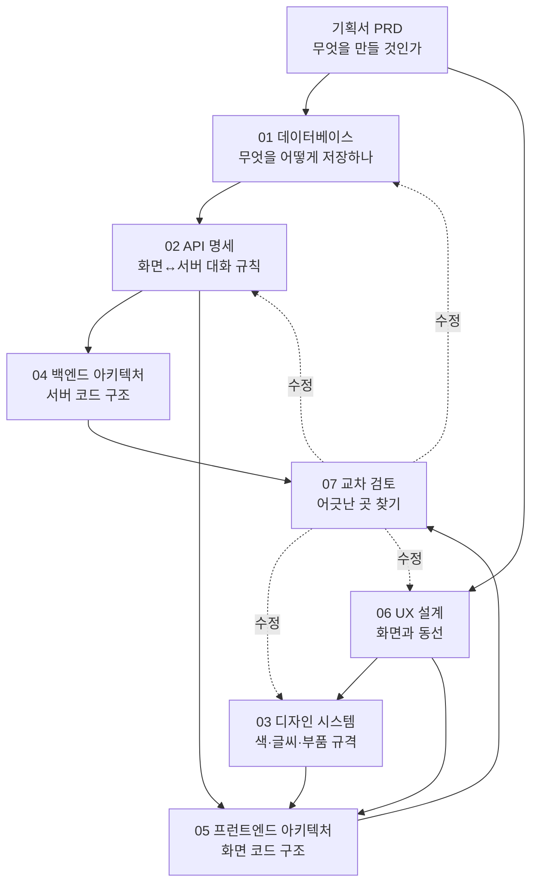

# 갤러리 K — 문서 안내

| 구분 | 경로 | 대상 |
|---|---|---|
| **기획서** | [PRD.md](PRD.md) | 전원 |
| **설계 문서 원문** | 이 폴더의 `01`~`07` | 개발자 |
| **설계 문서 해설판** | [annotated/](annotated/) | **IT 지식이 없는 분** |

---

## 설계 문서 (원문)

개발자가 구현 기준으로 삼는 문서입니다. 정보 밀도를 우선해 간결하게 작성되었습니다.

| # | 문서 | 내용 |
|---|---|---|
| 01 | [데이터베이스 설계서](01-DATABASE-MODEL.md) | 테이블 11종, 참조 무결성, 제약, 상태 전이, 마이그레이션, 보존 정책 |
| 02 | [API 명세서](02-API-SPEC.md) | 엔드포인트 50종의 요청·응답 전수, 표준 봉투, 오류 코드 카탈로그 |
| 03 | [디자인 시스템](03-DESIGN-SYSTEM.md) | 토큰 3계층, 색·타이포·간격, 컴포넌트 카탈로그, Tailwind 매핑 |
| 04 | [백엔드 아키텍처](04-BACKEND-ARCHITECTURE.md) | 계층 계약, 공용 DB 헬퍼, 미들웨어·데코레이터, 서비스 책임, 미디어 |
| 05 | [프런트엔드 아키텍처](05-FRONTEND-ARCHITECTURE.md) | 레이어 구조, 라우팅, 상태 관리, API 계층, PWA, 성능 |
| 06 | [UX 설계서](06-USER-EXPERIENCE.md) | 화면 19종의 레이아웃·상호작용·상태, 여정, 마이크로카피 전량 |
| 07 | [교차 검토 기록](07-CROSS-REVIEW.md) | 문서 간 불일치 27건의 식별과 조치 |

---

## 해설판 — IT 지식이 없어도 읽을 수 있습니다

원문에 **설명 상자를 끼워 넣은 판본**입니다. 원문은 한 글자도 바뀌지 않았습니다.

> **📘 쉬운 설명**
>
> 이런 상자가 중간중간 들어가, 바로 옆 내용이 무슨 말인지 일상어로 풀어 씁니다.

**[→ 해설판 폴더로 가기](annotated/)**

| 파일 | 먼저 읽으면 좋은 사람 |
|---|---|
| [용어 사전](annotated/00-용어사전.md) | **전원. 여기부터 시작하세요** |
| [UX 설계서 해설](annotated/06-USER-EXPERIENCE-해설.md) | 기획·운영 담당 |
| [디자인 시스템 해설](annotated/03-DESIGN-SYSTEM-해설.md) | 디자인 담당 |
| [데이터베이스 설계서 해설](annotated/01-DATABASE-MODEL-해설.md) | 개발 입문자 |
| [교차 검토 기록 해설](annotated/07-CROSS-REVIEW-해설.md) | 설계 문서를 처음 쓰는 사람 |

---

## 문서 사이의 관계

**변경할 때의 원칙** — 여러 문서에 같은 값이 나오는 경우, 어느 문서가 원본인지는 [07 §4 문서 간 계약 요약](07-CROSS-REVIEW.md#4-문서-간-계약-요약)에 정리되어 있습니다. 원본부터 고치고 참조 문서를 따라가며 맞춥니다.
