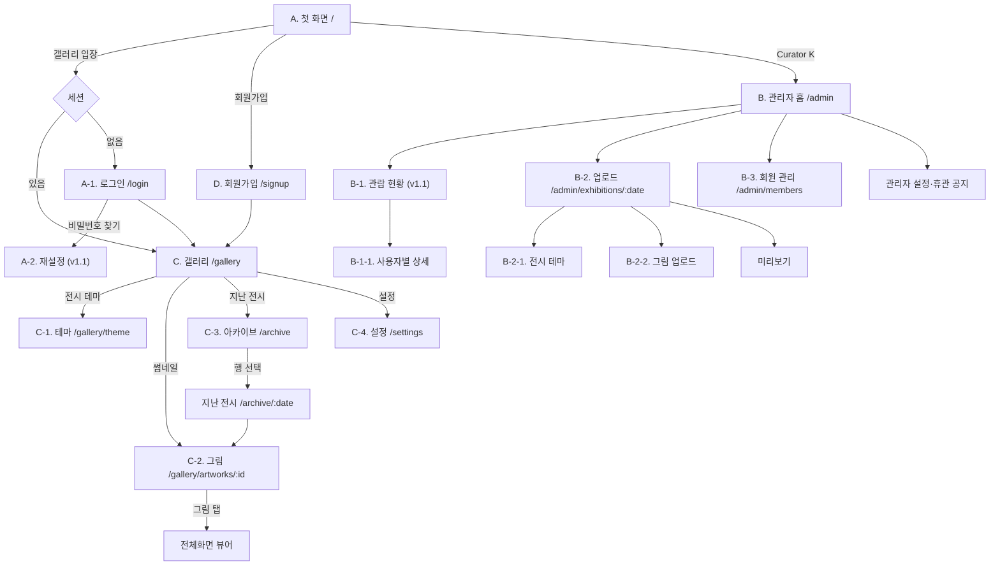

# 갤러리 K — 사용자 경험(UX) 설계서

| | |
|---|---|
| **문서 버전** | v1.0 |
| **작성일** | 2026-08-27 |
| **상위 문서** | `docs/PRD.md` v1.1, `03-DESIGN-SYSTEM.md`, `05-FRONTEND-ARCHITECTURE.md` |
| **범위** | 화면 구조 · 상호작용 · 상태 · 마이크로카피 전문 |
| **상태** | 확정 (구현 기준선) |

## 📘 초보자를 위한 안내

**UX가 뭔가요?**

**User Experience**, 우리말로 **사용자 경험**입니다. "사용자가 이 서비스를 쓰면서 겪는 모든 것"을 뜻합니다.

디자인이 "어떻게 보이는가"라면, UX는 **"어떻게 흘러가는가"**입니다.
- 앱을 열면 무엇이 먼저 보이는가
- 무엇을 누르면 어디로 가는가
- 잘못 눌렀을 때 어떻게 돌아오는가
- 실패했을 때 뭐라고 말해주는가

**이 문서가 비개발자에게 가장 읽기 쉽습니다**

여섯 개 설계 문서 중 **기술 용어가 가장 적은 문서**입니다. 화면을 하나씩 그려보며 "여기엔 이게 있고, 이걸 누르면 저리로 간다"를 적은 것이라, 개발을 몰라도 대부분 이해할 수 있습니다.

기획·운영 담당자라면 **이 문서부터 읽는 것을 권합니다.**

**이 서비스의 UX가 특별한 이유 — 68세 사용자**

기획서는 주요 사용자 세 명 중 한 명을 **"68세, 스마트폰은 카카오톡과 유튜브 정도, 작은 글씨와 여러 단계 메뉴에 약함"**으로 정했습니다.

이 한 사람 때문에 이 문서의 결정 상당수가 요즘 앱과 다릅니다.
- 손가락으로 미는 동작에는 **항상 글자 링크를 함께** 둔다
- 모든 화면 아래에 **"돌아가기" 글자 링크**가 있다
- 되돌릴 수 없는 동작은 **탈퇴 하나뿐**이고, 그것도 맨 아래 작게 둔다

**또 하나의 특징 — 재촉하지 않는다**

요즘 앱은 "연속 출석 7일!", "안 읽은 알림 3개" 같은 것으로 사용자를 계속 부릅니다. 이 서비스는 그런 장치를 **의도적으로 전부 뺐습니다.** 기획서의 표현으로는 "그림이 주인공"이고, 재촉은 액자가 눈에 띄는 일이기 때문입니다.

**읽는 요령** — §3이 화면별 상세, §4가 실제 사용 흐름, §5가 화면에 들어갈 문구 전량입니다. 모르는 단어는 [용어 사전](00-용어사전.md)에서. 원문은 `../06-USER-EXPERIENCE.md`입니다.

---

## 1. UX 원칙과 판단 기준

> **📘 쉬운 설명**
>
> 화면을 만들다 보면 "이렇게 할까 저렇게 할까"가 계속 생깁니다. 그때마다 취향으로 정하면 화면마다 결이 달라지므로, **판단 기준 7개**를 먼저 정합니다.
>
> 각 원칙이 **질문 형태**인 게 좋은 점입니다. "되돌아갈 길이 항상 보이는가?"처럼 물으면 예/아니오로 답할 수 있고, 답이 "아니오"면 고치면 됩니다.
>
> 마지막 문단의 **우선순위**가 특히 중요합니다. 원칙끼리 부딪칠 때 무엇을 먼저 지킬지 정해둔 것이죠. "탭을 줄이는 것"보다 **"길을 잃지 않는 것"과 "무언가를 잃지 않는 것"**이 먼저입니다.

| # | 원칙 | 검증 질문 |
|---|---|---|
| **UX-1** | **세 번의 탭 안에 첫 그림** | 앱을 열고 그림 한 점을 보기까지 탭이 3회를 넘는가? |
| **UX-2** | **끝이 있다** | 이 화면에 무한 스크롤·추천·더 보기가 있는가? |
| **UX-3** | **되돌아갈 길이 항상 보인다** | 이 화면 하단에 명시적 되돌아가기 링크가 있는가? |
| **UX-4** | **사과하지 않는다** | 시스템 사정을 사용자의 문제로 옮기고 있지 않은가? |
| **UX-5** | **재촉하지 않는다** | 카운터·배지·미완료 표시가 사용자를 몰아붙이지 않는가? |
| **UX-6** | **파괴적 동작은 멀리, 확인은 한 번** | 실수로 닿을 자리에 되돌릴 수 없는 것이 있는가? |
| **UX-7** | **제스처에는 항상 대안이 있다** | 스와이프·핀치를 모르는 사람도 같은 일을 할 수 있는가? |

이 7개가 충돌할 때의 우선순위는 **UX-3 > UX-6 > UX-1 > 나머지**다. 시니어 사용자(P2)가 길을 잃거나 무언가를 잃는 것이 가장 큰 실패다.

---

## 2. 정보 구조

> **📘 쉬운 설명**
>
> **정보 구조**는 "화면이 몇 개이고, 어디서 어디로 갈 수 있는가"의 지도입니다. 건물의 층별 안내도와 같습니다.

### 2.1 내비게이션 맵

> **📘 쉬운 설명**
>
> 아래 그림에서 **네모는 화면**, **화살표는 이동**, 화살표에 붙은 글자는 **무엇을 눌렀을 때인지**입니다.
>
> 마름모(`세션`)는 **갈림길**입니다. "로그인되어 있으면 갤러리로, 아니면 로그인 화면으로" 갈립니다.
>
> 화면 이름 앞의 `A`, `C-2`, `B-3` 같은 기호는 기획서에서 붙인 화면 번호입니다.
> - **A 계열** — 첫 화면·로그인·가입 (들어오는 길)
> - **C 계열** — 관람자 화면 (갤러리·그림·지난 전시·설정)
> - **B 계열** — 관리자 화면 (큐레이터만)

### 2.2 깊이 규칙

> **📘 쉬운 설명**
>
> **깊이**는 첫 화면에서 몇 번을 눌러야 도달하는지입니다. 깊을수록 사람들은 안 찾아갑니다.
>
> 마지막 굵은 문장이 중요합니다 — **관람자 화면은 3단계를 넘지 않습니다.** 그리고 새 화면을 추가하고 싶으면 **먼저 기존 화면을 대체할 수 있는지 검토**하라고 못박았습니다.
>
> 이런 규칙이 없으면 화면은 계속 늘어나기만 합니다. 늘리는 건 쉽고 지우는 건 어렵기 때문입니다.

| 계층 | 화면 | 규칙 |
|---|---|---|
| 0 | A | 모든 진입점. 알림 클릭도 여기로 온다 |
| 1 | C, B | 각 역할의 홈 |
| 2 | C-1, C-2, C-3, C-4 / B-1, B-2, B-3 | 홈에서 1탭 |
| 3 | 전체화면 뷰어, B-1-1, B-2-1, B-2-2 | 2탭 |

**관람자 화면은 3계층을 넘지 않는다.** 새 화면을 추가하고 싶다면 기존 화면을 대체할 수 있는지 먼저 검토한다.

### 2.3 되돌아가기 규약

> **📘 쉬운 설명**
>
> 표 아래 굵은 문장이 이 서비스만의 결정입니다 — **화면 아래쪽의 글자 링크가 1급이고, 위쪽의 `←` 아이콘은 보조입니다.**
>
> 요즘 앱은 대개 반대입니다. 위쪽 화살표가 기본이고 아래쪽엔 아무것도 없죠. 그런데 68세 사용자는 **브라우저의 뒤로가기도, 위쪽 화살표 아이콘도 잘 쓰지 않습니다.** "갤러리 화면으로"라는 글자가 있어야 누릅니다.
>
> 아래 표는 **화면마다 어떤 문구를 쓸지**까지 정해두었습니다. 어떤 화면은 "돌아가기", 어떤 화면은 "이전으로"처럼 제각각이면 그 자체로 혼란입니다.

| 위치 | 형태 | 대상 |
|---|---|---|
| 화면 하단 | 텍스트 링크(밑줄) | 논리적 상위 화면 |
| 화면 상단 좌측 | `←` 아이콘 버튼 | 동일 |
| 브라우저 뒤로 | 시스템 | 히스토리 |

**하단 텍스트 링크가 1급이다.** 시니어 사용자는 브라우저 뒤로가기도, 상단 아이콘도 쓰지 않는다(PRD §5.2). 상단 아이콘은 보조 수단이다.

| 화면 | 하단 링크 문구 |
|---|---|
| A-1, A-2, D | `첫 화면으로` |
| C | `첫 화면으로` |
| C-1, C-2, C-3, C-4 | `갤러리 화면으로` |
| 지난 전시 상세 | `지난 전시 목록으로` · `오늘의 전시로` |
| 지난 전시의 그림 | `이 전시로` (그 날짜의 갤러리로 돌아간다. 오늘의 전시로 튕기지 않는다) |
| B-1, B-2, B-3 | `관리자 화면으로` |
| B-1-1, B-2-1, B-2-2 | `이전 화면으로` |

---

## 3. 화면별 UX 명세

> **📘 쉬운 설명 — 이 문서의 본론**
>
> 이제 화면을 하나씩 그려봅니다. 각 화면은 같은 순서로 설명됩니다.
>
> | 항목 | 뜻 |
> |---|---|
> | **레이아웃** | 무엇이 위에서 아래로 어떤 순서로 놓이는가 |
> | **상호작용** | 무엇을 누르면 무슨 일이 일어나는가 |
> | **상태** | 로딩 중·비어 있을 때·오류일 때 어떻게 보이는가 |
> | **문구** | 실제로 화면에 들어갈 글자 |
> | **나가는 길** | 여기서 어디로 갈 수 있는가 |
>
> **"상태"를 빠짐없이 적는 게 중요합니다.** 개발자들이 흔히 정상 화면만 만들고 로딩·오류 화면을 나중에 급히 붙이는데, 그러면 사용자는 하얀 화면이나 "undefined" 같은 걸 보게 됩니다.

각 화면은 **레이아웃 / 상호작용 / 상태 / 문구 / 나가는 길** 순으로 기술한다.

### 3.1 A. 첫 화면

> **📘 쉬운 설명**
>
> 서비스의 첫인상을 정하는 화면입니다. 두 가지가 눈에 띕니다.
>
> **① 로그인 안 한 사람에게도 오늘의 전시 제목을 보여줍니다.**
> 보통은 "로그인하세요"만 보여주는데, 그러면 처음 온 사람은 **여기가 무엇을 주는 곳인지 모른 채** 가입을 요구받습니다. 제목 하나가 유일한 설득 수단입니다.
>
> **② `Curator K` 링크는 관리자에게만 보입니다.**
> 관람자에게는 아예 없는 것처럼 보입니다. 있어도 못 들어가지만, 안 보이는 편이 화면이 조용합니다.
>
> **상태 표의 "네트워크 오류" 줄**이 이 서비스의 태도를 잘 보여줍니다. 통신이 안 되면 전시 제목 자리만 비우고 **나머지는 그대로 보여줍니다. 오류 메시지도 안 띄웁니다.** 사용자 입장에서 "서비스가 안 열리는 것"과 "제목 한 줄이 안 보이는 것"은 완전히 다릅니다.
>
> **"가입 잠금" 줄**도 세심합니다. 가입을 안 받는 상태여도 링크를 숨기지 않습니다. 초대받아서 온 사람이 가입 버튼을 못 찾으면 당황하기 때문에, 일단 보여주고 눌렀을 때 설명합니다.

**레이아웃** (위 → 아래)

| # | 요소 | 사양 |
|---|---|---|
| 1 | `Curator K` | 우측 상단. **큐레이터에게만** 렌더 |
| 2 | 날짜 | `2026. 08. 27. 목` · caption · 중앙 |
| 3 | 로고 | `Morning Gallery K` · display |
| 4 | 오늘의 전시 제목 | title-lg · 중앙. 비회원에게도 노출 |
| 5 | 휴관 공지 | 공지 기간에만. 경계선 카드 + `지난 전시 보기` |
| 6 | 메인 이미지 | 미술관 정문 고정 이미지. 폭 100%, 종횡비 4:3 |
| 7 | `갤러리 입장` | Button primary lg, 전체 폭 |
| 8 | `회원가입` | TextLink, 중앙 |

**상호작용**

- `갤러리 입장` — 세션 있으면 `/gallery`, 없으면 `/login`. **누르는 순간 판정**하며 화면에 로그인 여부를 표시하지 않는다(불필요한 정보다).
- 정문 이미지는 탭해도 반응하지 않는다. 장식이다.

**상태**

| 상태 | 표시 |
|---|---|
| 로딩 | 로고·이미지·버튼은 즉시 렌더. 전시 제목 자리만 스켈레톤 1줄 |
| 개관 전 | 제목 자리에 `첫 전시를 준비하고 있습니다` |
| 연장 중 | 전시 제목 그대로. **발행일 병기 없음**(PRD §6.1) |
| 휴관 중 | 제목 아래 공지 카드 |
| 네트워크 오류 | 제목 자리 비움. 나머지 정상. **오류 메시지를 띄우지 않는다** |
| 가입 잠금 | `회원가입` 링크는 그대로 두고, 눌렀을 때 안내한다. 링크를 숨기면 초대받은 사람이 당황한다 |

**문구**

| 요소 | 문구 |
|---|---|
| 입장 버튼 | `갤러리 입장` |
| 가입 링크 | `회원가입` |
| 개관 전 | `첫 전시를 준비하고 있습니다` |
| 공지 링크 | `지난 전시 보기` |

**나가는 길** — `/gallery` · `/login` · `/signup` · `/admin` · `/archive`

### 3.2 A-1. 로그인

> **📘 쉬운 설명**
>
> 상호작용 표에서 눈여겨볼 것들:
>
> - **숫자 키패드** — 전화번호 칸을 누르면 숫자 자판이 뜹니다. 일반 자판이 뜨면 숫자를 찾아 눌러야 하고, 이건 시니어에게 특히 성가십니다
> - **자동 하이픈** — `01012345678`을 치면 `010-1234-5678`로 알아서 바뀝니다
> - **자동 로그인 체크박스 없음** — 90일 유지가 기본입니다. 체크박스를 두면 시니어는 못 보고 지나쳐서 매번 로그인하게 됩니다
> - **성공하면 갤러리로 직행** — 첫 화면으로 되돌리지 않습니다. 사용자는 그림을 보러 온 것이지 첫 화면을 다시 보러 온 게 아닙니다
>
> **오류 표의 첫 줄**은 보안 결정입니다. 가입 안 된 번호, 비밀번호 틀림, 차단된 회원에게 **전부 똑같은 문구**를 보여줍니다. "가입되지 않은 번호입니다"라고 알려주면, 번호를 하나씩 넣어보며 **누가 이 서비스 회원인지 알아낼 수 있기** 때문입니다.

**레이아웃** — 화면 제목 `입장` · 전화번호 필드 · 비밀번호 필드 · `입장` 버튼 · `비밀번호를 잊으셨나요?` · `첫 화면으로`

**상호작용**

| 항목 | 사양 |
|---|---|
| 전화번호 | 숫자 키패드(`inputmode=numeric`), 입력 중 자동 하이픈(`010-1234-5678`), 최대 13자(하이픈 포함) |
| 비밀번호 | 우측에 보기/숨기기 토글(`eye`/`eye-off`), 기본 숨김 |
| 제출 | 두 필드가 채워지면 버튼 활성. Enter로도 제출 |
| 로딩 | 버튼 `loading` 상태, 라벨 유지 |
| 성공 | **C 갤러리로 직행.** 첫 화면으로 되돌리지 않는다 |
| 자동 로그인 | 체크박스 없음. 90일 세션이 기본 동작(GAP-14) |

**상태·오류**

| 상황 | 표시 위치 | 문구 |
|---|---|---|
| 비밀번호 불일치 / 미가입 / 차단 | 폼 상단 배너 | `전화번호 또는 비밀번호가 맞지 않습니다.` |
| 5회 초과 | 폼 상단 배너 | `로그인 시도가 많았습니다. 10분 뒤에 다시 시도해 주세요.` |
| 형식 오류 | 필드 하단 인라인 | `전화번호를 정확히 입력해 주세요.` |
| 네트워크 | 토스트 | `연결이 원활하지 않습니다. 잠시 후 다시 시도해 주세요.` |
| 비밀번호 변경 필요 | 자동 이동 | 비밀번호 변경 화면으로. `안전을 위해 비밀번호를 새로 정해 주세요.` |

### 3.3 D. 회원가입

> **📘 쉬운 설명**
>
> 가입 화면입니다. **묻는 것이 전화번호·비밀번호·이름 세 개뿐**입니다.
>
> 입력 항목이 하나 늘 때마다 가입 도중 그만두는 사람이 늘어납니다. 그리고 **갖고 있지 않은 정보는 유출될 수 없습니다.**
>
> **약관 부분**을 눈여겨보세요. 전문에 **"관리자가 열람 이력을 확인할 수 있습니다"**를 반드시 넣기로 했습니다. 관리자 화면에서 "이분은 12점 중 8점을 보셨습니다"를 볼 수 있는 기능이 있는데, 이걸 알리지 않으면 나중에 알게 됐을 때 배신감을 줍니다. 지인 대상 서비스라 더욱 그렇습니다.
>
> **알림 안내 문구**의 iOS 부분이 중요합니다. iPhone에서는 **홈 화면에 추가하지 않으면 알림을 받을 수 없습니다.** 이 사실을 모르면 "알림 켰는데 왜 안 와요?" 상태가 되므로, iPhone 사용자에게는 권한을 묻기 전에 방법을 그림으로 안내합니다.
>
> **"나중에"를 누르면 다시 묻지 않습니다.** 계속 물으면 서비스 자체를 지웁니다.

**레이아웃** — 제목 `'갤러리 K'는` · 취지 본문 4줄 · 입력 3필드 · 약관 동의 · `회원 가입` 버튼 · `첫 화면으로`

취지 본문은 PRD §6.4의 초안을 그대로 사용한다.

> 갤러리 K는 매일 아침 12점의 그림이 걸리는 작은 미술관입니다.
> 전시는 매일 바뀌고, 하나의 테마로 묶입니다.
> 무엇을 볼지 고르실 필요는 없습니다. 그저 오시면 됩니다.
> 초대받은 분들만 입장하실 수 있고, 광고도 비용도 없습니다.

**입력 필드**

| 필드 | 라벨 | 힌트 | 검증 |
|---|---|---|---|
| 전화번호 | `전화번호` | `로그인할 때 쓰는 번호입니다` | 형식 |
| 비밀번호 | `비밀번호` | `8자 이상` | 실시간. 충족 시 힌트가 체크로 바뀐다 |
| 이름 | `이름` | `갤러리에서 부를 이름입니다` | 1–20자 |

**약관** — 체크박스 1개. 라벨 `서비스 이용과 개인정보 처리에 동의합니다`, 우측에 `보기` 링크(바텀시트로 전문). PRD §6.11에 따라 전문에 **"관리자가 열람 이력을 확인할 수 있습니다"**를 명시한다.

**흐름**

1. 제출 → 가입 + 자동 로그인
2. **알림 권한 안내 화면**(전체 화면 오버레이) — iOS·비standalone이면 홈 화면 추가 안내 먼저
3. C 갤러리 진입

**알림 안내 문구**

| 대상 | 문구 |
|---|---|
| 공통 제목 | `매일 아침, 새 전시를 알려드릴까요?` |
| 본문 | `하루에 한 번, 새로운 전시가 걸린 날에만 보내드립니다.` |
| 버튼 | `알림 받기` / `나중에` |
| iOS 선행 안내 제목 | `홈 화면에 추가하면 매일 아침 알려드립니다` |
| iOS 본문 | `아래 공유 버튼을 누르고 '홈 화면에 추가'를 선택해 주세요.` (도해 포함) |
| iOS 버튼 | `알겠습니다` |

`나중에`를 누르면 다시 묻지 않는다. C-4 설정에서 언제든 켤 수 있다.

**오류**

| 상황 | 문구 |
|---|---|
| 이미 가입된 번호 | `이미 가입된 번호입니다.` + `로그인하러 가기` 링크 |
| 가입 잠금 | 전체 화면 대체: `지금은 새로운 회원을 받고 있지 않습니다.` + `첫 화면으로` |
| 비밀번호 미달 | 필드 인라인: `8자 이상 입력해 주세요.` |

### 3.4 A-2. 비밀번호 재설정 *(v1.1)*

MVP 기간에는 이 화면 대신 큐레이터가 B-3에서 직접 초기화한다(PRD §6.3). 화면 사양은 v1.1 착수 시 재논의 없이 그대로 구현할 수 있도록 지금 확정해 둔다.

**단계 1 — 전화번호 입력**

- 화면 제목 `비밀번호 재설정` · 안내 `가입하신 전화번호로 인증번호를 보내드립니다.`
- 전화번호 필드 · `인증번호 받기` 버튼 · `첫 화면으로`
- 제출 후 **미가입 번호여도 단계 2로 넘어간다**(계정 존재를 노출하지 않는다).

**단계 2 — 인증번호 확인 + 새 비밀번호**

| 요소 | 사양 |
|---|---|
| 인증번호 필드 | 6자리 숫자. `inputmode=numeric`, `autocomplete=one-time-code` |
| 남은 시간 | `2:47` 형식 카운트다운. 만료 시 `시간이 지났습니다. 다시 받아 주세요.` |
| 재발송 | 60초 후 활성. `인증번호 다시 받기` |
| 새 비밀번호 | 8자 이상. 실시간 힌트 |
| 제출 | `비밀번호 바꾸기` |

**완료** — 자동 로그인하지 않는다. A-1으로 이동하며 상단 배너 `비밀번호를 바꿨습니다. 새 비밀번호로 입장해 주세요.`

**오류**

| 상황 | 위치 | 문구 |
|---|---|---|
| 인증번호 불일치 | 필드 인라인 | `인증번호가 맞지 않습니다. (남은 횟수 {n}회)` |
| 만료 | 필드 인라인 | `인증번호가 만료되었습니다. 다시 받아 주세요.` |
| 요청 과다 | 폼 배너 | `요청이 많았습니다. 잠시 후 다시 시도해 주세요.` |

### 3.5 비밀번호 변경

> **📘 쉬운 설명**
>
> 큐레이터가 대신 계정을 만들어준 경우(시니어 배려), 초기 비밀번호를 전화로 알려줍니다. 그 비밀번호를 계속 쓰면 안 되므로 **첫 로그인에서 바꾸게** 합니다.
>
> 아래 굵은 문단이 재미있습니다. 이 화면에는 **되돌아가기가 없습니다** — 이 문서의 원칙 UX-3을 어기는 유일한 예외입니다.
>
> 되돌아갈 수 있으면 초기 비밀번호로 계속 쓸 수 있기 때문입니다. 대신 **`로그아웃`을 두어 갇히지는 않게** 했습니다. 원칙을 어길 때도 "왜 어기는지"와 "대신 무엇을 두는지"를 적어두는 게 좋은 설계 문서의 태도입니다.

**진입 경로** — C-4 설정의 `비밀번호 변경`. 또는 `must_change_password`인 계정의 로그인 직후 **자동 이동**(대행 가입·초기화된 계정).

**레이아웃** — 화면 제목 `비밀번호 변경` · (강제 진입 시) 안내 문구 · 현재 비밀번호 · 새 비밀번호 · `바꾸기` · 되돌아가기 링크

| 진입 유형 | 안내 문구 | 되돌아가기 |
|---|---|---|
| 설정에서 | 없음 | `설정으로` |
| 강제(초기 비밀번호) | `안전을 위해 비밀번호를 새로 정해 주세요.` | **없음.** 이 화면에서 나갈 수 있는 곳은 로그아웃뿐이다 |

강제 진입에서 되돌아가기를 두지 않는 것은 UX-3의 유일한 예외다. 초기 비밀번호가 전화로 전달된 상태이므로 반드시 교체되어야 한다. 대신 `로그아웃` 링크를 두어 갇히지 않게 한다.

**완료** — C 갤러리로 이동 + 토스트 `비밀번호를 바꿨습니다.` 다른 단말의 세션은 모두 만료된다.

### 3.6 C. 갤러리 — 중심 화면

> **📘 쉬운 설명**
>
> 이 서비스의 중심 화면입니다. 그림 12개가 격자로 놓입니다.
>
> **썸네일에 작가 이름만 넣고 그림 제목은 안 넣습니다.** 제목까지 넣으면 격자가 글자로 가득 차서 그림이 죽기 때문입니다.
>
> **열람 표식**이 이 서비스의 성격을 잘 보여줍니다. 이미 본 그림에 **아주 작고 옅은 점**을 찍습니다. 진하게 하거나 "3/12 감상"처럼 숫자로 보여주면 **"아직 9개 남았네"라는 숙제**가 됩니다.
>
> **상태 표의 "연장 중" 줄**이 이 서비스의 핵심 결정입니다. 큐레이터가 오늘 못 올렸으면 어제 전시가 그대로 걸리는데, 이때 **"오늘의 전시는 준비 중입니다" 같은 사과를 하지 않습니다.**
>
> 왜냐하면 **관람자에게는 아무 문제도 일어나지 않았기** 때문입니다. 볼 그림 12점이 그대로 있습니다. 사과를 하면 없던 문제를 만들어 알려주는 셈입니다. 대신 제목 아래에 작게 "8월 30일의 전시"라고만 적습니다 — 어제 본 사람은 알아채고, 처음 온 사람은 그냥 오늘의 전시로 받아들입니다.

**레이아웃**

| # | 요소 | 사양 |
|---|---|---|
| 1 | 날짜 | **오늘 날짜**(관람일). caption |
| 2 | 전시 제목 | title-lg. 탭하면 C-1 |
| 3 | 연장 라벨 | 연장 시에만 `8월 30일의 전시`. caption·tertiary |
| 4 | 그림 그리드 | 3열 × 4행 (큰 글씨 2열 × 6행) |
| 5 | 하단 링크 3종 | `지난 전시` · `설정` · `첫 화면으로` |

**썸네일**

- 정사각 크롭, 하단에 작가명만(caption). 제목은 표시하지 않는다.
- 열람 표식: 우상단 4px 점. **전시 기준**이며 관람일이 바뀌어도 유지된다(PRD §6.5).
- 로딩: LQIP 블러 → 페이드 인.

**상호작용**

| 동작 | 결과 |
|---|---|
| 썸네일 탭 | C-2로 이동. 해당 그림이 첫 화면 |
| 전시 제목 탭 | C-1 |
| 그리드 롱프레스 | 브라우저 기본 동작 유지(막지 않음) |
| 화면 진입 | 입장 기록 전송(사용자에게 보이지 않음) |

**상태**

| 상태 | 표시 |
|---|---|
| 로딩 | 날짜·제목 스켈레톤 + 12개 회색 정사각 |
| 연장 중 | 정상 그리드 + 연장 라벨. **사과 문구 없음**(UX-4) |
| 개관 전 | `첫 전시를 준비하고 있습니다` + `첫 화면으로` |
| 오프라인 | 캐시 렌더 + 상단 안내 바 `연결이 없어 마지막으로 본 전시를 보여드립니다` |
| 이미지 일부 실패 | 해당 칸만 회색 + 재시도 아이콘. 나머지 정상 |
| 조회 실패 | `ErrorState`: `전시를 불러오지 못했습니다` + `다시 시도` |

**아카이브 모드**(`/archive/:date`)일 때 상단에 안내 바를 추가한다.

> `지난 전시를 보고 있습니다` · `오늘의 전시로`

### 3.7 C-1. 전시 테마

**레이아웃** — 날짜 · 전시 제목(title-lg) · 테마 본문(body-lg, `container-reading`) · 작가 목록 · `갤러리 화면으로`

**작가 목록** — 본문 아래 여백 32px 후, `caption`·tertiary로 중복 제거된 작가명을 `·`로 연결. 라벨 없이 명단만 둔다.

**상태** — 본문이 비어 있는 경우는 발생하지 않는다(발행 조건). 오류 시 `ErrorState` + 재시도.

### 3.8 C-2. 그림

> **📘 쉬운 설명**
>
> 그림 한 점을 보는 화면입니다. **글이 그림보다 위에 있는 것**이 특이한 결정입니다.
>
> 보통은 그림을 크게 먼저 보여주는데, 그러면 설명을 읽으려고 매번 스크롤해야 합니다. 제목·작가·설명을 먼저 읽고 그림을 보면 **"무엇을 보아야 하는지"를 알고 보게** 됩니다. 미술관에서 벽의 설명을 먼저 읽는 것과 같습니다.
>
> **제스처 표**가 이 문서에서 가장 시니어 배려가 잘 드러나는 부분입니다. 좌우로 미는 동작, 손가락 두 개로 벌리는 동작 — 이걸 모르는 사람을 위해 **전부 글자 링크나 버튼을 함께** 뒀습니다.
>
> **"양 끝에서 순환하지 않는다"**도 의도적입니다. 12번째에서 더 밀면 1번으로 돌아가게 만들 수도 있지만, 그러면 **끝이 없어집니다.** 이 서비스는 "끝이 있는 경험"이 핵심 가치입니다.
>
> **전체화면 뷰어의 "힌트"**도 세심합니다. 처음 한 번만 "손가락으로 벌려 확대할 수 있습니다"를 2초 보여주고 다시는 안 보여줍니다.

**레이아웃** (위 → 아래)

| # | 요소 | 사양 |
|---|---|---|
| 1 | 그림 제목 | title-md |
| 2 | 작가, 연도 | `요하네스 페르메이르, 1665년경` · caption |
| 3 | 설명 | body-lg, 최대 300자, 줄바꿈 보존 |
| 4 | 그림 | 원본 비율. 우하단에 `크게 보기` 버튼 |
| 5 | 출처 | 소장처·출처가 있으면 caption·tertiary |
| 6 | 위치 표시 | `3 / 12` · 중앙 |
| 7 | 이전/다음 링크 | `← 이전 그림` · `다음 그림 →` (텍스트, UX-7) |
| 8 | 되돌아가기 | 오늘의 전시에서 왔으면 `갤러리 화면으로`, 지난 전시에서 왔으면 `이 전시로` |

**텍스트를 그림 위에 두는 이유** — 스크롤 없이 제목·작가·설명이 먼저 보이고, 그림은 그 아래에서 충분한 크기로 나타난다. 그림을 먼저 두면 설명을 보려고 매번 스크롤해야 한다.

**제스처**

| 제스처 | 동작 | 대체 수단 |
|---|---|---|
| 좌우 스와이프 | 이전·다음 그림 | 하단 이전/다음 링크, 좌우 화살표 키 |
| 그림 탭 | 전체화면 뷰어 | `크게 보기` 버튼 |
| 양 끝에서 스와이프 | 고무줄 저항 후 복귀. **순환하지 않는다**(끝이 있어야 한다, UX-2) | — |

**스와이프 사양** — 임계: 화면 폭의 20% 또는 속도 0.4px/ms. 이동 중 다음 그림이 따라 들어오고, 놓으면 260ms로 정착. 전환 중에도 텍스트가 함께 이동한다(그림만 바뀌면 어떤 설명인지 혼동된다).

**전체화면 뷰어**

| 항목 | 사양 |
|---|---|
| 배경 | 검정. 모든 UI 제거 |
| 확대 | 핀치 줌(최대 4배), 더블탭(2배 토글) |
| 이동 | 확대 상태에서 드래그 패닝 |
| 닫기 | 아래로 스와이프, 우상단 `×`, `Esc` |
| 로딩 | display 이미지 즉시 표시 → 원본 로드되면 교체(전환 없음) |
| 힌트 | 최초 1회만 하단에 `손가락으로 벌려 확대할 수 있습니다` 2초 표시 |

**상태**

| 상태 | 표시 |
|---|---|
| 이미지 실패 | 이미지 자리만 대체 + `다시 시도`. **제목·작가·설명은 유지**(PRD §6.7) |
| 원본 로딩 | display 유지 + 우상단 작은 스피너 |

### 3.9 C-3. 지난 전시

> **📘 쉬운 설명**
>
> 놓친 날의 전시를 볼 수 있는 화면입니다. 하루 못 봤다고 그대로 떠나버리지 않게 하는 안전망입니다.
>
> **감상 표식** 부분이 이 서비스의 태도를 보여줍니다. 안 본 전시에 `NEW` 배지를 붙이거나 "3개 안 봄" 같은 숫자를 두지 않습니다. 대신 **이미 본 전시의 제목 색을 살짝 낮춥니다.**
>
> 배지를 붙이면 그건 **처리해야 할 목록**이 됩니다. 색을 낮추는 방식은 "본 것과 안 본 것을 구별할 수 있게" 해주면서도 재촉하지 않습니다.
>
> 마지막에 **"여기까지입니다"**로 조용히 끝나는 것도 "끝이 있는 경험"의 일부입니다.

**레이아웃** — 화면 제목 `지난 전시` · 목록(최근 30개) · `갤러리 화면으로`

**행 구성** — 좌측 64×64 썸네일(1번 그림) / 우측 상단 발행일(`8월 30일 · 토`) / 제목(title-sm) / 우측 감상 표식.

**감상 표식** — 본 전시는 표식 없음, 안 본 전시도 표식 없음. 대신 **본 전시의 제목을 tertiary 색**으로 낮춘다. `NEW` 배지나 미열람 카운트를 두지 않는다(UX-5).

**상호작용** — 행 탭 → `/archive/:date`. 무한 스크롤은 30개에서 끝나며, 마지막에 `여기까지입니다`를 조용히 표시한다.

**상태**

| 상태 | 표시 |
|---|---|
| 로딩 | 5행 스켈레톤 |
| 비어 있음 | `아직 지난 전시가 없습니다` |
| 오류 | `ErrorState` + 재시도 |

### 3.10 C-4. 설정

> **📘 쉬운 설명**
>
> 설정 화면에 **딱 필요한 것만** 있습니다. 알림, 큰 글씨, 계정.
>
> **"알림 끄기는 1탭이다. 붙잡지 않는다"**가 좋은 판단입니다. 많은 앱이 알림을 끄려 하면 "정말 끄시겠어요? 좋은 소식을 놓칠 수 있어요"라며 붙잡는데, 그러면 사용자는 **앱 자체를 지웁니다.** 쉽게 끌 수 있으면 나중에 다시 켤 수도 있습니다.
>
> **탈퇴 흐름**을 보세요. 확인을 **한 번만** 받습니다. "탈퇴하려면 '탈퇴합니다'를 입력하세요" 같은 추가 관문을 두지 않습니다. 되돌릴 수 없다는 사실을 명확히 알리는 것으로 충분하고, 그 이상은 68세 사용자에게 공포를 줍니다.
>
> 대신 **취소 버튼이 왼쪽에 있고 기본 선택**입니다. 습관적으로 눌렀을 때 탈퇴가 실행되지 않게 하는 배치입니다.

**레이아웃** — 화면 제목 `설정` · 알림 섹션 · 화면 섹션 · 계정 섹션 · `갤러리 화면으로`

| 섹션 | 항목 | 컨트롤 |
|---|---|---|
| 알림 | `아침 알림` | Switch. **1탭으로 꺼진다.** 붙잡지 않는다 |
| 알림 | `알림 시각` | 알림이 켜져 있을 때만. 탭 → 바텀시트 시간 선택(05:00–11:00, 30분 단위) |
| 화면 | `큰 글씨` (v1.1) | Switch. 즉시 반영 |
| 계정 | `이름`·`전화번호` | 읽기 전용 표시 |
| 계정 | `비밀번호 변경` | TextLink |
| 계정 | `탈퇴` | 맨 아래, `danger` 텍스트 링크, 작게 |

**알림 관련 상태**

| 상황 | 표시 |
|---|---|
| 브라우저 권한 거부됨 | 스위치 비활성 + `브라우저 설정에서 알림을 허용해 주세요` |
| iOS·비standalone | 스위치 대신 `홈 화면에 추가하면 알림을 받을 수 있습니다` + 안내 열기 |
| 구독 실패 | 스위치 원복 + 토스트 `알림 설정에 실패했습니다. 잠시 후 다시 시도해 주세요.` |

**탈퇴 흐름** (UX-6)

1. `탈퇴` 탭 → Dialog
2. 제목 `정말 탈퇴하시겠어요?`
3. 본문 `계정과 감상 기록이 모두 지워집니다. 되돌릴 수 없습니다.`
4. 버튼 — `취소`(기본 포커스, 좌측) / `탈퇴`(danger, 우측)
5. 완료 → A 첫 화면 + 토스트 `탈퇴가 완료되었습니다.`

확인은 **한 번만** 받는다. 문구 입력 같은 추가 관문을 두지 않는다 — 되돌릴 수 없다는 사실을 명확히 알리는 것으로 충분하며, 그 이상은 P2에게 공포를 준다.

### 3.11 B. 관리자 홈

> **📘 쉬운 설명**
>
> 여기부터 큐레이터(관리자) 화면입니다. 첫 줄이 이 화면의 전부입니다 — **"어느 날이 비어 있는가"를 1초 안에 알게 한다.**
>
> **상태 칩 세 가지**가 이 화면의 핵심입니다.
> - `Y`(초록) — 전시가 준비됨
> - `N`(주황) — 아직 비어 있음
> - `↑ 08.30`(회색) — 그날은 못 올렸고 8월 30일 전시가 대신 걸렸음
>
> **지나간 날의 미발행을 `N`(빨간 느낌)이 아니라 `↑`(회색)으로 표시하는 것**이 의도적입니다. 기획서는 큐레이터가 지쳐 그만두는 것을 가장 큰 위험으로 봤습니다. 지난 날짜에 경고 표시를 남겨두면 **매일 죄책감을 주게** 되고, 그게 곧 번아웃입니다.
>
> **"이틀째 같은 전시가 걸려 있습니다"**도 마찬가지입니다. 느낌표도 경고색도 없이 조용히 적습니다. 알려주되 몰아붙이지 않습니다.
>
> **이어쓰기 다이얼로그**가 이 서비스에서 가장 인간적인 부분입니다. 8월 31일에 11점까지 올리고 자정을 넘겼을 때, **하루치 작업을 버리게 하지 않고 오늘 날짜로 옮겨** 마저 쓰게 합니다.

**목적** — "어느 날이 비어 있는가"를 1초 안에 알게 한다. 스캔 속도가 이 화면의 전부다.

**레이아웃**

| # | 요소 | 사양 |
|---|---|---|
| 1 | 요약 줄 | `오늘 입장 12명 · 이번 주 꾸준히 보는 분 68%` |
| 2 | 링크 줄 | `관람 현황` · `회원 관리` · `설정` |
| 3 | 날짜 목록 | 3열 행. 오늘이 맨 위, 아래로 미래 7일 |
| 4 | `첫 화면으로` | |

**날짜 행 구성**

| 열 | 내용 | 폭 |
|---|---|---|
| 1 | `08.27 목` (오늘은 `오늘 · 08.27 목`) | 고정 |
| 2 | `UP` 버튼 또는 상태별 라벨 | 고정 |
| 3 | 상태 칩 | 고정 |

**상태 칩** (디자인 문서 §8.3)

| 상태 | 표시 | 색 |
|---|---|---|
| 발행됨 | `Y` + 체크 | 초록 |
| 준비 안 됨 | `N` + 점 | 주황 |
| 연장됨 | `↑ 08.30` + 위화살표 | 회색 |

> **개관 전의 과거 날짜** — 서비스 시작 이전 날짜에는 연장할 직전 전시가 없으므로 `N`으로 표시된다. 이 상태는 개관 이후 다시 나타나지 않으며, 별도 안내를 두지 않는다.

**2열 버튼의 4가지 모습** (서버 `edit_mode`)

| edit_mode | 버튼 | 동작 |
|---|---|---|
| `create` | `UP` | 새 전시 작성 |
| `edit` | `수정` | 기존 전시 편집 |
| `carry_draft` | `이어서 쓰기` | 확인 후 오늘 날짜로 이동 |
| `locked` | (버튼 없음) | 회색 `—` |

**진행률 표시** — `N` 상태이고 드래프트가 있으면 칩 아래에 `7/12` 를 작게 표시한다. 주말에 미리 채워둔 진행 상황이 한눈에 보인다.

**스크롤** — 위로 스크롤하면 과거 30일씩 추가 로드. 아래로는 미래 30일씩. 오늘 행은 좌측에 2px accent 바가 붙는다.

**이어쓰기 확인 다이얼로그**

> 제목 `8월 31일에 쓰던 전시를 오늘로 옮길까요?`
> 본문 `그림 11점과 원고가 오늘(9월 2일) 전시로 옮겨집니다. 8월 31일은 비어 있는 채로 남습니다.`
> 버튼 `취소` / `옮기기`

대상 날짜에 이미 작업물이 있으면 다이얼로그 대신 안내를 띄운다.

> `오늘 날짜에 이미 작업 중인 전시가 있습니다. 먼저 정리한 뒤에 옮겨 주세요.`

**상태**

| 상태 | 표시 |
|---|---|
| 로딩 | 요약 줄 스켈레톤 + 7행 스켈레톤 |
| 오류 | 요약 줄만 실패해도 목록은 정상 렌더 |
| 연장 2일 이상 | 요약 줄 아래에 조용한 안내: `이틀째 같은 전시가 걸려 있습니다` — 경고색·느낌표를 쓰지 않는다(RISK-1) |
| 오프라인 | **관리자 화면은 오프라인을 지원하지 않는다.** 화면 대체: `연결이 없어 관리자 화면을 열 수 없습니다` + `다시 시도` |

### 3.12 B-2. 작품·큐레이션 업로드

> **📘 쉬운 설명**
>
> 큐레이터가 가장 오래 머무는 화면입니다. 하루치 전시를 완성하는 곳이죠.
>
> **PC와 모바일의 배치가 다릅니다.** PC에서는 왼쪽에 12칸 격자, 오른쪽에 입력 폼을 나란히 둡니다. 그림을 고르고 바로 옆에서 설명을 쓰고, 다음 그림으로 넘어갑니다. 화면을 왔다갔다하지 않아도 됩니다.
>
> **12점 × 설명은 하루치 노동**이고, 그 작업이 편한지 아닌지가 이 서비스의 수명을 결정합니다.
>
> **"발행 버튼이 없다"**가 이 화면의 특이점입니다. 제목·테마·그림 12점이 다 차는 순간 **저절로 걸립니다.** 대신 화면 아래에 항상 "발행까지 — 그림 3점, 전시 테마"처럼 **뭐가 부족한지** 보여줍니다.
>
> **자동 저장**은 이 화면에서 가장 중요한 기능입니다. 마지막 굵은 문장이 이유입니다 — 12점의 설명을 다 쓴 뒤 저장에 실패해서 전부 날아가면, 그 좌절 한 번으로 서비스가 끝날 수 있습니다.

큐레이터가 가장 오래 머무는 화면. PC와 모바일을 동등하게 지원한다(PRD §6.9).

**레이아웃 (모바일)**

| # | 요소 |
|---|---|
| 1 | 날짜 + 발행 상태 칩 |
| 2 | 저장 표시(`저장됨 · 방금`) |
| 3 | `전시 테마` 카드 — 제목 미리보기 + 글자 수. 탭 → B-2-1 |
| 4 | 12칸 슬롯 그리드(3×4) |
| 5 | 다중 업로드 버튼 `사진 여러 장 올리기` |
| 6 | `미리보기` 버튼 |
| 7 | 발행 조건 안내 |
| 8 | `관리자 화면으로` |

**레이아웃 (≥1024px)** — 좌측에 슬롯 그리드, 우측에 선택된 슬롯의 입력 폼을 나란히 둔다. 화면 이동 없이 12점을 연속 입력할 수 있다. **PC에서의 집필 효율이 G3(운영 지속성)를 좌우한다.**

**슬롯 버튼의 5가지 상태**

| 상태 | 표시 |
|---|---|
| `empty` | 회색 점선 테두리 + `+` + 번호 |
| `uploading` | 진행률 링 + `올리는 중` |
| `processing` | 썸네일 흐림 + 스피너 + `처리 중` |
| `ready` (미완성) | 썸네일 + 우상단 주황 점 + `N` |
| `ready` (완성) | 썸네일 + 우상단 초록 체크 |
| `failed` | 붉은 테두리 + `!` + `다시 올리기` |

**다중 업로드**

1. `사진 여러 장 올리기` → 파일 선택(다중)
2. 빈 슬롯에 **번호 순서대로** 배정. 파일 수가 빈 슬롯보다 많으면 초과분을 알리고 배정하지 않는다
3. 동시 3개씩 업로드, 각 슬롯에 개별 진행률
4. 처리 완료 순서와 무관하게 슬롯 위치 고정
5. 완료 후 토스트 `사진 8장을 올렸습니다. 설명을 채워 주세요.`

**순서 변경** — 슬롯 롱프레스 → 드래그. PC는 즉시 드래그. 키보드는 슬롯 포커스 후 `Space`로 집고 방향키로 이동, `Space`로 놓기. 변경 즉시 저장하고 `SaveIndicator`로 알린다.

**발행 조건 안내** — 항상 화면 하단에 상태를 보여준다.

| 상황 | 문구 |
|---|---|
| 미충족 | `발행까지 — 그림 3점, 전시 테마` |
| 충족 순간 | 토스트 `전시가 발행되었습니다.` + 상태 칩이 `Y`로 전환 |
| 이미 발행됨 + 수정 중 | `발행된 전시입니다. 수정 내용은 바로 반영됩니다.` |

발행 버튼은 없다. 조건이 채워지면 자동으로 걸린다(PRD §6.10).

**자동 저장** — 입력 후 1.2초 디바운스 + 화면 이탈 시 즉시 저장. 표시는 3상태(`저장 중…` / `저장됨 · 방금` / `저장 실패 · 다시 시도`)만 쓴다. 저장 실패 시 입력 내용을 로컬에 보존하고 재시도 버튼을 제공한다 — **12점 × 설명은 하루치 노동이고, 그것을 잃는 것이 RISK-1이다.**

### 3.13 B-2-1. 전시 테마 입력

> **📘 쉬운 설명**
>
> 전시 제목(20자)과 테마 글(500자)을 쓰는 화면입니다.
>
> **글자 수가 넘쳐도 입력을 막지 않습니다.** 500자 제한인데 520자를 썼다면, 타자를 못 치게 막는 대신 숫자를 빨갛게 표시하고 저장할 때 알려줍니다.
>
> 쓰다가 갑자기 글자가 안 써지는 건 상당히 불쾌하고, **어디를 줄일지는 쓴 사람이 정하는 게** 맞습니다.

**레이아웃** — 날짜 · `전시 제목` 필드(20자) · `전시 테마` 텍스트영역(500자) · 저장 표시 · `이전 화면으로`

- 글자 수는 항상 `12 / 20` 형태로 필드 우하단에 표시한다.
- 초과 시 입력을 막지 않고 숫자만 붉게 표시하며, 저장 시 차단하고 인라인 오류를 띄운다(PRD §6.10).
- 테마 텍스트영역은 최소 8행, 자동 확장. 줄바꿈이 그대로 보존됨을 힌트로 알린다: `줄바꿈은 그대로 보입니다`

### 3.14 B-2-2. 그림 입력

> **📘 쉬운 설명**
>
> 그림 한 점의 정보를 쓰는 화면입니다. **힌트 문구**를 눈여겨보세요.
>
> - 제작 연도: "1665년경처럼 자유롭게 쓰셔도 됩니다" — 정확한 연도를 모를 때 스트레스받지 않게
> - 설명: "40자 이상 권장 · **한 가지 볼거리를 짚어 주세요**" — 무엇을 쓸지 막막할 때의 길잡이
>
> 그리고 **설명이 짧아도 저장은 됩니다.** 힌트만 "조금 더 써 주시면 좋습니다"로 바뀝니다. **막지 않고 권합니다.** 매일 12점을 써야 하는 사람에게 규칙을 강제하면 그날 하루를 통째로 못 올리게 될 수 있습니다.

**필드 순서와 문구**

| 필드 | 라벨 | 힌트 | 제한 |
|---|---|---|---|
| 이미지 | `그림` | `JPG · PNG · WebP · 20MB까지` | 필수 |
| 제목 | `그림 제목` | | 20자 |
| 작가 | `작가` | | 40자 |
| 연도 | `제작 연도` | `1665년경처럼 자유롭게 쓰셔도 됩니다` | 20자 |
| 설명 | `설명` | `40자 이상 권장 · 한 가지 볼거리를 짚어 주세요` | 300자 |
| 소장처 | `소장처` | `선택` | 60자 |
| 출처 | `출처 링크` | `선택` | https:// |

- 설명이 40자 미만이면 저장은 되지만 힌트가 `조금 더 써 주시면 좋습니다`로 바뀐다. **막지 않고 권한다.**
- 이미지 교체는 슬롯 상단의 `사진 바꾸기`. 교체 시 확인을 받는다.

### 3.15 B-3. 회원 관리

> **📘 쉬운 설명**
>
> 이 서비스가 **"초대받은 사람만"**을 실제로 지키는 화면입니다.
>
> 방식이 특이합니다. 초대 코드를 만들지 않았습니다. **URL을 아는 것 자체가 초대**이고, 대신 세 가지로 사후 관리합니다.
> 1. 지인들이 다 들어오면 **가입을 잠근다**
> 2. 누가 가입하면 **큐레이터에게 알림이 온다**
> 3. 모르는 사람이면 **차단한다**
>
> **차단 확인 문구**가 정직합니다 — "지금 로그인해 둔 상태는 유지됩니다."
>
> 차단이 즉시 효과가 없다는 **한계를 그대로 알립니다.** 이걸 숨기면 큐레이터는 차단했으니 안전하다고 믿고 넘어갑니다.
>
> **`iOS` 배지**도 세심합니다. 알림을 못 받고 있는 iPhone 사용자를 표시해줘서, 큐레이터가 **전화 한 통으로 도와줄 수 있게** 합니다.

**레이아웃** — 상단 `신규 가입 받기` Switch · 검색 필드 · 필터 칩(`전체`/`차단됨`/`알림 꺼짐`) · 회원 목록 · `계정 만들기` 버튼 · `관리자 화면으로`

**회원 행** — 이름(title-sm) / 전화번호(caption) / 가입일 · 마지막 입장(caption) / 알림 상태 아이콘 / 우측 `⋯` 메뉴.

**`⋯` 메뉴** — `비밀번호 초기화` · `차단` 또는 `차단 해제`.

**가입 잠금 스위치**

| 상태 | 라벨 아래 설명 |
|---|---|
| 켜짐 | `링크를 아는 분은 가입할 수 있습니다` |
| 꺼짐 | `새로운 가입을 받지 않습니다` |

**차단 확인**

> 제목 `{이름} 님을 차단할까요?`
> 본문 `다음 로그인부터 입장할 수 없습니다. 지금 로그인해 둔 상태는 유지됩니다.`
> 버튼 `취소` / `차단`

차단의 **한계를 그대로 알린다**(PRD §6.4). 즉시 끊긴다고 오해하면 운영 판단이 틀어진다.

**계정 만들기** — 이름·전화번호·초기 비밀번호. 생성 후 안내 카드를 띄운다.

> `{이름} 님의 계정을 만들었습니다.`
> `전화번호 010-1234-5678 · 초기 비밀번호 {입력값}`
> `전화로 알려주세요. 처음 로그인할 때 새 비밀번호를 정하게 됩니다.`

**알림 상태 아이콘**

| 상태 | 표시 | 의미 |
|---|---|---|
| `active` | 벨 | 받고 있음 |
| `inactive` | 벨(회색) + `!` | 구독은 있으나 실패 중 |
| `none` | 벨 끄기 | 안 받음 |

`iOS` 플랫폼이면서 `none`인 회원은 이름 옆에 작은 `iOS` 배지를 단다 — 홈 화면 추가 안내가 필요한 사람을 K가 찾아 전화할 수 있어야 한다(PRD §6.14).

### 3.16 관리자 설정 · 휴관 공지

**레이아웃** — 휴관 공지 섹션(예정·진행 중 목록 + `공지 추가`) · 운영 설정 섹션 · `관리자 화면으로`

**공지 추가 폼** — 시작일·종료일(날짜 선택) · 문구(300자). 저장 전 미리보기를 보여준다.

> 예시 문구 초안: `9월 5일까지 잠시 쉬어갑니다. 그동안 지난 전시를 둘러보세요.`

**중첩 오류** — `이미 같은 기간에 공지가 있습니다.` + 해당 공지로 이동 링크.

**운영 설정** — 기본 알림 시각 · 알림 컷오프 시각 · 아카이브 개수. 각 항목에 한 줄 설명을 붙인다. 위험한 값은 두지 않는다.

### 3.17 B-1 · B-1-1. 관람 현황 *(v1.1)*

**B-1 레이아웃** — 최근 7일 목록(날짜 · 전시 제목 · 입장 회수) · 회원 검색 필드 · `관리자 화면으로`

**행 문구** — `08.27 목 · 빛을 등진 사람들 · 12명`. 연장된 날은 제목 앞에 `↑`.

**B-1-1 레이아웃** — 회원 이름 · 최근 30일 목록(날짜 · 전시 제목 · `8 / 12` 또는 `—`) · `이전 화면으로`

**개인정보 문구** — 화면 하단에 상시 표시: `이 화면은 개인의 열람 기록을 보여줍니다. 가입 시 안내된 범위 안에서만 확인해 주세요.`

### 3.18 미리보기

> **📘 쉬운 설명**
>
> 큐레이터가 **"관람자에게 어떻게 보일까"**를 확인하는 화면입니다.
>
> PC에서는 실제 휴대폰 크기(390px)의 틀 안에 그려줍니다. 큐레이터는 PC에서 작업하지만 관람자는 대부분 휴대폰으로 보기 때문입니다.
>
> 마지막 줄 — **미리보기에서는 방문 기록을 남기지 않습니다.** 큐레이터가 확인차 열어본 것까지 "감상"으로 세면 통계가 오염됩니다.

**진입** — B-2의 `미리보기` 버튼. **관람자의 C 화면과 픽셀 단위로 동일하게** 렌더한다(PRD §5.3 4단계).

| 요소 | 사양 |
|---|---|
| 프레임 | 데스크톱에서는 390px 폭 모바일 프레임 안에 렌더. 모바일에서는 전체 화면 |
| 상단 바 | `미리보기 · {날짜}` + `닫기`. **프레임 바깥**에 둔다 |
| 미완성 슬롯 | 이미지 자리에 `준비 중` 회색 블록. 관람자에게는 이 상태로 노출되지 않음을 하단에 안내 |
| 이동 | 미리보기 안에서 전시 테마·그림 화면까지 실제로 이동할 수 있다 |
| 기록 | 미리보기에서는 입장·열람 기록을 **전송하지 않는다** |

### 3.19 404 · 시스템 오류 화면

| 상황 | 표시 | 동작 |
|---|---|---|
| 없는 경로 | `찾으시는 화면이 없습니다.` | `첫 화면으로` |
| 없는 전시·그림 | `전시를 찾을 수 없습니다.` | `갤러리 화면으로` |
| 렌더 예외 | `문제가 생겼습니다.` + `새로고침` | `request_id`를 작게 병기(문의 대응용) |
| 점검 중 | `잠시 점검 중입니다.` + 예상 종료 시각 | 자동 재시도 없음 |

**어떤 오류 화면에도 기술 정보를 노출하지 않는다.** `request_id`만이 예외이며, 이것도 `문의 번호`라는 라벨로 표시한다.

---

## 4. 핵심 여정

> **📘 쉬운 설명**
>
> 지금까지 화면을 하나씩 봤다면, 여기서는 **실제 상황에서 화면들이 어떻게 이어지는지**를 봅니다.
>
> 화면을 따로따로 보면 다 괜찮은데 이어붙이면 어색한 경우가 많습니다. 예를 들어 각 화면은 완벽한데 **첫 그림을 보기까지 7번을 눌러야** 한다면 실패입니다.

### 4.1 초대 → 첫 감상 (신규 회원)

> **📘 쉬운 설명**
>
> 카카오톡으로 링크를 받은 사람이 첫 그림을 보기까지의 8단계입니다.
>
> **"탭 수 검증"**을 보세요. 링크(1) → 입장(2) → 썸네일(3) = **3탭**. 기획서의 "세 번의 탭 안에"를 실제로 충족하는지 세어본 것입니다.
>
> 이렇게 세어보는 습관이 중요합니다. 목표를 정해놓고 확인 안 하면, 화면을 만들다 보면 어느새 5탭이 되어 있습니다.

| 단계 | 화면 | 사용자 행동 | 시스템 | 이탈 방지 |
|---|---|---|---|---|
| 1 | 카카오톡 | 링크 탭 | OG 카드(정문 이미지 + 전시 제목) | 발신자 신뢰 |
| 2 | A | 전시 제목 확인 | 비회원에게도 제목 노출 | 무엇을 얻는지 먼저 |
| 3 | A | `회원가입` 탭 | | |
| 4 | D | 3필드 입력 (목표 60초) | | 필수 3개뿐 |
| 5 | D | 알림 허용 | iOS는 홈 화면 안내 선행 | 재방문의 유일한 장치 |
| 6 | C | 12점 그리드 | LCP 2.5초 이내 | LQIP로 즉시 무언가 보임 |
| 7 | C-2 | 첫 그림 | | |
| 8 | C-2 | 스와이프로 계속 | 인접 그림 프리페치 | 탭 12회로 완주 |

**탭 수 검증** — 링크(1) → 입장(2) → 썸네일(3) = **3탭**. UX-1 충족.

### 4.2 매일 아침 (기존 회원)

> **📘 쉬운 설명**
>
> 알림을 눌렀을 때 **바로 갤러리로 안 가고 첫 화면을 거치는** 이유를 설명합니다.
>
> 한 단계 더 거치는 셈이라 손해 같지만, **휴관 공지처럼 첫 화면에만 있는 것을 놓치지 않게** 하려는 것입니다. 대신 첫 화면에서 갤러리로 가는 걸 즉시로 만들어서 한 단계처럼 느껴지게 합니다.

알림 탭 → A 첫 화면 → `갤러리 입장` → C. **탭 3회.** 90일 세션이므로 로그인이 끼어들지 않는다.

A를 거치게 하는 이유는 휴관 공지처럼 첫 화면에만 있는 것을 놓치지 않게 하기 위함이다(PRD §6.1). 대신 A→C 전환을 즉시로 만들어(프리페치) 한 단계로 느껴지게 한다.

### 4.3 놓친 날 따라잡기

C 하단 `지난 전시` → C-3 목록 → 행 탭 → 지난 전시의 C 화면(안내 바 포함) → 썸네일 탭 → 그 전시의 그림 화면 → `이 전시로` → `오늘의 전시로`.

**아카이브 문맥은 그림 화면까지 이어진다.** 지난 전시를 보다가 그림을 열고 되돌아갔을 때 오늘의 전시가 나오면 길을 잃는다.

**어디에서도 재촉하지 않는다.** 알림·배지·미열람 카운트가 없고, 아카이브는 하단 링크로 조용히 존재한다(PRD §5.1 8단계).

### 4.4 큐레이터의 하루치 업로드

> **📘 쉬운 설명**
>
> 큐레이터가 전시 하나를 올리는 전 과정입니다.
>
> 마지막 **"중단 복구"** 부분이 이 흐름의 핵심입니다. 7단계 중 **어디서 그만둬도 잃는 게 없습니다.** 자동 저장되어 있고, 자정을 넘겨도 다음 날 이어 쓸 수 있습니다.
>
> 매일 해야 하는 일에서는 **"한 번에 끝내야 한다"는 압박이 없는 것**이 무엇보다 중요합니다.

| 단계 | 화면 | 행동 |
|---|---|---|
| 1 | B | 비어 있는 날짜 확인(`N`) → `UP` |
| 2 | B-2 | `사진 여러 장 올리기`로 12장 선택 |
| 3 | B-2 | 업로드·처리 대기(진행률 표시) |
| 4 | B-2-1 | 제목·테마 작성 |
| 5 | B-2-2 | 12점 설명 작성 (PC에서는 좌우 분할로 연속 입력) |
| 6 | B-2 | `미리보기`로 관람자 화면 확인 |
| 7 | — | 조건 충족 순간 자동 발행 + `Y` 전환 |

**중단 복구** — 어느 단계에서 나가도 자동 저장되어 있다. 자정을 넘겨도 다음 날 `이어서 쓰기`로 이어진다.

---

## 5. 마이크로카피 카탈로그

> **📘 쉬운 설명**
>
> **마이크로카피**는 화면에 들어가는 짧은 글자들입니다. 버튼 이름, 안내 문구, 오류 메시지 같은 것.
>
> 이걸 왜 문서로 관리할까요? 개발할 때 그때그때 지어내면 **말투가 화면마다 달라지기** 때문입니다. 어떤 화면은 "확인", 어떤 화면은 "네", 어떤 화면은 "저장하기". 각각은 문제없지만 모아놓으면 어수선합니다.
>
> 그리고 문구를 다듬고 싶어졌을 때, **한 곳에 모여 있어야 전체 말투를 한눈에 보고 고칠 수 있습니다.**

문구는 코드에 흩어지지 않고 `shared/config/messages.ts` 하나에 모은다.

### 5.1 문체 규칙

> **📘 쉬운 설명**
>
> 말투의 규칙입니다. 예와 반례가 나란히 있어서 이해하기 쉽습니다.
>
> 특히 **"시스템을 주어로 삼지 않는다"**가 중요합니다.
> - ✗ "서버가 응답하지 않습니다" — 사용자는 서버가 뭔지 모릅니다
> - ✓ "전시를 불러오지 못했습니다" — 무슨 일이 안 됐는지 알 수 있습니다
>
> **"사과를 남발하지 않는다"**도 좋습니다. "불편을 드려 대단히 죄송합니다"를 매번 하면 진짜 사과가 필요할 때 무게가 없어집니다.
>
> **"느낌표를 쓰지 않는다"**는 이 서비스만의 결정입니다. 조용한 미술관에서 "업로드 완료!"라고 외치면 어울리지 않습니다.

| 규칙 | 예 | 반례 |
|---|---|---|
| 해요체 존댓말 | `다시 시도해 주세요.` | `재시도하십시오.` |
| 시스템을 주어로 삼지 않는다 | `전시를 불러오지 못했습니다.` | `서버가 응답하지 않습니다.` |
| 사용자를 탓하지 않는다 | `전화번호를 정확히 입력해 주세요.` | `잘못된 입력입니다.` |
| 사과를 남발하지 않는다 | `잠시 후 다시 시도해 주세요.` | `불편을 드려 대단히 죄송합니다.` |
| 전문 용어를 쓰지 않는다 | `연결이 원활하지 않습니다.` | `네트워크 타임아웃` |
| 마침표를 찍는다 (버튼·라벨 제외) | | |
| 느낌표를 쓰지 않는다 | | `업로드 완료!` |

### 5.2 버튼·링크

| 키 | 문구 |
|---|---|
| `enter_gallery` | `갤러리 입장` |
| `signup` | `회원가입` |
| `login` | `입장` |
| `back_home` | `첫 화면으로` |
| `back_gallery` | `갤러리 화면으로` |
| `back_prev` | `이전 화면으로` |
| `back_admin` | `관리자 화면으로` |
| `archive` | `지난 전시` |
| `settings` | `설정` |
| `retry` | `다시 시도` |
| `cancel` | `취소` |
| `confirm_withdraw` | `탈퇴` |
| `view_large` | `크게 보기` |
| `prev_artwork` / `next_artwork` | `← 이전 그림` / `다음 그림 →` |
| `today_exhibition` | `오늘의 전시로` |
| `upload_many` | `사진 여러 장 올리기` |
| `preview` | `미리보기` |
| `carry_draft` | `이어서 쓰기` |
| `create_account` | `계정 만들기` |
| `send_code` | `인증번호 받기` |
| `resend_code` | `인증번호 다시 받기` |
| `change_password` | `비밀번호 바꾸기` |
| `logout` | `로그아웃` |
| `close` | `닫기` |
| `refresh` | `새로고침` |
| `back_settings` | `설정으로` |
| `back_archive` | `지난 전시 목록으로` |

### 5.3 상태·안내

| 키 | 문구 |
|---|---|
| `first_exhibition_pending` | `첫 전시를 준비하고 있습니다` |
| `carried_over_label` | `{월}월 {일}일의 전시` |
| `archive_banner` | `지난 전시를 보고 있습니다` |
| `archive_end` | `여기까지입니다` |
| `archive_empty` | `아직 지난 전시가 없습니다` |
| `offline_banner` | `연결이 없어 마지막으로 본 전시를 보여드립니다` |
| `update_available` | `새 버전이 있습니다` + `새로고침` |
| `zoom_hint` | `손가락으로 벌려 확대할 수 있습니다` |
| `saved` | `저장됨 · 방금` |
| `saving` | `저장 중…` |
| `save_failed` | `저장 실패 · 다시 시도` |
| `publish_pending` | `발행까지 — {부족한 항목}` |
| `published` | `전시가 발행되었습니다.` |
| `carryover_notice_admin` | `이틀째 같은 전시가 걸려 있습니다` |

### 5.4 오류 문구 매핑

> **📘 쉬운 설명**
>
> 서버가 "이런 문제가 있다"고 알려주는 각 경우에 대해, **화면 어디에 무슨 글자를 보여줄지**의 표입니다.
>
> **"위치"** 열이 중요합니다. 같은 오류라도 어디에 띄우느냐로 친절함이 달라집니다.
> - "비밀번호가 짧습니다" → **그 입력칸 바로 아래**
> - "연결이 원활하지 않습니다" → 화면 위쪽 배너
> - "잠시 후 다시 시도해 주세요" → 잠깐 떴다 사라지는 토스트
>
> 이 표가 있으면 개발자가 오류 처리를 만들 때 **고민하거나 지어낼 필요가 없습니다.**

서버 `error.code` → 표시 위치·문구. 문구는 서버 응답을 우선하고 아래는 폴백이다.

| code | 위치 | 문구 |
|---|---|---|
| `AUTH_INVALID_CREDENTIALS` | 폼 배너 | `전화번호 또는 비밀번호가 맞지 않습니다.` |
| `AUTH_TOO_MANY_ATTEMPTS` | 폼 배너 | `로그인 시도가 많았습니다. 10분 뒤에 다시 시도해 주세요.` |
| `AUTH_SESSION_EXPIRED` | 전체 이동 | `로그인이 만료되었습니다. 다시 입장해 주세요.` |
| `SIGNUP_CLOSED` | 화면 대체 | `지금은 새로운 회원을 받고 있지 않습니다.` |
| `SIGNUP_PHONE_TAKEN` | 필드 인라인 | `이미 가입된 번호입니다.` |
| `PASSWORD_POLICY_VIOLATION` | 필드 인라인 | `8자 이상 입력해 주세요.` |
| `EXHIBITION_NOT_OPENED` | 화면 대체 | `첫 전시를 준비하고 있습니다` |
| `EXHIBITION_NOT_FOUND` | 화면 대체 | `전시를 찾을 수 없습니다.` |
| `EXHIBITION_BACKFILL_FORBIDDEN` | 다이얼로그 | `지난 날짜에는 새 전시를 걸 수 없습니다. 오늘 날짜로 이어서 쓰실 수 있습니다.` |
| `DRAFT_TARGET_OCCUPIED` | 다이얼로그 | `오늘 날짜에 이미 작업 중인 전시가 있습니다.` |
| `UPLOAD_FILE_TOO_LARGE` | 슬롯 인라인 | `20MB까지 올릴 수 있습니다.` |
| `UPLOAD_MIME_NOT_ALLOWED` | 슬롯 인라인 | `JPG, PNG, WebP 파일만 올릴 수 있습니다.` |
| `CONFLICT_VERSION` | 다이얼로그 | `다른 곳에서 먼저 수정되었습니다. 새로고침 후 다시 시도해 주세요.` |
| `NOTICE_PERIOD_OVERLAP` | 폼 배너 | `이미 같은 기간에 공지가 있습니다.` |
| `RATE_LIMITED` | 토스트 | `잠시 후 다시 시도해 주세요.` |
| `NETWORK_OFFLINE` | 배너 | `연결이 원활하지 않습니다.` |
| `SYSTEM_INTERNAL` | 토스트 또는 ErrorState | `문제가 생겼습니다. 잠시 후 다시 시도해 주세요.` |

---

## 6. 피드백 규칙

> **📘 쉬운 설명**
>
> **피드백**은 사용자의 행동에 시스템이 반응해주는 것입니다. "저장되었습니다" 같은 것.
>
> 마지막 굵은 문장이 이 서비스답습니다 — **관람자 화면에는 성공 알림이 없습니다.**
>
> 그림을 열었을 때 "그림을 열었습니다" 같은 게 뜨면 방해입니다. **잘 되고 있을 때는 아무 말도 안 하는 것**이 최선의 피드백입니다.

| 상황 | 수단 | 지속 |
|---|---|---|
| 저장·전송 성공(관리자) | `SaveIndicator` 또는 Toast | 4초 |
| 되돌릴 수 없는 조작 완료 | Toast | 4초 |
| 조작 실패 | Toast | 6초 |
| 확인이 필요한 결정 | Dialog | 사용자 응답까지 |
| 선택·입력 | BottomSheet | |
| 진행 중(3초 이상 예상) | 진행률 또는 스피너 + 문구 | |
| 관람자의 정상 동작 | **아무 피드백도 주지 않는다** | |

**관람자 화면에는 성공 토스트가 없다.** 그림을 보는 일에 시스템이 끼어들지 않는다. 유일한 예외는 설정 변경 실패와 탈퇴 완료다.

---

## 7. 제스처 · 입력 규격

> **📘 쉬운 설명**
>
> 손가락 동작의 규격입니다. **"임계값"**은 "얼마나 해야 인정되는가"입니다.
>
> 예를 들어 좌우로 밀 때 "화면 폭의 20% 또는 초당 400픽셀 속도"를 넘어야 다음 그림으로 넘어갑니다. 너무 민감하면 스크롤하다가 실수로 넘어가고, 너무 둔하면 밀어도 안 넘어갑니다.
>
> **"대체 수단" 열이 이 표의 핵심입니다.** 모든 제스처에 예외 없이 대안이 있습니다.
>
> 아래 굵은 문장 — **"제스처만 있는 기능은 존재하지 않는다."** 이 한 줄이 68세 사용자를 위한 가장 중요한 약속입니다.

| 제스처 | 화면 | 임계값 | 대체 수단 |
|---|---|---|---|
| 좌우 스와이프 | C-2 | 폭 20% 또는 0.4px/ms | 하단 링크, 화살표 키 |
| 아래로 스와이프 | 전체화면 뷰어 | 120px 또는 0.5px/ms | `×` 버튼, `Esc` |
| 핀치 줌 | 전체화면 뷰어 | 1.0–4.0배 | 더블탭, `크게 보기` |
| 더블탭 | 전체화면 뷰어 | 300ms 이내 2회 | 핀치 |
| 롱프레스 | B-2 슬롯 | 400ms | PC 드래그, 키보드 |
| 당겨서 새로고침 | C, C-3 | 80px | 상단 재시도 |

**모든 제스처에 대체 수단이 있다**(UX-7). 제스처만 있는 기능은 존재하지 않는다.

**입력 규격**

| 입력 | 키보드 | 자동완성 |
|---|---|---|
| 전화번호 | 숫자 | `tel` |
| 비밀번호(로그인) | 기본 | `current-password` |
| 비밀번호(가입·변경) | 기본 | `new-password` |
| 이름 | 기본 | `name` |
| 인증번호 | 숫자 | `one-time-code` |

---

## 8. 알림 UX

> **📘 쉬운 설명**
>
> 아침 알림에 대한 규칙입니다.
>
> **문구가 "오늘의 전시 · {제목}"뿐**입니다. 어떤 그림인지는 알려주지 않습니다. 궁금해야 열어보기 때문입니다.
>
> **"새 전시가 발행된 날에만"**이 중요합니다. 큐레이터가 못 올린 날에는 알림이 안 옵니다. 어제 본 것과 같은 전시로 다시 부르면 사용자는 속았다고 느끼고 알림을 꺼버립니다.
>
> 마지막 굵은 문장이 좋습니다 — **알림이 안 오는 날에 대해 아무 설명도 하지 않습니다.** "오늘은 새 전시가 없습니다"라고 알리면 그것도 알림입니다. 관람자는 **"알림이 오면 새 전시가 있다"**만 알면 됩니다.

| 항목 | 사양 |
|---|---|
| 문구 | 제목 `오늘의 전시` · 본문 `{전시 제목}` |
| 시각 | 기본 07:30, 사용자 변경 가능(05:00–11:00) |
| 빈도 | 새 전시가 발행된 날에만 1회 |
| 탭 시 | A 첫 화면 |
| 그룹 | `tag = 발행일`. 같은 날 중복 배너가 쌓이지 않는다 |
| 끄기 | C-4에서 1탭 |

**알림이 오지 않는 날에 대해 아무 설명도 하지 않는다.** 관람자는 "알림이 오면 새 전시가 있다"만 알면 된다(PRD §6.12).

**큐레이터 알림**

| 종류 | 문구 |
|---|---|
| 연장 2일 | `이틀째 같은 전시가 걸려 있습니다.` |
| 신규 가입 | `{이름} 님이 가입했습니다.` |

---

## 9. 접근성 UX (P2 시니어 대응 집중)

> **📘 쉬운 설명**
>
> 68세 사용자를 위한 배려를 **한 표에 모아둔** 것입니다.
>
> 이렇게 모아두면 좋은 점이 있습니다. 화면마다 흩어져 있으면 **하나쯤 빠뜨려도 모르는데**, 표로 모아두면 점검할 수 있습니다.
>
> §9.1의 **검증 시나리오**가 특히 실용적입니다. 가족 5명과 2주간 시험 운영할 때 **무엇을 관찰할지** 미리 정해뒀습니다.
>
> "그림 사이 이동을 스와이프로 하는가, 링크로 하는가" — 이걸 관찰하면 **다음에 무엇을 고칠지** 알 수 있습니다. 짐작으로 고치는 것과 관찰하고 고치는 것은 다릅니다.

| 항목 | 대응 |
|---|---|
| 글씨 크기 | 본문 17px, 큰 글씨 20px |
| 터치 영역 | 48×48px 이상 |
| 되돌아가기 | 모든 화면 하단 텍스트 링크 |
| 파괴적 동작 | 탈퇴만 존재. 맨 아래·작게·1회 확인 |
| 제스처 | 전부 대체 수단 제공 |
| 그리드 | 큰 글씨에서 2열 |
| 확대 | `크게 보기` 버튼 상시 노출 |
| 로그인 | 90일 세션. 사실상 1회 |
| 비밀번호 | 못 만들면 K가 대신 만들어 전화로 전달 |
| 색 | 상태를 색만으로 전달하지 않음 |
| 애니메이션 | `prefers-reduced-motion` 대응 |
| 문구 | 전문 용어 없음, 짧은 문장 |

### 9.1 시니어 사용성 검증 시나리오

M3(가족 5명 2주 운영) 기간에 아래를 직접 관찰한다.

1. 알림을 받고 그림 1점을 보기까지 도움 없이 도달하는가
2. 그림 사이 이동을 스와이프로 하는가, 링크로 하는가
3. `크게 보기` 버튼을 발견하는가
4. 갤러리로 돌아올 때 무엇을 누르는가
5. 설정 화면에 들어가는 일이 있는가

관찰 결과에 따라 C-2의 이전/다음 링크 위치와 `크게 보기` 버튼 크기를 조정한다.

---

## 10. 체감 성능 UX

> **📘 쉬운 설명**
>
> **체감 성능**은 "실제로 빠른 것"이 아니라 **"빠르게 느껴지는 것"**입니다. 둘은 다릅니다.
>
> 같은 2초라도, 하얀 화면으로 2초 기다리는 것과 뿌연 이미지가 보이다가 선명해지는 2초는 완전히 다르게 느껴집니다.
>
> **"목록 갱신 시 기존 내용을 유지한다"**도 같은 이야기입니다. 새로 받아온다고 화면을 비우면, 사용자는 읽던 것을 잃고 **기다린다는 느낌**을 받습니다.

| 상황 | 규칙 |
|---|---|
| 화면 전환 | 200ms 이내에 무언가 보인다. 흰 화면 금지 |
| 이미지 | LQIP 즉시 → 실제 이미지 페이드 |
| 목록 갱신 | 기존 내용 유지. 비우지 않는다 |
| 3초 이상 걸리는 작업 | 진행률 + 남은 항목 수 표시(업로드) |
| 실패 후 재시도 | 원래 자리에 재시도 버튼. 처음부터 다시 시키지 않는다 |
| 낙관적 반영 | 알림 on/off, 열람 표식 |

---

## 11. 빈 상태 · 최초 상태

> **📘 쉬운 설명**
>
> **빈 상태**는 보여줄 게 아직 없을 때입니다. 서비스를 처음 켠 날, 지난 전시가 아직 없을 때.
>
> 개발할 때 가장 흔히 잊는 부분입니다. 정보가 있는 상태로만 만들어보다가, 실제 서비스 첫날에 **아무것도 없는 이상한 화면**이 나옵니다.
>
> 마지막 굵은 문장도 이 서비스답습니다 — **일러스트레이션을 쓰지 않습니다.** 요즘 앱은 빈 화면에 귀여운 그림을 넣는데, 그림이 주인공인 서비스에서 다른 그림이 끼어들면 안 됩니다.

| 화면 | 상황 | 표시 |
|---|---|---|
| A | 개관 전 | `첫 전시를 준비하고 있습니다` |
| C | 개관 전 | 동일 + `첫 화면으로` |
| C-3 | 지난 전시 없음 | `아직 지난 전시가 없습니다` |
| B | 전 날짜 미발행 | 목록은 그대로. `N`이 나열될 뿐 별도 안내 없음 |
| B-2 | 새 전시 | 12칸 빈 슬롯 + `사진 여러 장 올리기` 강조 |
| B-3 | 회원 0명 | `아직 회원이 없습니다` + `계정 만들기` |
| B-1 | 데이터 없음 | `아직 기록이 없습니다` |

**빈 상태에 일러스트레이션을 쓰지 않는다.** 한 줄 문구와 다음 행동 하나면 충분하다.

---

## 12. PRD 대비 보완 사항

> **📘 쉬운 설명**
>
> 기획서의 요구를 **화면 사양으로 어떻게 옮겼는지**의 대응표입니다.
>
> **U-3**이 좋은 예입니다. 기획서는 "재촉하지 않는다"고만 적었는데, 그걸 실제 화면으로 옮기려면 **"그럼 이미 본 전시를 어떻게 표시하지?"**를 정해야 합니다. 답이 "배지 대신 제목 색을 낮춘다"입니다.
>
> **기획서의 태도를 화면의 구체적 결정으로 번역하는 것**, 그게 이 문서가 한 일입니다.

| # | 근거 | 이 문서의 결정 |
|---|---|---|
| **U-1** | PRD §6.7 (그림 화면 구성) | 텍스트를 그림 **위**에 배치. 스크롤 없이 맥락을 먼저 읽게 한다 |
| **U-2** | PRD §6.5 (열람 표식) | 아주 옅은 점 1개. `NEW`·미열람 카운트 금지 규정 명문화(UX-5) |
| **U-3** | PRD §6.8 (재촉하지 않음) | 아카이브의 감상 표식을 배지가 아닌 **제목 색 낮춤**으로 구현 |
| **U-4** | PRD §6.9 (스캔 속도) | 상태 칩 3종 + 진행률(`7/12`) + `edit_mode` 4종 버튼 |
| **U-5** | PRD §6.10 (자동 임시저장) | 3상태 저장 표시 + 실패 시 로컬 보존. 하루치 노동 보호 |
| **U-6** | PRD §6.14 (iOS 안내) | B-3 회원 행에 `iOS` 배지. K가 도울 대상을 찾을 수 있게 한다 |
| **U-7** | PRD §5.2 (시니어) | 전 제스처 대체 수단 표(§7) + 검증 시나리오(§9.1) |
| **U-8** | PRD §4.3 (사과하지 않는다) | 문체 규칙(§5.1)과 연장 표시 규정으로 명문화 |
| **U-9** | (없음) | 마이크로카피 전량을 단일 카탈로그로 관리. 문구가 코드에 흩어지면 톤이 무너진다 |
| **U-10** | (없음) | 관리자 PC 좌우 분할 레이아웃. 12점 연속 입력이 G3를 좌우한다 |
| **U-11** | 교차 검토 | A-2 재설정(§3.4)·비밀번호 변경(§3.5)·미리보기(§3.18)·오류 화면(§3.19) 명세 추가. 프런트 라우팅 표에는 있으나 UX 사양이 없던 화면들 |
| **U-12** | 교차 검토 | 강제 비밀번호 변경 화면을 UX-3(되돌아가기)의 명시적 예외로 규정하고 `로그아웃` 탈출구를 둔다 |
| **U-13** | 교차 검토 | 관리자 화면의 오프라인 미지원을 상태 표에 명문화 |
| **U-14** | 교차 검토 | 아카이브 문맥의 되돌아가기(`이 전시로`)를 규약에 추가. 그림 화면이 문맥을 잃던 경로 |
